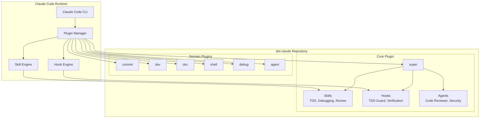
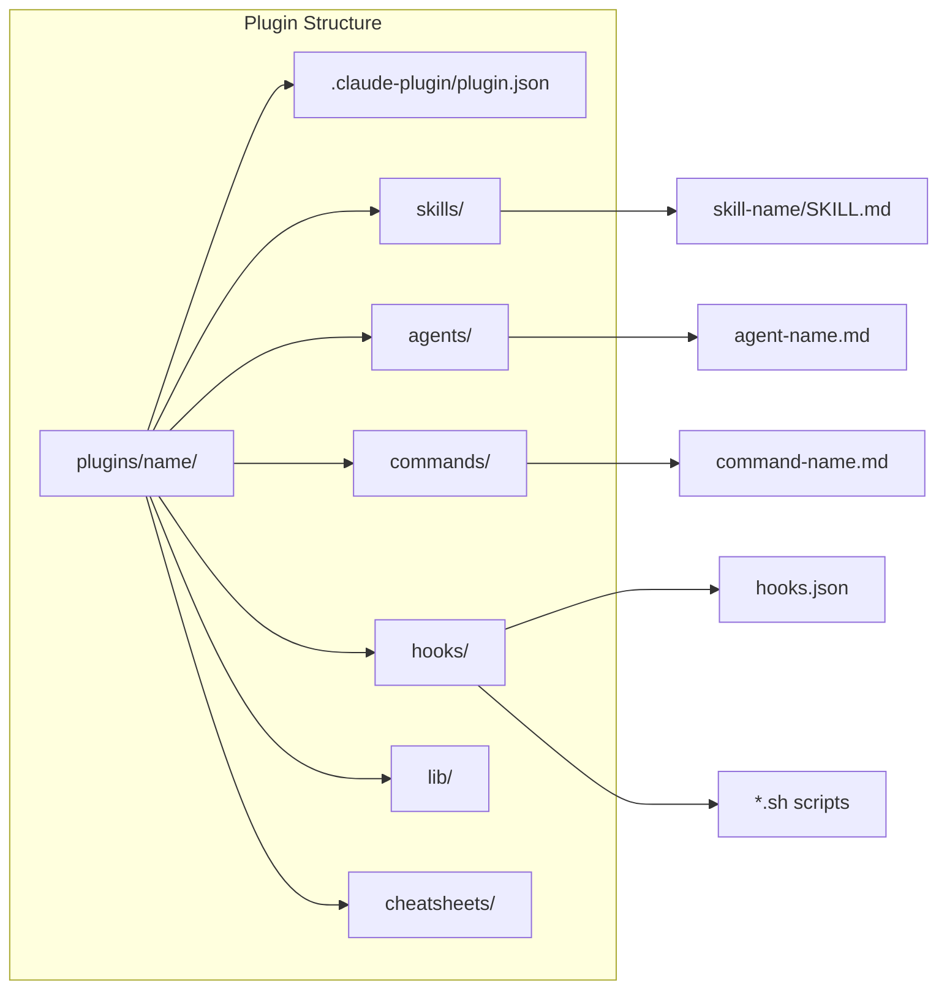
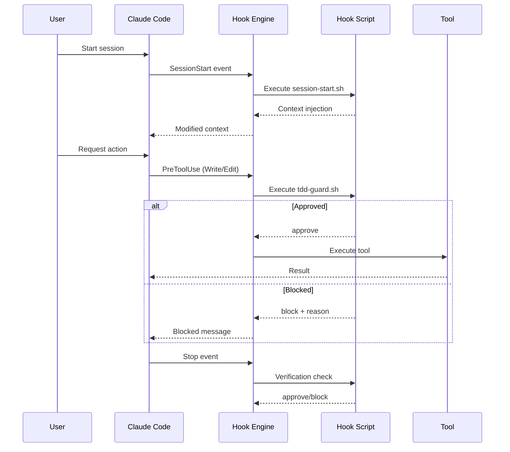
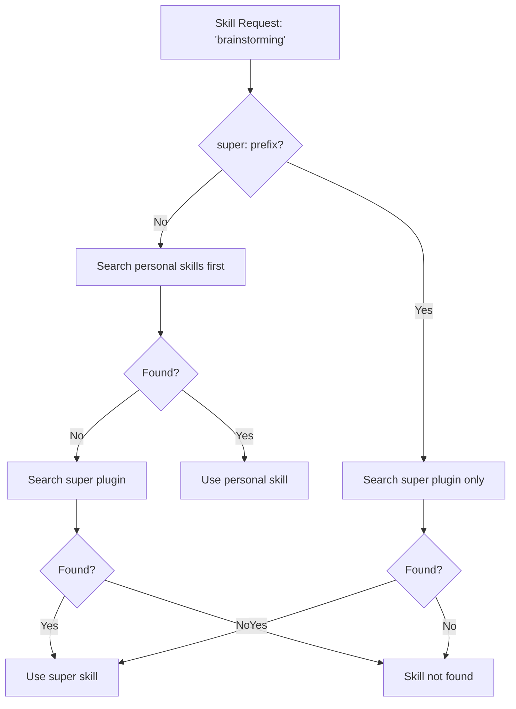
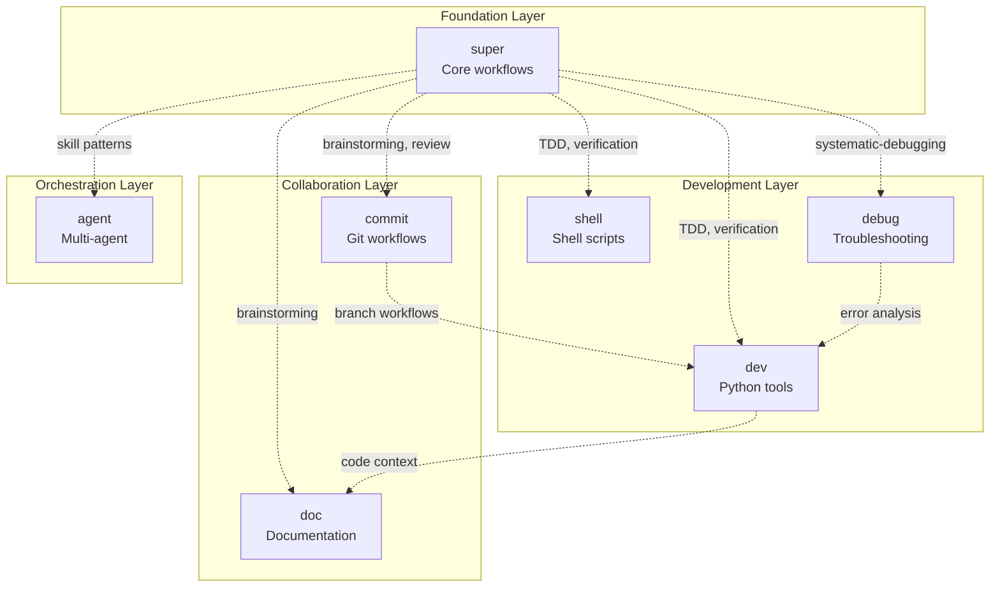
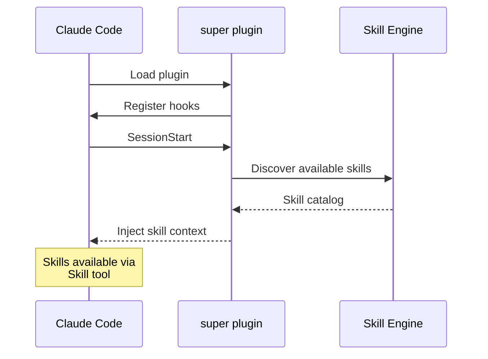
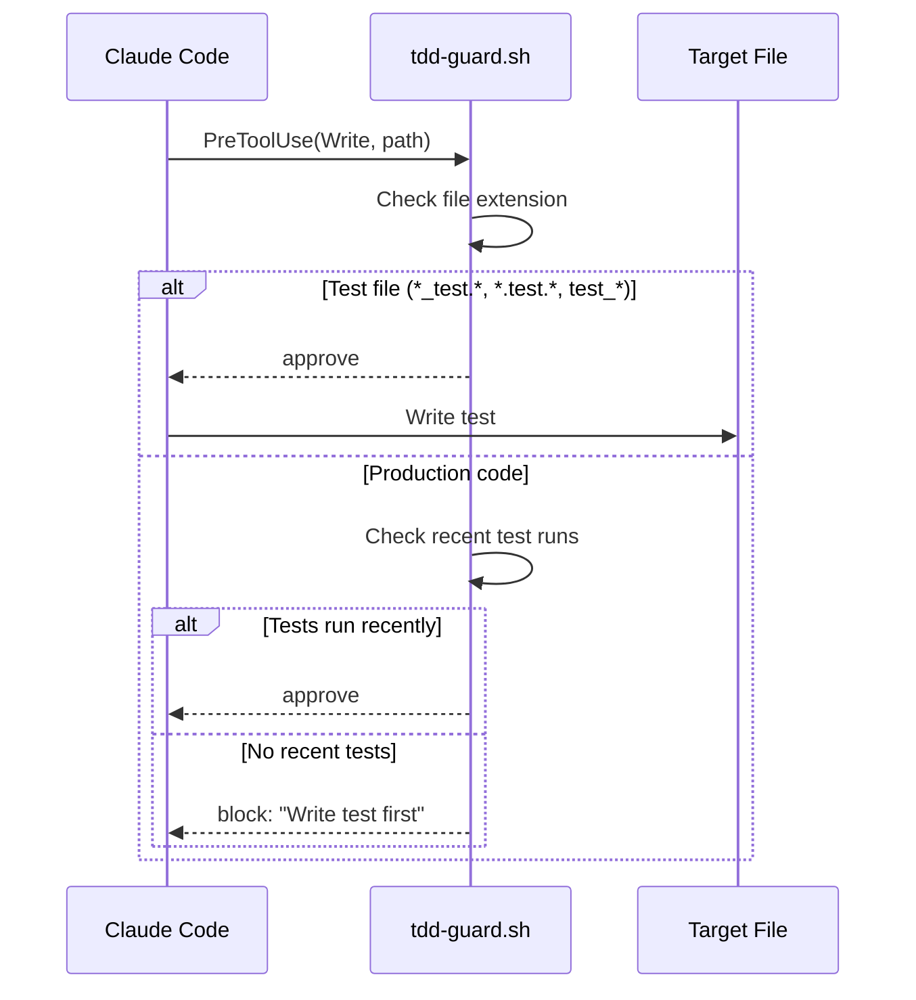
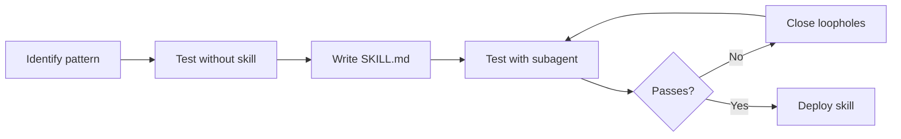

# Architecture

This document describes the architecture of dot-claude, a modular plugin system for Claude Code.

## System Overview



## Plugin Architecture

Each plugin follows a standardized structure that Claude Code recognizes:



### Component Types

| Component | Location | Format | Purpose |
|-----------|----------|--------|---------|
| **Skills** | `skills/<name>/SKILL.md` | Markdown + YAML frontmatter | Reusable techniques and workflows |
| **Agents** | `agents/<name>.md` | Markdown + YAML frontmatter | Subagent definitions with prompts |
| **Commands** | `commands/<name>.md` | Markdown + YAML frontmatter | Slash commands that expand to prompts |
| **Hooks** | `hooks/hooks.json` + `*.sh` | JSON config + shell scripts | Intercept tool usage events |
| **Cheatsheets** | `cheatsheets/*.md` | Markdown | Reference documentation |
| **Libraries** | `lib/*.js` | JavaScript/ESM | Shared utilities |

## Hook System

Hooks intercept Claude Code events at four lifecycle points:



### Hook Events

| Event | Trigger | Use Case |
|-------|---------|----------|
| `SessionStart` | Session begins, resumes, or clears | Inject context, load skills |
| `PreToolUse` | Before tool execution | Validate, block, or modify tool calls |
| `PostToolUse` | After tool execution | Audit, log, or react to results |
| `Stop` | Conversation ends | Verify work completion |

## Skill Resolution

Skills support namespacing and shadowing:



### Skill File Format

```yaml
---
name: skill-name
description: Use when [condition] - [what it does]
---

# Skill Content

Instructions, checklists, and patterns...
```

## Plugin Relationships



## Data Flow

### Session Initialization



### TDD Enforcement



## Plugin Catalog

| Plugin | Version | Skills | Agents | Commands | Hooks |
|--------|---------|--------|--------|----------|-------|
| **super** | 3.5.1 | 20 | 3 | 3 | 3 |
| **commit** | 1.0.0 | 0 | 1 | 3 | 3 |
| **dev** | 0.1.0 | 5 | 3 | 1 | 0 |
| **doc** | 0.3.0 | 1 | 5 | 3 | 0 |
| **shell** | 1.2.0 | 1 | 1 | 1 | 1 |
| **debug** | 0.1.0 | 0 | 2 | 1 | 0 |
| **agent** | 0.1.0 | 0 | 1 | 2 | 0 |

## Extension Points

### Creating a New Plugin

1. Create directory: `plugins/<name>/`
2. Add metadata: `.claude-plugin/plugin.json`
3. Add components as needed (skills, agents, commands, hooks)
4. Install: Add to Claude Code settings or symlink to `~/.claude/plugins/`

### Skill Development Workflow



## Security Considerations

- **Hook scripts** run with user privileges; review before installing
- **PreToolUse hooks** can block dangerous operations
- **Skill content** is injected into LLM context; avoid sensitive data
- **Personal skills** shadow plugin skills; verify source on conflicts
