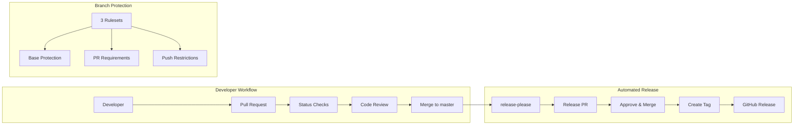

# CI/CD

This document describes the CI/CD setup for dot-claude, including automated releases and branch protection.

## Overview



## Release Process

We use [release-please](https://github.com/googleapis/release-please) for automated versioning and changelog generation.

### How It Works

1. **Conventional Commits**: All commits to `master` must follow [Conventional Commits](https://www.conventionalcommits.org/) format
2. **Release PR**: release-please automatically creates/updates a Release PR with:
   - Version bump based on commit types (`feat:` = minor, `fix:` = patch)
   - Generated CHANGELOG.md entries
   - Updated version in all plugin.json files
3. **Manual Approval**: Release PRs require human approval (same as feature PRs)
4. **Release**: Merging the Release PR triggers:
   - Git tag creation
   - GitHub Release with release notes

### Commit Types and Versioning

| Commit Type | Version Bump | Changelog Section |
|-------------|--------------|-------------------|
| `feat:` | Minor (0.X.0) | Features |
| `fix:` | Patch (0.0.X) | Bug Fixes |
| `perf:` | Patch | Performance |
| `refactor:` | Patch | Code Refactoring |
| `docs:` | Patch | Documentation |
| `chore:` | None | Hidden |

### Configuration Files

| File | Purpose |
|------|---------|
| `release-please-config.json` | Release configuration (type, changelog sections, extra files) |
| `.release-please-manifest.json` | Current version tracking |
| `.github/workflows/release-please.yml` | GitHub Actions workflow |

## Authentication

The release-please workflow uses the built-in `GITHUB_TOKEN` for authentication.

### Why GITHUB_TOKEN?

- **Zero maintenance**: No secrets to rotate, no apps to manage
- **Built-in security**: Token automatically scoped to repository
- **Standard workflow**: Release PRs go through normal approval process

### Workflow Permissions

```yaml
permissions:
  contents: write      # Create releases, tags, update files
  pull-requests: write # Create and update Release PRs
```

### Trade-off

Release PRs require manual approval like any other PR. This adds a small manual step but eliminates maintenance overhead of managing a GitHub App.

## Branch Protection Rulesets

The `master` branch is protected by three rulesets:

### Ruleset 1: Base Protection

Applies to **everyone**, no exceptions.

| Rule | Purpose |
|------|---------|
| Restrict deletions | Cannot delete master branch |
| Restrict force pushes | Cannot force push |
| Require linear history | No merge commits |

### Ruleset 2: PR Requirements

Applies to **everyone**, no exceptions.

| Rule | Purpose |
|------|---------|
| Require pull request | All changes via PR |
| Required approvals: 1 | At least one review |
| Dismiss stale reviews | Re-review after push |
| Require status checks | `validate` must pass |

### Ruleset 3: Push Restrictions

Applies to **everyone**, no exceptions.

| Rule | Purpose |
|------|---------|
| Restrict pushes | Cannot push directly to master |

### Visual Summary

```
+-----------------------------------------------------------+
|                    MASTER BRANCH                          |
+-----------------------------------------------------------+
|  Ruleset 1: Base Protection                               |
|  - No force push                                          |
|  - No deletion                                            |
|  - Linear history                                         |
+-----------------------------------------------------------+
|  Ruleset 2: PR Requirements                               |
|  - Require PR with 1+ approval                            |
|  - Require status checks (validate)                       |
|  - Dismiss stale reviews                                  |
+-----------------------------------------------------------+
|  Ruleset 3: Push Restrictions                             |
|  - Block direct pushes                                    |
+-----------------------------------------------------------+

All PRs (feature + release): Create PR -> Pass checks -> Get approval -> Merge
```

## Validation Workflow

Before release-please runs, a validation job checks all plugin JSON files:

```yaml
validate:
  runs-on: ubuntu-latest
  steps:
    - uses: actions/checkout@v4
    - name: Validate plugin JSON files
      run: |
        for f in .claude-plugin/marketplace.json plugins/*/.claude-plugin/plugin.json; do
          jq empty "$f" || exit 1
          jq -e '.name and .version' "$f" > /dev/null || exit 1
        done
```

This ensures:
- Valid JSON syntax in all plugin manifests
- Required fields (`name`, `version`) are present

## Troubleshooting

### Release PR Not Created

1. Check workflow ran: `gh run list --workflow=release-please.yml`
2. Verify commits follow Conventional Commits format
3. Check for existing Release PR: `gh pr list --label "autorelease: pending"`

### Status Checks Failing

1. Check `validate` job output in workflow run
2. Verify JSON syntax: `jq empty plugins/*/.claude-plugin/plugin.json`
3. Check required fields: `jq '.name, .version' plugins/*/.claude-plugin/plugin.json`
