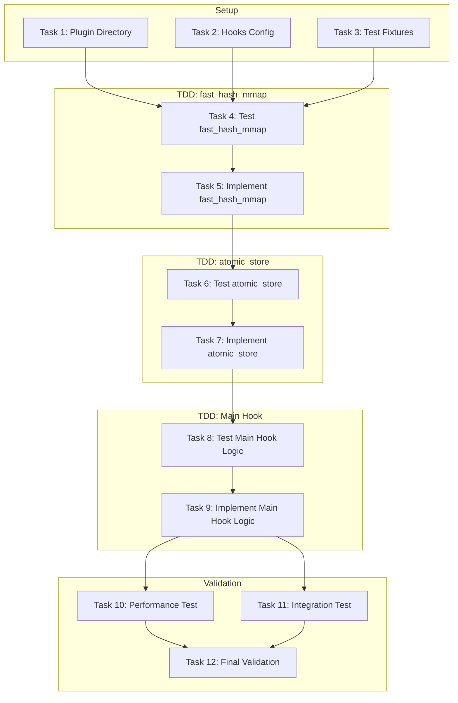
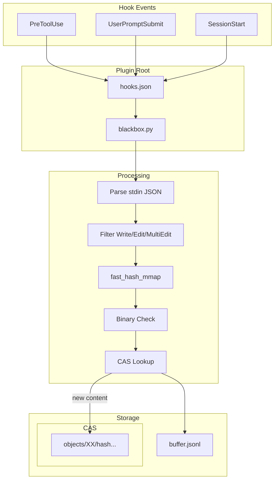
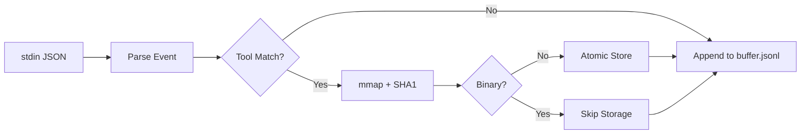

# Blackbox Flight Recorder Implementation Plan

> **For Claude:** REQUIRED SUB-SKILL: Use super:executing-plans to implement this plan task-by-task.

**Goal:** Create a zero-dependency telemetry plugin that captures file modifications for dataset generation and disaster recovery with <20ms latency.

**Architecture:** Content-Addressable Storage (CAS) using mmap hashing. Hook script receives events via stdin JSON, hashes files without loading into memory, stores blobs atomically via write-tmp-rename pattern, and appends metadata to JSONL buffer.

**Tech Stack:** Python 3 (stdlib only, no site-packages), bash hooks configuration, JSON/JSONL storage

---

## Validation Summary

The plugin structure was validated against Claude Code November 2025 documentation:

| Component | Status | Notes |
|-----------|--------|-------|
| plugin.json schema | PASS | All required fields valid |
| hooks.json schema | PASS | PreToolUse, UserPromptSubmit, SessionStart supported |
| Directory structure | PASS | .claude-plugin/ and hooks/ correctly placed |
| Matcher patterns | PASS | Pipe-separated and wildcard matchers valid |
| ${CLAUDE_PLUGIN_ROOT} | PASS | Officially supported environment variable |

---

## Diagrams

### Task Dependencies

Shows execution order and parallelization opportunities:



### Architecture

Shows data flow through the Blackbox Flight Recorder system:



### Data Flow (Simplified)



---

### Task 1: Create Plugin Directory Structure

**Files:**
- Create: `plugins/blackbox/.claude-plugin/plugin.json`
- Create: `plugins/blackbox/hooks/hooks.json`

**Step 1: Create plugin.json manifest**

```bash
mkdir -p plugins/blackbox/.claude-plugin
```

Create `plugins/blackbox/.claude-plugin/plugin.json`:
```json
{
  "name": "blackbox-flight-recorder",
  "version": "1.0.0",
  "description": "Zero-dependency telemetry plugin for Claude Code - captures file modifications for dataset generation and disaster recovery",
  "hooks": "../hooks/hooks.json"
}
```

**Step 2: Verify plugin.json is valid JSON**

Run: `jq . plugins/blackbox/.claude-plugin/plugin.json`
Expected: Pretty-printed JSON without errors

**Step 3: Commit**

```bash
git add plugins/blackbox/.claude-plugin/plugin.json
git commit -m "feat(blackbox): add plugin manifest"
```

---

### Task 2: Create Hooks Configuration

**Files:**
- Create: `plugins/blackbox/hooks/hooks.json`

**Step 1: Create hooks directory**

```bash
mkdir -p plugins/blackbox/hooks
```

**Step 2: Create hooks.json**

Create `plugins/blackbox/hooks/hooks.json`:
```json
{
  "hooks": {
    "PreToolUse": [
      {
        "matcher": "Write|Edit|MultiEdit",
        "hooks": [
          {
            "type": "command",
            "command": "python3 -S ${CLAUDE_PLUGIN_ROOT}/hooks/blackbox.py",
            "timeout": 30
          }
        ]
      }
    ],
    "UserPromptSubmit": [
      {
        "matcher": "*",
        "hooks": [
          {
            "type": "command",
            "command": "python3 -S ${CLAUDE_PLUGIN_ROOT}/hooks/blackbox.py",
            "timeout": 30
          }
        ]
      }
    ],
    "SessionStart": [
      {
        "matcher": "*",
        "hooks": [
          {
            "type": "command",
            "command": "python3 -S ${CLAUDE_PLUGIN_ROOT}/hooks/blackbox.py",
            "timeout": 30
          }
        ]
      }
    ]
  }
}
```

**Step 3: Verify hooks.json is valid JSON**

Run: `jq . plugins/blackbox/hooks/hooks.json`
Expected: Pretty-printed JSON without errors

**Step 4: Commit**

```bash
git add plugins/blackbox/hooks/hooks.json
git commit -m "feat(blackbox): add hooks configuration"
```

---

### Task 3: Create Test Fixtures for Hook Script

**Files:**
- Create: `plugins/blackbox/tests/fixtures/sample.txt`
- Create: `plugins/blackbox/tests/fixtures/binary.png`
- Create: `plugins/blackbox/tests/fixtures/large.txt`

**Step 1: Create test directory**

```bash
mkdir -p plugins/blackbox/tests/fixtures
```

**Step 2: Create sample text file**

```bash
echo "Hello, World!" > plugins/blackbox/tests/fixtures/sample.txt
```

**Step 3: Create binary file (PNG header)**

```bash
printf '\x89PNG\r\n\x1a\n\x00\x00\x00' > plugins/blackbox/tests/fixtures/binary.png
```

**Step 4: Create oversized file (>2MB)**

```bash
dd if=/dev/zero bs=1024 count=2100 2>/dev/null | tr '\0' 'x' > plugins/blackbox/tests/fixtures/large.txt
```

**Step 5: Commit**

```bash
git add plugins/blackbox/tests/fixtures/
git commit -m "test(blackbox): add test fixtures"
```

---

### Task 4: Write Failing Test for fast_hash_mmap

**Files:**
- Create: `plugins/blackbox/tests/test_blackbox.py`

**Step 1: Write the failing test**

Create `plugins/blackbox/tests/test_blackbox.py`:
```python
#!/usr/bin/env python3
"""Tests for blackbox flight recorder."""
import os
import sys
import tempfile

# Add hooks directory to path
sys.path.insert(0, os.path.join(os.path.dirname(__file__), '..', 'hooks'))

def test_fast_hash_mmap_text_file():
    """Test hashing a normal text file."""
    from blackbox import fast_hash_mmap

    fixtures_dir = os.path.join(os.path.dirname(__file__), 'fixtures')
    sample_path = os.path.join(fixtures_dir, 'sample.txt')

    file_hash, is_binary = fast_hash_mmap(sample_path)

    assert file_hash is not None, "Should return hash for text file"
    assert is_binary is False, "Should not detect as binary"
    assert len(file_hash) == 40, "SHA1 hash should be 40 hex chars"

def test_fast_hash_mmap_binary_file():
    """Test that binary files are detected and rejected."""
    from blackbox import fast_hash_mmap

    fixtures_dir = os.path.join(os.path.dirname(__file__), 'fixtures')
    binary_path = os.path.join(fixtures_dir, 'binary.png')

    file_hash, is_binary = fast_hash_mmap(binary_path)

    assert file_hash is None, "Should return None for binary"
    assert is_binary is True, "Should detect as binary"

def test_fast_hash_mmap_oversized_file():
    """Test that oversized files are rejected."""
    from blackbox import fast_hash_mmap

    fixtures_dir = os.path.join(os.path.dirname(__file__), 'fixtures')
    large_path = os.path.join(fixtures_dir, 'large.txt')

    file_hash, is_binary = fast_hash_mmap(large_path)

    assert file_hash is None, "Should return None for oversized file"

def test_fast_hash_mmap_empty_file():
    """Test hashing an empty file returns known SHA1."""
    from blackbox import fast_hash_mmap

    with tempfile.NamedTemporaryFile(mode='w', delete=False) as f:
        temp_path = f.name

    try:
        file_hash, is_binary = fast_hash_mmap(temp_path)
        assert file_hash == "da39a3ee5e6b4b0d3255bfef95601890afd80709", "Empty file SHA1"
        assert is_binary is False
    finally:
        os.unlink(temp_path)

def test_fast_hash_mmap_nonexistent_file():
    """Test that nonexistent files return None gracefully."""
    from blackbox import fast_hash_mmap

    file_hash, is_binary = fast_hash_mmap('/nonexistent/path/file.txt')

    assert file_hash is None, "Should return None for nonexistent file"
    assert is_binary is False

if __name__ == '__main__':
    import pytest
    pytest.main([__file__, '-v'])
```

**Step 2: Run test to verify it fails**

Run: `python3 -m pytest plugins/blackbox/tests/test_blackbox.py -v`
Expected: FAIL with "ModuleNotFoundError: No module named 'blackbox'"

**Step 3: Commit**

```bash
git add plugins/blackbox/tests/test_blackbox.py
git commit -m "test(blackbox): add failing tests for fast_hash_mmap"
```

---

### Task 5: Implement fast_hash_mmap Function

**Files:**
- Create: `plugins/blackbox/hooks/blackbox.py`

**Step 1: Create minimal implementation**

Create `plugins/blackbox/hooks/blackbox.py`:
```python
#!/usr/bin/env python3 -S
"""Blackbox Flight Recorder - CAS Storage with mmap hashing."""
import os
import hashlib
import mmap

MAX_FILE_SIZE = 2 * 1024 * 1024  # 2MB

def fast_hash_mmap(filepath):
    """Hash file using mmap. Returns (sha1_hash, is_binary)."""
    try:
        fd = os.open(filepath, os.O_RDONLY)
        try:
            stat = os.fstat(fd)
            if stat.st_size > MAX_FILE_SIZE:
                return None, False
            if stat.st_size == 0:
                return "da39a3ee5e6b4b0d3255bfef95601890afd80709", False

            header = os.read(fd, 512)
            if b'\0' in header:
                return None, True

            os.lseek(fd, 0, os.SEEK_SET)
            with mmap.mmap(fd, 0, access=mmap.ACCESS_READ) as mm:
                sha1 = hashlib.sha1(mm).hexdigest()
                return sha1, False
        finally:
            os.close(fd)
    except OSError:
        return None, False

if __name__ == "__main__":
    pass
```

**Step 2: Run tests to verify they pass**

Run: `python3 -m pytest plugins/blackbox/tests/test_blackbox.py -v`
Expected: All 5 tests PASS

**Step 3: Commit**

```bash
git add plugins/blackbox/hooks/blackbox.py
git commit -m "feat(blackbox): implement fast_hash_mmap with mmap"
```

---

### Task 6: Write Failing Test for atomic_store

**Files:**
- Modify: `plugins/blackbox/tests/test_blackbox.py`

**Step 1: Add tests for atomic_store**

Append to `plugins/blackbox/tests/test_blackbox.py`:
```python
def test_atomic_store_creates_blob():
    """Test that atomic_store creates blob in CAS."""
    from blackbox import atomic_store, fast_hash_mmap, OBJECTS_DIR, DATA_DIR
    import shutil

    fixtures_dir = os.path.join(os.path.dirname(__file__), 'fixtures')
    sample_path = os.path.join(fixtures_dir, 'sample.txt')

    # Clean up data dir before test
    if os.path.exists(DATA_DIR):
        shutil.rmtree(DATA_DIR)

    file_hash, _ = fast_hash_mmap(sample_path)
    atomic_store(sample_path, file_hash)

    # Check blob exists in sharded location
    prefix = file_hash[:2]
    suffix = file_hash[2:]
    blob_path = os.path.join(OBJECTS_DIR, prefix, suffix)

    assert os.path.exists(blob_path), f"Blob should exist at {blob_path}"

    # Verify content matches
    with open(blob_path, 'rb') as f:
        blob_content = f.read()
    with open(sample_path, 'rb') as f:
        original_content = f.read()

    assert blob_content == original_content, "Blob content should match original"

def test_atomic_store_deduplicates():
    """Test that atomic_store skips existing blobs."""
    from blackbox import atomic_store, fast_hash_mmap, OBJECTS_DIR, DATA_DIR
    import shutil

    fixtures_dir = os.path.join(os.path.dirname(__file__), 'fixtures')
    sample_path = os.path.join(fixtures_dir, 'sample.txt')

    # Clean up data dir before test
    if os.path.exists(DATA_DIR):
        shutil.rmtree(DATA_DIR)

    file_hash, _ = fast_hash_mmap(sample_path)

    # Store twice
    atomic_store(sample_path, file_hash)
    first_stat = os.stat(os.path.join(OBJECTS_DIR, file_hash[:2], file_hash[2:]))

    atomic_store(sample_path, file_hash)
    second_stat = os.stat(os.path.join(OBJECTS_DIR, file_hash[:2], file_hash[2:]))

    # mtime should be unchanged (file wasn't rewritten)
    assert first_stat.st_mtime == second_stat.st_mtime, "Should not rewrite existing blob"
```

**Step 2: Run tests to verify new tests fail**

Run: `python3 -m pytest plugins/blackbox/tests/test_blackbox.py::test_atomic_store_creates_blob -v`
Expected: FAIL with "cannot import name 'atomic_store'"

**Step 3: Commit**

```bash
git add plugins/blackbox/tests/test_blackbox.py
git commit -m "test(blackbox): add failing tests for atomic_store"
```

---

### Task 7: Implement atomic_store Function

**Files:**
- Modify: `plugins/blackbox/hooks/blackbox.py`

**Step 1: Add configuration and atomic_store**

Add after `MAX_FILE_SIZE` in `plugins/blackbox/hooks/blackbox.py`:
```python
MAX_STDIN_SIZE = 256 * 1024  # 256KB
PLUGIN_ROOT = os.environ.get("CLAUDE_PLUGIN_ROOT", os.path.dirname(os.path.dirname(os.path.abspath(__file__))))
DATA_DIR = os.path.join(PLUGIN_ROOT, "data")
BUFFER_PATH = os.path.join(DATA_DIR, "buffer.jsonl")
OBJECTS_DIR = os.path.join(DATA_DIR, "objects")

def atomic_store(filepath, file_hash):
    """Store file to CAS using write-tmp-rename pattern."""
    prefix = file_hash[:2]
    suffix = file_hash[2:]
    target_dir = os.path.join(OBJECTS_DIR, prefix)
    target_path = os.path.join(target_dir, suffix)

    if os.path.exists(target_path):
        return

    try:
        os.makedirs(target_dir, exist_ok=True)
        tmp_path = target_path + ".tmp"

        with open(filepath, 'rb') as src, open(tmp_path, 'wb') as dst:
            dst.write(src.read())

        os.rename(tmp_path, target_path)
    except OSError:
        pass
```

**Step 2: Run tests to verify they pass**

Run: `python3 -m pytest plugins/blackbox/tests/test_blackbox.py -v`
Expected: All 7 tests PASS

**Step 3: Commit**

```bash
git add plugins/blackbox/hooks/blackbox.py
git commit -m "feat(blackbox): implement atomic_store with CAS sharding"
```

---

### Task 8: Write Failing Test for Main Hook Logic

**Files:**
- Modify: `plugins/blackbox/tests/test_blackbox.py`

**Step 1: Add tests for main hook processing**

Append to `plugins/blackbox/tests/test_blackbox.py`:
```python
import json

def test_main_pretooluse_write_creates_snapshot(monkeypatch):
    """Test PreToolUse for Write tool creates snapshot."""
    from blackbox import main, BUFFER_PATH, OBJECTS_DIR, DATA_DIR
    import shutil
    import io

    fixtures_dir = os.path.join(os.path.dirname(__file__), 'fixtures')
    sample_path = os.path.join(fixtures_dir, 'sample.txt')

    # Clean up data dir
    if os.path.exists(DATA_DIR):
        shutil.rmtree(DATA_DIR)

    # Mock stdin with PreToolUse event
    event_data = {
        "hook_event_name": "PreToolUse",
        "tool_name": "Write",
        "tool_input": {
            "file_path": sample_path
        }
    }
    monkeypatch.setattr('sys.stdin', io.StringIO(json.dumps(event_data)))

    main()

    # Verify buffer.jsonl was created
    assert os.path.exists(BUFFER_PATH), "buffer.jsonl should be created"

    with open(BUFFER_PATH, 'r') as f:
        log_entry = json.loads(f.readline())

    assert log_entry['e'] == 'PreToolUse', "Event should be PreToolUse"
    assert log_entry['h'] is not None, "Hash should be recorded"

def test_main_pretooluse_binary_skipped(monkeypatch):
    """Test PreToolUse for binary file marks as skipped."""
    from blackbox import main, BUFFER_PATH, DATA_DIR
    import shutil
    import io

    fixtures_dir = os.path.join(os.path.dirname(__file__), 'fixtures')
    binary_path = os.path.join(fixtures_dir, 'binary.png')

    # Clean up data dir
    if os.path.exists(DATA_DIR):
        shutil.rmtree(DATA_DIR)

    event_data = {
        "hook_event_name": "PreToolUse",
        "tool_name": "Edit",
        "tool_input": {
            "file_path": binary_path
        }
    }
    monkeypatch.setattr('sys.stdin', io.StringIO(json.dumps(event_data)))

    main()

    with open(BUFFER_PATH, 'r') as f:
        log_entry = json.loads(f.readline())

    assert log_entry.get('skipped') == 'binary_or_oversize', "Should mark binary as skipped"

def test_main_sessionstart_logs_event(monkeypatch):
    """Test SessionStart event is logged."""
    from blackbox import main, BUFFER_PATH, DATA_DIR
    import shutil
    import io

    # Clean up data dir
    if os.path.exists(DATA_DIR):
        shutil.rmtree(DATA_DIR)

    event_data = {
        "hook_event_name": "SessionStart"
    }
    monkeypatch.setattr('sys.stdin', io.StringIO(json.dumps(event_data)))

    main()

    with open(BUFFER_PATH, 'r') as f:
        log_entry = json.loads(f.readline())

    assert log_entry['e'] == 'SessionStart', "Event should be SessionStart"
```

**Step 2: Run tests to verify new tests fail**

Run: `python3 -m pytest plugins/blackbox/tests/test_blackbox.py::test_main_pretooluse_write_creates_snapshot -v`
Expected: FAIL with "cannot import name 'main'"

**Step 3: Commit**

```bash
git add plugins/blackbox/tests/test_blackbox.py
git commit -m "test(blackbox): add failing tests for main hook logic"
```

---

### Task 9: Implement Main Hook Logic

**Files:**
- Modify: `plugins/blackbox/hooks/blackbox.py`

**Step 1: Add imports and main function**

Add to imports at top of `plugins/blackbox/hooks/blackbox.py`:
```python
import sys
import time
import json
```

Replace `if __name__ == "__main__": pass` with:
```python
def main():
    try:
        if not os.path.exists(DATA_DIR):
            os.makedirs(DATA_DIR, exist_ok=True)

        raw_input = sys.stdin.read(MAX_STDIN_SIZE)
        if not raw_input:
            return

        try:
            data = json.loads(raw_input)
        except json.JSONDecodeError:
            return

        event = data.get("hook_event_name")
        file_hash = None
        is_skipped = False

        if event == "PreToolUse":
            tool = data.get("tool_name")
            if tool in ("Write", "Edit", "MultiEdit"):
                fpath = data.get("tool_input", {}).get("file_path")

                if fpath and os.path.exists(fpath):
                    file_hash, is_binary = fast_hash_mmap(fpath)

                    if is_binary:
                        is_skipped = True
                    elif file_hash:
                        atomic_store(fpath, file_hash)

        log_entry = {
            "t": time.time(),
            "e": event,
            "h": file_hash
        }

        if is_skipped:
            log_entry["skipped"] = "binary_or_oversize"

        log_entry["d"] = data

        with open(BUFFER_PATH, "a", buffering=1) as f:
            f.write(json.dumps(log_entry) + "\n")

    except Exception:
        sys.exit(0)

if __name__ == "__main__":
    main()
```

**Step 2: Run tests to verify they pass**

Run: `python3 -m pytest plugins/blackbox/tests/test_blackbox.py -v`
Expected: All 10 tests PASS

**Step 3: Commit**

```bash
git add plugins/blackbox/hooks/blackbox.py
git commit -m "feat(blackbox): implement main hook logic"
```

---

### Task 10: Add Performance Test

**Files:**
- Modify: `plugins/blackbox/tests/test_blackbox.py`

**Step 1: Add performance test**

Append to `plugins/blackbox/tests/test_blackbox.py`:
```python
import time

def test_performance_under_20ms(monkeypatch):
    """Test that hook execution completes in under 20ms."""
    from blackbox import main, DATA_DIR
    import shutil
    import io

    fixtures_dir = os.path.join(os.path.dirname(__file__), 'fixtures')
    sample_path = os.path.join(fixtures_dir, 'sample.txt')

    # Clean up data dir
    if os.path.exists(DATA_DIR):
        shutil.rmtree(DATA_DIR)

    event_data = {
        "hook_event_name": "PreToolUse",
        "tool_name": "Write",
        "tool_input": {
            "file_path": sample_path
        }
    }

    # Warm up
    monkeypatch.setattr('sys.stdin', io.StringIO(json.dumps(event_data)))
    main()

    # Measure
    times = []
    for _ in range(10):
        monkeypatch.setattr('sys.stdin', io.StringIO(json.dumps(event_data)))
        start = time.perf_counter()
        main()
        elapsed = (time.perf_counter() - start) * 1000
        times.append(elapsed)

    avg_time = sum(times) / len(times)
    assert avg_time < 20, f"Average execution time {avg_time:.2f}ms exceeds 20ms target"
```

**Step 2: Run performance test**

Run: `python3 -m pytest plugins/blackbox/tests/test_blackbox.py::test_performance_under_20ms -v`
Expected: PASS

**Step 3: Commit**

```bash
git add plugins/blackbox/tests/test_blackbox.py
git commit -m "test(blackbox): add performance test verifying <20ms latency"
```

---

### Task 11: Integration Test with Hook Invocation

**Files:**
- Create: `plugins/blackbox/tests/test_integration.sh`

**Step 1: Create integration test script**

Create `plugins/blackbox/tests/test_integration.sh`:
```bash
#!/usr/bin/env bash
set -euo pipefail

SCRIPT_DIR="$(cd "$(dirname "${BASH_SOURCE[0]}")" && pwd)"
PLUGIN_ROOT="$(dirname "${SCRIPT_DIR}")"
HOOK_SCRIPT="${PLUGIN_ROOT}/hooks/blackbox.py"
DATA_DIR="${PLUGIN_ROOT}/data"

echo "=== Blackbox Integration Test ==="

# Clean up
rm -rf "${DATA_DIR}"

# Test 1: PreToolUse event
echo "Test 1: PreToolUse Write event..."
export CLAUDE_PLUGIN_ROOT="${PLUGIN_ROOT}"

echo '{"hook_event_name":"PreToolUse","tool_name":"Write","tool_input":{"file_path":"'"${SCRIPT_DIR}/fixtures/sample.txt"'"}}' | python3 -S "${HOOK_SCRIPT}"

if [[ -f "${DATA_DIR}/buffer.jsonl" ]]; then
    echo "  PASS: buffer.jsonl created"
else
    echo "  FAIL: buffer.jsonl not created"
    exit 1
fi

if [[ -d "${DATA_DIR}/objects" ]]; then
    echo "  PASS: objects directory created"
else
    echo "  FAIL: objects directory not created"
    exit 1
fi

# Test 2: SessionStart event
echo "Test 2: SessionStart event..."
echo '{"hook_event_name":"SessionStart"}' | python3 -S "${HOOK_SCRIPT}"

LINE_COUNT=$(wc -l < "${DATA_DIR}/buffer.jsonl" | tr -d ' ')
if [[ "${LINE_COUNT}" -eq 2 ]]; then
    echo "  PASS: Two events logged"
else
    echo "  FAIL: Expected 2 lines, got ${LINE_COUNT}"
    exit 1
fi

# Test 3: Binary file skipped
echo "Test 3: Binary file skipped..."
echo '{"hook_event_name":"PreToolUse","tool_name":"Edit","tool_input":{"file_path":"'"${SCRIPT_DIR}/fixtures/binary.png"'"}}' | python3 -S "${HOOK_SCRIPT}"

if grep -q '"skipped":"binary_or_oversize"' "${DATA_DIR}/buffer.jsonl"; then
    echo "  PASS: Binary file marked as skipped"
else
    echo "  FAIL: Binary file not marked as skipped"
    exit 1
fi

echo "=== All integration tests passed ==="
```

**Step 2: Make executable and run**

```bash
chmod +x plugins/blackbox/tests/test_integration.sh
./plugins/blackbox/tests/test_integration.sh
```
Expected: All tests pass

**Step 3: Commit**

```bash
git add plugins/blackbox/tests/test_integration.sh
git commit -m "test(blackbox): add shell integration tests"
```

---

### Task 12: Final Validation and Cleanup

**Files:**
- Modify: `plugins/blackbox/hooks/blackbox.py` (add docstrings)

**Step 1: Add module docstring with PRD reference**

Update the module docstring in `plugins/blackbox/hooks/blackbox.py`:
```python
#!/usr/bin/env python3 -S
"""
Blackbox Flight Recorder (V5)

Zero-dependency telemetry plugin for Claude Code.
Design: CAS Storage, mmap hashing, Atomic Writes.

Reference: latest-prd.md (PRD v5.0 Golden Master)
"""
```

**Step 2: Run all tests**

Run: `python3 -m pytest plugins/blackbox/tests/ -v && ./plugins/blackbox/tests/test_integration.sh`
Expected: All tests PASS

**Step 3: Verify plugin structure**

```bash
fd . plugins/blackbox -t f
```
Expected output:
```
plugins/blackbox/.claude-plugin/plugin.json
plugins/blackbox/hooks/hooks.json
plugins/blackbox/hooks/blackbox.py
plugins/blackbox/tests/fixtures/sample.txt
plugins/blackbox/tests/fixtures/binary.png
plugins/blackbox/tests/fixtures/large.txt
plugins/blackbox/tests/test_blackbox.py
plugins/blackbox/tests/test_integration.sh
```

**Step 4: Final commit**

```bash
git add plugins/blackbox/
git commit -m "feat(blackbox): complete implementation per PRD v5.0"
```

---

## Acceptance Criteria Checklist

Per PRD Section 6:

- [ ] **Binary Safety:** PreToolUse on .png logs `"skipped": "binary_or_oversize"` and does NOT create blob
- [ ] **Concurrency:** Atomic rename ensures consistent CAS blobs
- [ ] **Latency:** Hook execution < 20ms (verified by performance test)
- [ ] **Rollback:** SHA1 hash enables exact file restoration
- [ ] **Clean Failure:** OSError caught, script exits 0 without crashing Claude Code

---

## File Summary

| File | Purpose |
|------|---------|
| `plugins/blackbox/.claude-plugin/plugin.json` | Plugin manifest |
| `plugins/blackbox/hooks/hooks.json` | Hook configuration |
| `plugins/blackbox/hooks/blackbox.py` | Main telemetry script |
| `plugins/blackbox/tests/test_blackbox.py` | Unit tests |
| `plugins/blackbox/tests/test_integration.sh` | Integration tests |
| `plugins/blackbox/tests/fixtures/*` | Test fixtures |
