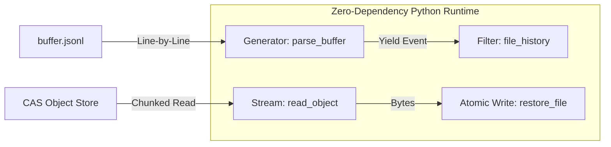
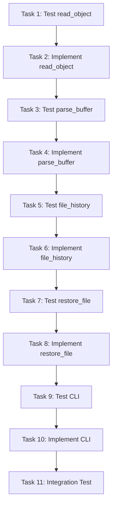

# Blackbox Read Implementation Plan

> **For Claude:** REQUIRED SUB-SKILL: Use super:executing-plans to implement this plan task-by-task.

**Goal:** Build read, query, and restore tools for the blackbox flight recorder CAS, enabling file recovery and event log analysis.

**Architecture:** Pure Python standard library utilities that read immutable CAS blobs and parse the JSONL event log using streaming/generators for O(1) memory usage. Atomic write pattern for safe restoration.

**Tech Stack:** Python 3 (stdlib only, no site-packages), existing CAS at `plugins/blackbox/data/objects/`, existing event log at `plugins/blackbox/data/buffer.jsonl`

**Status:** APPROVED
**Reviewers:** Guido van Rossum (Pythonic Design), Sam Gross (Performance/Concurrency), Google Runtimes (Reliability)

---

## Anti-Pattern Analysis

This plan has been hardened against common failure modes:

| Risk | Problem | Solution |
|------|---------|----------|
| **Memory Bombs** | Loading entire `buffer.jsonl` into list could consume GBs | `parse_buffer` is a **generator** (`yield`), O(1) memory |
| **StdOut Corruption** | Printing binary blobs causes encoding crashes | CLI writes raw bytes to `sys.stdout.buffer` |
| **Partial Write** | Crash mid-restore leaves corrupt file | **Atomic Write Pattern**: tmp file → `os.replace()` |
| **Race Conditions** | Reading buffer during rotation | Skip malformed lines silently (best-effort read) |

---

## Diagrams

### Architecture (Streaming & Generators)



### Task Dependencies



---

### Task 1: Write Failing Test for read_object

**Files:**
- Create: `plugins/blackbox/tests/test_blackbox_read.py`

**Step 1: Write the failing test**

Create `plugins/blackbox/tests/test_blackbox_read.py`:
```python
#!/usr/bin/env python3
"""Tests for blackbox read utilities."""
import os
import sys
import tempfile

# Add hooks directory to path for existing blackbox module
sys.path.insert(0, os.path.join(os.path.dirname(__file__), '..', 'hooks'))


def test_read_object_returns_bytes():
    """Test reading a blob from CAS returns bytes."""
    from blackbox_read import read_object

    # Use existing hash from write-side tests
    # Hash: 60fde9c2310b0d4cad4dab8d126b04387efba289
    # Content: "Hello, World!\n"
    test_hash = "60fde9c2310b0d4cad4dab8d126b04387efba289"

    content = read_object(test_hash)

    assert isinstance(content, bytes), "Should return bytes"
    assert content == b"Hello, World!\n", f"Expected b'Hello, World!\\n', got {content!r}"


def test_read_object_nonexistent_returns_none():
    """Test reading nonexistent hash returns None."""
    from blackbox_read import read_object

    content = read_object("0000000000000000000000000000000000000000")

    assert content is None, "Should return None for nonexistent hash"


def test_read_object_invalid_hash_returns_none():
    """Test reading invalid hash format returns None."""
    from blackbox_read import read_object

    assert read_object("badhash") is None, "Should return None for short hash"
    assert read_object("not-a-valid-hash-at-all") is None, "Should return None for invalid format"
    assert read_object("") is None, "Should return None for empty string"
    assert read_object(None) is None, "Should return None for None"


if __name__ == '__main__':
    import pytest
    pytest.main([__file__, '-v'])
```

**Step 2: Run test to verify it fails**

Run: `python3 -m pytest plugins/blackbox/tests/test_blackbox_read.py::test_read_object_returns_bytes -v`
Expected: FAIL with "ModuleNotFoundError: No module named 'blackbox_read'"

**Step 3: Commit**

```bash
git add plugins/blackbox/tests/test_blackbox_read.py
git commit -m "test(blackbox): add failing tests for read_object"
```

---

### Task 2: Implement read_object Function

**Files:**
- Create: `plugins/blackbox/hooks/blackbox_read.py`

**Step 1: Create minimal implementation**

Create `plugins/blackbox/hooks/blackbox_read.py`:
```python
#!/usr/bin/env python3 -S
"""
Blackbox Read Utilities

Zero-dependency tools for reading from the blackbox CAS and event log.
Companion to blackbox.py (write-side).

Design: Streaming reads, generator-based parsing, atomic writes.
"""
import os
import re
import sys

# Dynamic root determination
PLUGIN_ROOT = os.environ.get(
    "CLAUDE_PLUGIN_ROOT",
    os.path.dirname(os.path.dirname(os.path.abspath(__file__)))
)
DATA_DIR = os.path.join(PLUGIN_ROOT, "data")
OBJECTS_DIR = os.path.join(DATA_DIR, "objects")
BUFFER_PATH = os.path.join(DATA_DIR, "buffer.jsonl")

# SHA1 hash pattern: 40 hex characters
SHA1_PATTERN = re.compile(r'^[0-9a-f]{40}$')


def read_object(sha1_hash):
    """
    Read blob content from CAS by SHA1 hash.

    Args:
        sha1_hash: 40-character hex SHA1 hash

    Returns:
        bytes: Blob content, or None if not found/invalid
    """
    if not sha1_hash or not SHA1_PATTERN.match(sha1_hash):
        return None

    path = os.path.join(OBJECTS_DIR, sha1_hash[:2], sha1_hash[2:])

    try:
        with open(path, 'rb') as f:
            return f.read()
    except OSError:
        return None


if __name__ == "__main__":
    pass
```

**Step 2: Run tests to verify they pass**

Run: `python3 -m pytest plugins/blackbox/tests/test_blackbox_read.py -v`
Expected: All 3 tests PASS

**Step 3: Commit**

```bash
git add plugins/blackbox/hooks/blackbox_read.py
git commit -m "feat(blackbox): implement read_object for CAS retrieval"
```

---

### Task 3: Write Failing Test for parse_buffer (Generator)

**Files:**
- Modify: `plugins/blackbox/tests/test_blackbox_read.py`

**Step 1: Add tests for buffer parsing**

Append to `plugins/blackbox/tests/test_blackbox_read.py`:
```python
import json
import types
import pytest


def test_parse_buffer_is_generator():
    """Test parse_buffer returns a generator (O(1) memory)."""
    from blackbox_read import parse_buffer

    gen = parse_buffer()

    assert isinstance(gen, types.GeneratorType), "Must be a generator for O(1) memory"


def test_parse_buffer_yields_events():
    """Test parsing buffer.jsonl yields events."""
    from blackbox_read import parse_buffer, BUFFER_PATH

    if not os.path.exists(BUFFER_PATH):
        pytest.skip("buffer.jsonl does not exist")

    events = list(parse_buffer(limit=5))

    assert len(events) > 0, "Should yield at least one event"
    assert 't' in events[0], "Event should have timestamp"
    assert 'e' in events[0], "Event should have event type"


def test_parse_buffer_respects_limit():
    """Test parsing buffer with limit parameter."""
    from blackbox_read import parse_buffer, BUFFER_PATH

    if not os.path.exists(BUFFER_PATH):
        pytest.skip("buffer.jsonl does not exist")

    events = list(parse_buffer(limit=2))

    assert len(events) <= 2, "Should respect limit"


def test_parse_buffer_empty_file():
    """Test parsing empty buffer yields nothing."""
    from blackbox_read import parse_buffer

    with tempfile.NamedTemporaryFile(mode='w', suffix='.jsonl', delete=False) as f:
        temp_path = f.name

    try:
        events = list(parse_buffer(buffer_path=temp_path))
        assert events == [], "Should yield nothing for empty file"
    finally:
        os.unlink(temp_path)


def test_parse_buffer_skips_malformed_lines():
    """Test that malformed JSON lines are skipped (race condition resilience)."""
    from blackbox_read import parse_buffer

    with tempfile.NamedTemporaryFile(mode='w', suffix='.jsonl', delete=False) as f:
        f.write('{"t": 1, "e": "Valid"}\n')
        f.write('not valid json\n')
        f.write('{"t": 2, "e": "AlsoValid"}\n')
        f.write('\n')  # Empty line
        f.write('partial json {"broken\n')
        f.write('{"t": 3, "e": "StillValid"}\n')
        temp_path = f.name

    try:
        events = list(parse_buffer(buffer_path=temp_path))
        assert len(events) == 3, "Should skip malformed lines silently"
        assert events[0]['e'] == 'Valid'
        assert events[1]['e'] == 'AlsoValid'
        assert events[2]['e'] == 'StillValid'
    finally:
        os.unlink(temp_path)


def test_parse_buffer_nonexistent_file():
    """Test parsing nonexistent buffer yields nothing."""
    from blackbox_read import parse_buffer

    events = list(parse_buffer(buffer_path='/nonexistent/path/buffer.jsonl'))
    assert events == [], "Should yield nothing for nonexistent file"
```

**Step 2: Run test to verify it fails**

Run: `python3 -m pytest plugins/blackbox/tests/test_blackbox_read.py::test_parse_buffer_is_generator -v`
Expected: FAIL with "cannot import name 'parse_buffer'"

**Step 3: Commit**

```bash
git add plugins/blackbox/tests/test_blackbox_read.py
git commit -m "test(blackbox): add failing tests for parse_buffer generator"
```

---

### Task 4: Implement parse_buffer Function (Generator)

**Files:**
- Modify: `plugins/blackbox/hooks/blackbox_read.py`

**Step 1: Add json import and parse_buffer generator**

Add to imports at top of `plugins/blackbox/hooks/blackbox_read.py`:
```python
import json
```

Add after `read_object` function:
```python
def parse_buffer(limit=None, buffer_path=None):
    """
    Generator that yields events from the log.

    Uses yield for O(1) memory regardless of log size.
    Resilient to malformed lines (concurrent write races).

    Args:
        limit: Maximum number of events to yield (None = all)
        buffer_path: Override path to buffer file (for testing)

    Yields:
        dict: Event dictionaries from the log
    """
    path = buffer_path if buffer_path else BUFFER_PATH

    if not os.path.exists(path):
        return

    count = 0
    try:
        # errors='replace' handles potential encoding races
        with open(path, 'r', encoding='utf-8', errors='replace') as f:
            for line in f:
                line = line.strip()
                if not line:
                    continue

                try:
                    yield json.loads(line)
                    count += 1
                    if limit and count >= limit:
                        return
                except json.JSONDecodeError:
                    # Skip corrupt lines silently (best-effort read)
                    continue
    except OSError:
        return
```

**Step 2: Run tests to verify they pass**

Run: `python3 -m pytest plugins/blackbox/tests/test_blackbox_read.py -v`
Expected: All 9 tests PASS

**Step 3: Commit**

```bash
git add plugins/blackbox/hooks/blackbox_read.py
git commit -m "feat(blackbox): implement parse_buffer as generator for O(1) memory"
```

---

### Task 5: Write Failing Test for file_history

**Files:**
- Modify: `plugins/blackbox/tests/test_blackbox_read.py`

**Step 1: Add tests for file history**

Append to `plugins/blackbox/tests/test_blackbox_read.py`:
```python
def test_file_history_is_generator():
    """Test file_history returns a generator."""
    from blackbox_read import file_history

    gen = file_history("/some/path.py")

    assert isinstance(gen, types.GeneratorType), "Must be a generator"


def test_file_history_filters_by_path():
    """Test file_history yields only events for specified path."""
    from blackbox_read import file_history

    with tempfile.NamedTemporaryFile(mode='w', suffix='.jsonl', delete=False) as f:
        f.write(json.dumps({
            "t": 1.0, "e": "PreToolUse", "h": "abc123" + "0" * 34,
            "d": {"tool_input": {"file_path": "/path/to/file1.py"}}
        }) + '\n')
        f.write(json.dumps({
            "t": 2.0, "e": "PreToolUse", "h": "def456" + "0" * 34,
            "d": {"tool_input": {"file_path": "/path/to/file2.py"}}
        }) + '\n')
        f.write(json.dumps({
            "t": 3.0, "e": "PreToolUse", "h": "ghi789" + "0" * 34,
            "d": {"tool_input": {"file_path": "/path/to/file1.py"}}
        }) + '\n')
        temp_path = f.name

    try:
        history = list(file_history("/path/to/file1.py", buffer_path=temp_path))

        assert len(history) == 2, "Should yield only file1.py events"
        assert history[0]['h'] == "abc123" + "0" * 34
        assert history[1]['h'] == "ghi789" + "0" * 34
    finally:
        os.unlink(temp_path)


def test_file_history_normalizes_paths():
    """Test file_history normalizes paths for comparison."""
    from blackbox_read import file_history

    with tempfile.NamedTemporaryFile(mode='w', suffix='.jsonl', delete=False) as f:
        f.write(json.dumps({
            "t": 1.0, "e": "PreToolUse", "h": "a" * 40,
            "d": {"tool_input": {"file_path": "/path/to/./file.py"}}
        }) + '\n')
        temp_path = f.name

    try:
        # Query with normalized path should still match
        history = list(file_history("/path/to/file.py", buffer_path=temp_path))
        assert len(history) == 1, "Should match after path normalization"
    finally:
        os.unlink(temp_path)


def test_file_history_empty_for_unknown_file():
    """Test file_history yields nothing for unknown file."""
    from blackbox_read import file_history

    with tempfile.NamedTemporaryFile(mode='w', suffix='.jsonl', delete=False) as f:
        f.write(json.dumps({
            "t": 1.0, "e": "PreToolUse", "h": "abc" + "0" * 37,
            "d": {"tool_input": {"file_path": "/known.py"}}
        }) + '\n')
        temp_path = f.name

    try:
        history = list(file_history("/unknown.py", buffer_path=temp_path))
        assert history == [], "Should yield nothing for unknown file"
    finally:
        os.unlink(temp_path)


def test_file_history_handles_missing_fields():
    """Test file_history handles events with missing fields gracefully."""
    from blackbox_read import file_history

    with tempfile.NamedTemporaryFile(mode='w', suffix='.jsonl', delete=False) as f:
        f.write(json.dumps({"t": 1.0, "e": "SessionStart"}) + '\n')  # No d field
        f.write(json.dumps({"t": 2.0, "e": "PreToolUse", "d": {}}) + '\n')  # No tool_input
        f.write(json.dumps({
            "t": 3.0, "e": "PreToolUse", "h": "b" * 40,
            "d": {"tool_input": {"file_path": "/target.py"}}
        }) + '\n')
        temp_path = f.name

    try:
        history = list(file_history("/target.py", buffer_path=temp_path))
        assert len(history) == 1, "Should skip events without file_path"
    finally:
        os.unlink(temp_path)
```

**Step 2: Run test to verify it fails**

Run: `python3 -m pytest plugins/blackbox/tests/test_blackbox_read.py::test_file_history_is_generator -v`
Expected: FAIL with "cannot import name 'file_history'"

**Step 3: Commit**

```bash
git add plugins/blackbox/tests/test_blackbox_read.py
git commit -m "test(blackbox): add failing tests for file_history generator"
```

---

### Task 6: Implement file_history Function

**Files:**
- Modify: `plugins/blackbox/hooks/blackbox_read.py`

**Step 1: Add file_history generator**

Add after `parse_buffer` function:
```python
def file_history(filepath, buffer_path=None):
    """
    Generator that yields modification history for a specific file.

    Args:
        filepath: Path to file (will be normalized for comparison)
        buffer_path: Override path to buffer file (for testing)

    Yields:
        dict: Events for this file in log order
    """
    # Normalize target path for comparison
    target = os.path.normpath(os.path.abspath(filepath))

    for event in parse_buffer(buffer_path=buffer_path):
        try:
            data = event.get('d', {})
            tool_input = data.get('tool_input', {})
            evt_path = tool_input.get('file_path')

            if evt_path:
                # Normalize event path for comparison
                normalized = os.path.normpath(os.path.abspath(evt_path))
                if normalized == target:
                    yield event
        except (AttributeError, TypeError):
            # Skip malformed events
            continue
```

**Step 2: Run tests to verify they pass**

Run: `python3 -m pytest plugins/blackbox/tests/test_blackbox_read.py -v`
Expected: All 14 tests PASS

**Step 3: Commit**

```bash
git add plugins/blackbox/hooks/blackbox_read.py
git commit -m "feat(blackbox): implement file_history as generator with path normalization"
```

---

### Task 7: Write Failing Test for restore_file (Atomic)

**Files:**
- Modify: `plugins/blackbox/tests/test_blackbox_read.py`

**Step 1: Add tests for atomic file restoration**

Append to `plugins/blackbox/tests/test_blackbox_read.py`:
```python
def test_restore_file_by_hash():
    """Test restoring file content by hash."""
    from blackbox_read import restore_file, OBJECTS_DIR
    from blackbox import fast_hash_mmap, atomic_store

    # Create a known blob in CAS
    with tempfile.NamedTemporaryFile(mode='w', delete=False) as f:
        f.write("Original content\n")
        source_path = f.name

    try:
        # Store to CAS
        file_hash, _ = fast_hash_mmap(source_path)
        atomic_store(source_path, file_hash)

        # Create target file with different content
        with tempfile.NamedTemporaryFile(mode='w', delete=False) as f:
            f.write("Modified content\n")
            target_path = f.name

        try:
            success = restore_file(target_path, file_hash)

            assert success is True, "Restore should succeed"

            with open(target_path, 'r') as f:
                content = f.read()

            assert content == "Original content\n", "Content should be restored"
        finally:
            os.unlink(target_path)
    finally:
        os.unlink(source_path)


def test_restore_file_nonexistent_hash_fails():
    """Test restoring with nonexistent hash returns False."""
    from blackbox_read import restore_file

    with tempfile.NamedTemporaryFile(mode='w', delete=False) as f:
        target_path = f.name

    try:
        success = restore_file(target_path, "0" * 40)
        assert success is False, "Should fail for nonexistent hash"
    finally:
        if os.path.exists(target_path):
            os.unlink(target_path)


def test_restore_file_creates_backup():
    """Test restore creates .bak backup of existing file."""
    from blackbox_read import restore_file
    from blackbox import fast_hash_mmap, atomic_store

    # Create a known blob
    with tempfile.NamedTemporaryFile(mode='w', delete=False) as f:
        f.write("Restore this\n")
        source_path = f.name

    try:
        file_hash, _ = fast_hash_mmap(source_path)
        atomic_store(source_path, file_hash)

        # Create target with different content
        with tempfile.NamedTemporaryFile(mode='w', delete=False, suffix='.py') as f:
            f.write("Current content\n")
            target_path = f.name

        backup_path = target_path + ".bak"

        try:
            success = restore_file(target_path, file_hash, backup=True)

            assert success is True
            assert os.path.exists(backup_path), "Backup should be created"

            with open(backup_path, 'r') as f:
                assert f.read() == "Current content\n", "Backup should have original content"

            with open(target_path, 'r') as f:
                assert f.read() == "Restore this\n", "Target should have restored content"
        finally:
            if os.path.exists(target_path):
                os.unlink(target_path)
            if os.path.exists(backup_path):
                os.unlink(backup_path)
    finally:
        os.unlink(source_path)


def test_restore_file_atomic_no_partial_writes():
    """Test restore uses atomic pattern (no partial writes on failure)."""
    from blackbox_read import restore_file

    # Create target with known content
    with tempfile.NamedTemporaryFile(mode='w', delete=False) as f:
        f.write("Original safe content\n")
        target_path = f.name

    try:
        # Try to restore with invalid hash (will fail)
        success = restore_file(target_path, "0" * 40)

        assert success is False

        # Original content should be preserved (atomic = no partial writes)
        with open(target_path, 'r') as f:
            content = f.read()

        assert content == "Original safe content\n", "Original should be preserved on failure"
    finally:
        os.unlink(target_path)


def test_restore_file_creates_parent_dirs():
    """Test restore creates parent directories if needed."""
    from blackbox_read import restore_file
    from blackbox import fast_hash_mmap, atomic_store

    # Create a known blob
    with tempfile.NamedTemporaryFile(mode='w', delete=False) as f:
        f.write("Content to restore\n")
        source_path = f.name

    try:
        file_hash, _ = fast_hash_mmap(source_path)
        atomic_store(source_path, file_hash)

        # Target in non-existent directory
        temp_dir = tempfile.mkdtemp()
        target_path = os.path.join(temp_dir, "new_subdir", "restored.txt")

        try:
            success = restore_file(target_path, file_hash)

            assert success is True
            assert os.path.exists(target_path)

            with open(target_path, 'r') as f:
                assert f.read() == "Content to restore\n"
        finally:
            import shutil
            shutil.rmtree(temp_dir)
    finally:
        os.unlink(source_path)
```

**Step 2: Run test to verify it fails**

Run: `python3 -m pytest plugins/blackbox/tests/test_blackbox_read.py::test_restore_file_by_hash -v`
Expected: FAIL with "cannot import name 'restore_file'"

**Step 3: Commit**

```bash
git add plugins/blackbox/tests/test_blackbox_read.py
git commit -m "test(blackbox): add failing tests for atomic restore_file"
```

---

### Task 8: Implement restore_file Function (Atomic)

**Files:**
- Modify: `plugins/blackbox/hooks/blackbox_read.py`

**Step 1: Add shutil and tempfile imports, then restore_file function**

Add to imports at top:
```python
import shutil
import tempfile
```

Add after `file_history` function:
```python
def restore_file(filepath, sha1_hash, backup=False):
    """
    Atomically restore file content from CAS.

    Uses atomic write pattern (tmp file -> os.replace) to prevent
    corruption if process crashes mid-write.

    Args:
        filepath: Path where to restore the file
        sha1_hash: SHA1 hash of version to restore
        backup: If True, create .bak backup of existing file

    Returns:
        bool: True if restore succeeded, False otherwise
    """
    if not sha1_hash:
        return False

    # Read content from CAS
    content = read_object(sha1_hash)
    if content is None:
        return False

    # Ensure parent directory exists
    dir_name = os.path.dirname(filepath)
    if dir_name and not os.path.exists(dir_name):
        try:
            os.makedirs(dir_name, exist_ok=True)
        except OSError:
            return False

    # Create backup if requested and file exists
    if backup and os.path.exists(filepath):
        backup_path = filepath + ".bak"
        try:
            shutil.copy2(filepath, backup_path)
        except OSError:
            return False

    # Atomic Write Pattern: Write to tmp -> os.replace()
    # This prevents corruption if the script crashes mid-write
    tmp_fd = None
    tmp_name = None
    try:
        # Create temp file in same directory for atomic rename
        target_dir = dir_name if dir_name else "."
        tmp_fd, tmp_name = tempfile.mkstemp(dir=target_dir, prefix='.restore_')

        os.write(tmp_fd, content)
        os.fsync(tmp_fd)
        os.close(tmp_fd)
        tmp_fd = None

        # Atomic switch on POSIX
        os.replace(tmp_name, filepath)
        return True

    except OSError:
        if tmp_fd is not None:
            os.close(tmp_fd)
        if tmp_name and os.path.exists(tmp_name):
            os.unlink(tmp_name)
        return False
```

**Step 2: Run tests to verify they pass**

Run: `python3 -m pytest plugins/blackbox/tests/test_blackbox_read.py -v`
Expected: All 19 tests PASS

**Step 3: Commit**

```bash
git add plugins/blackbox/hooks/blackbox_read.py
git commit -m "feat(blackbox): implement atomic restore_file with tmp+replace pattern"
```

---

### Task 9: Write Failing Test for CLI Interface

**Files:**
- Modify: `plugins/blackbox/tests/test_blackbox_read.py`

**Step 1: Add CLI tests**

Append to `plugins/blackbox/tests/test_blackbox_read.py`:
```python
import subprocess


def test_cli_read_outputs_bytes():
    """Test CLI read command outputs raw bytes to stdout."""
    script_path = os.path.join(
        os.path.dirname(__file__), '..', 'hooks', 'blackbox_read.py'
    )

    # Known test hash
    test_hash = "60fde9c2310b0d4cad4dab8d126b04387efba289"

    result = subprocess.run(
        ['python3', '-S', script_path, 'read', test_hash],
        capture_output=True,
        env={**os.environ, 'CLAUDE_PLUGIN_ROOT': os.path.join(
            os.path.dirname(__file__), '..'
        )}
    )

    assert result.returncode == 0, f"Should succeed: {result.stderr}"
    assert result.stdout == b"Hello, World!\n", "Should output raw bytes"


def test_cli_read_nonexistent_fails():
    """Test CLI read with nonexistent hash returns error."""
    script_path = os.path.join(
        os.path.dirname(__file__), '..', 'hooks', 'blackbox_read.py'
    )

    result = subprocess.run(
        ['python3', '-S', script_path, 'read', '0' * 40],
        capture_output=True,
        env={**os.environ, 'CLAUDE_PLUGIN_ROOT': os.path.join(
            os.path.dirname(__file__), '..'
        )}
    )

    assert result.returncode != 0, "Should fail for nonexistent hash"


def test_cli_history_outputs_json():
    """Test CLI history command outputs valid JSON."""
    script_path = os.path.join(
        os.path.dirname(__file__), '..', 'hooks', 'blackbox_read.py'
    )

    result = subprocess.run(
        ['python3', '-S', script_path, 'history', '/nonexistent/path.py'],
        capture_output=True,
        text=True,
        env={**os.environ, 'CLAUDE_PLUGIN_ROOT': os.path.join(
            os.path.dirname(__file__), '..'
        )}
    )

    assert result.returncode == 0, f"Should succeed: {result.stderr}"

    # Should be valid JSON (empty array for unknown file)
    parsed = json.loads(result.stdout)
    assert isinstance(parsed, list), "Should output JSON array"


def test_cli_restore_success():
    """Test CLI restore command restores file."""
    from blackbox import fast_hash_mmap, atomic_store

    script_path = os.path.join(
        os.path.dirname(__file__), '..', 'hooks', 'blackbox_read.py'
    )

    # Create a known blob
    with tempfile.NamedTemporaryFile(mode='w', delete=False) as f:
        f.write("CLI restore test\n")
        source_path = f.name

    try:
        file_hash, _ = fast_hash_mmap(source_path)
        atomic_store(source_path, file_hash)

        # Create target
        with tempfile.NamedTemporaryFile(mode='w', delete=False) as f:
            f.write("Different content\n")
            target_path = f.name

        try:
            result = subprocess.run(
                ['python3', '-S', script_path, 'restore', target_path, file_hash],
                capture_output=True,
                text=True,
                env={**os.environ, 'CLAUDE_PLUGIN_ROOT': os.path.join(
                    os.path.dirname(__file__), '..'
                )}
            )

            assert result.returncode == 0, f"Should succeed: {result.stderr}"

            with open(target_path, 'r') as f:
                assert f.read() == "CLI restore test\n"
        finally:
            os.unlink(target_path)
    finally:
        os.unlink(source_path)


def test_cli_unknown_command_fails():
    """Test CLI with unknown command returns error."""
    script_path = os.path.join(
        os.path.dirname(__file__), '..', 'hooks', 'blackbox_read.py'
    )

    result = subprocess.run(
        ['python3', '-S', script_path, 'unknown'],
        capture_output=True,
        text=True
    )

    assert result.returncode != 0, "Should fail for unknown command"


def test_cli_no_args_shows_usage():
    """Test CLI with no args shows usage and fails."""
    script_path = os.path.join(
        os.path.dirname(__file__), '..', 'hooks', 'blackbox_read.py'
    )

    result = subprocess.run(
        ['python3', '-S', script_path],
        capture_output=True,
        text=True
    )

    assert result.returncode != 0, "Should fail with no args"
    assert "Usage" in result.stdout or "usage" in result.stdout.lower(), "Should show usage"
```

**Step 2: Run test to verify it fails**

Run: `python3 -m pytest plugins/blackbox/tests/test_blackbox_read.py::test_cli_read_outputs_bytes -v`
Expected: FAIL (CLI not implemented yet)

**Step 3: Commit**

```bash
git add plugins/blackbox/tests/test_blackbox_read.py
git commit -m "test(blackbox): add failing tests for binary-safe CLI"
```

---

### Task 10: Implement CLI Interface

**Files:**
- Modify: `plugins/blackbox/hooks/blackbox_read.py`

**Step 1: Replace main block with CLI implementation**

Replace `if __name__ == "__main__": pass` with:
```python
def print_usage():
    """Print CLI usage."""
    print("Usage: blackbox_read.py <command> [args]")
    print("")
    print("Commands:")
    print("  read <hash>                       Read blob content to stdout")
    print("  history <path>                    Show modification history (JSON)")
    print("  restore <path> <hash> [--backup]  Restore file from CAS")
    print("")
    print("Examples:")
    print("  blackbox_read.py read 60fde9c2310b0d4cad4dab8d126b04387efba289")
    print("  blackbox_read.py history /path/to/file.py")
    print("  blackbox_read.py restore /path/to/file.py abc123... --backup")


def main():
    """CLI entry point."""
    if len(sys.argv) < 2:
        print_usage()
        sys.exit(1)

    command = sys.argv[1]

    if command == 'read':
        if len(sys.argv) < 3:
            print("Error: read requires a hash argument", file=sys.stderr)
            sys.exit(1)

        content = read_object(sys.argv[2])
        if content is None:
            print(f"Error: hash not found: {sys.argv[2]}", file=sys.stderr)
            sys.exit(1)

        # Write bytes directly to buffer to support binary blobs
        # This avoids encoding issues with images, compressed files, etc.
        sys.stdout.buffer.write(content)

    elif command == 'history':
        if len(sys.argv) < 3:
            print("Error: history requires a file path argument", file=sys.stderr)
            sys.exit(1)

        # Collect generator into list for JSON output
        events = list(file_history(sys.argv[2]))
        print(json.dumps(events, indent=2))

    elif command == 'restore':
        if len(sys.argv) < 4:
            print("Error: restore requires path and hash arguments", file=sys.stderr)
            sys.exit(1)

        filepath = sys.argv[2]
        sha1_hash = sys.argv[3]
        do_backup = '--backup' in sys.argv

        success = restore_file(filepath, sha1_hash, backup=do_backup)
        if success:
            print(f"Restored: {filepath}")
            if do_backup:
                print(f"Backup: {filepath}.bak")
        else:
            print(f"Error: restore failed for {filepath}", file=sys.stderr)
            sys.exit(1)

    else:
        print(f"Error: unknown command: {command}", file=sys.stderr)
        print_usage()
        sys.exit(1)


if __name__ == "__main__":
    main()
```

**Step 2: Run tests to verify they pass**

Run: `python3 -m pytest plugins/blackbox/tests/test_blackbox_read.py -v`
Expected: All 25 tests PASS

**Step 3: Commit**

```bash
git add plugins/blackbox/hooks/blackbox_read.py
git commit -m "feat(blackbox): implement binary-safe CLI for read, history, restore"
```

---

### Task 11: Integration Test

**Files:**
- Create: `plugins/blackbox/tests/test_read_integration.sh`

**Step 1: Create integration test script**

Create `plugins/blackbox/tests/test_read_integration.sh`:
```bash
#!/usr/bin/env bash
set -euo pipefail

SCRIPT_DIR="$(cd "$(dirname "${BASH_SOURCE[0]}")" && pwd)"
PLUGIN_ROOT="$(dirname "${SCRIPT_DIR}")"
READ_SCRIPT="${PLUGIN_ROOT}/hooks/blackbox_read.py"
WRITE_SCRIPT="${PLUGIN_ROOT}/hooks/blackbox.py"
DATA_DIR="${PLUGIN_ROOT}/data"

export CLAUDE_PLUGIN_ROOT="${PLUGIN_ROOT}"

echo "=== Blackbox Read Integration Test ==="

# Test 1: Read known blob
echo "Test 1: Read existing blob..."
CONTENT=$(python3 -S "${READ_SCRIPT}" read "60fde9c2310b0d4cad4dab8d126b04387efba289" 2>/dev/null || true)
if [[ "${CONTENT}" == "Hello, World!" ]]; then
    echo "  PASS: Read correct content"
else
    echo "  FAIL: Expected 'Hello, World!', got '${CONTENT}'"
    exit 1
fi

# Test 2: Read nonexistent blob returns error
echo "Test 2: Read nonexistent blob fails gracefully..."
if python3 -S "${READ_SCRIPT}" read "0000000000000000000000000000000000000000" 2>/dev/null; then
    echo "  FAIL: Should have returned error"
    exit 1
else
    echo "  PASS: Correctly returned error"
fi

# Test 3: History command works
echo "Test 3: History command..."
HISTORY=$(python3 -S "${READ_SCRIPT}" history "/nonexistent/path" 2>/dev/null)
if [[ "${HISTORY}" == "[]" ]]; then
    echo "  PASS: Returns empty array for unknown file"
else
    echo "  FAIL: Expected '[]', got '${HISTORY}'"
    exit 1
fi

# Test 4: Restore round-trip
echo "Test 4: Write-then-restore round-trip..."
TEMP_FILE=$(mktemp)
echo "Test content for restore" > "${TEMP_FILE}"

# Create a snapshot via the write hook
echo "{\"hook_event_name\":\"PreToolUse\",\"tool_name\":\"Write\",\"tool_input\":{\"file_path\":\"${TEMP_FILE}\"}}" | python3 -S "${WRITE_SCRIPT}"

# Get the hash from the last buffer entry
HASH=$(tail -1 "${DATA_DIR}/buffer.jsonl" | python3 -c "import sys,json; print(json.load(sys.stdin).get('h',''))")

if [[ -n "${HASH}" && "${HASH}" != "null" ]]; then
    # Modify the file
    echo "Modified content" > "${TEMP_FILE}"

    # Restore from CAS
    python3 -S "${READ_SCRIPT}" restore "${TEMP_FILE}" "${HASH}"

    RESTORED=$(cat "${TEMP_FILE}")
    if [[ "${RESTORED}" == "Test content for restore" ]]; then
        echo "  PASS: Content restored correctly"
    else
        echo "  FAIL: Restored content mismatch: '${RESTORED}'"
        rm -f "${TEMP_FILE}"
        exit 1
    fi
else
    echo "  SKIP: No hash captured (file may have been binary/oversized)"
fi

rm -f "${TEMP_FILE}"

# Test 5: Binary output safety
echo "Test 5: Binary output safety..."
python3 -S "${READ_SCRIPT}" read "60fde9c2310b0d4cad4dab8d126b04387efba289" > /dev/null 2>&1
if [ $? -eq 0 ]; then
    echo "  PASS: Binary read handled correctly"
else
    echo "  FAIL: Binary read crashed"
    exit 1
fi

echo "=== All integration tests passed ==="
```

**Step 2: Make executable and run**

```bash
chmod +x plugins/blackbox/tests/test_read_integration.sh
./plugins/blackbox/tests/test_read_integration.sh
```
Expected: All tests pass

**Step 3: Commit**

```bash
git add plugins/blackbox/tests/test_read_integration.sh
git commit -m "test(blackbox): add read integration tests with binary safety check"
```

---

## Acceptance Criteria Checklist

- [ ] `read_object(hash)` returns bytes from CAS
- [ ] `parse_buffer()` is a **generator** (O(1) memory)
- [ ] `parse_buffer()` skips malformed lines silently
- [ ] `file_history(path)` is a generator with path normalization
- [ ] `restore_file(path, hash)` uses **atomic write pattern** (tmp→replace)
- [ ] `restore_file(..., backup=True)` creates .bak backup
- [ ] CLI `read <hash>` writes raw bytes to `sys.stdout.buffer`
- [ ] CLI `history <path>` outputs JSON array
- [ ] CLI `restore <path> <hash>` atomically restores file
- [ ] All unit tests pass
- [ ] Integration tests pass (including binary safety)

---

## File Summary

| File | Purpose |
|------|---------|
| `plugins/blackbox/hooks/blackbox_read.py` | Read utilities and CLI (generator-based, atomic writes) |
| `plugins/blackbox/tests/test_blackbox_read.py` | Unit tests (25 tests) |
| `plugins/blackbox/tests/test_read_integration.sh` | Integration tests with binary safety |
