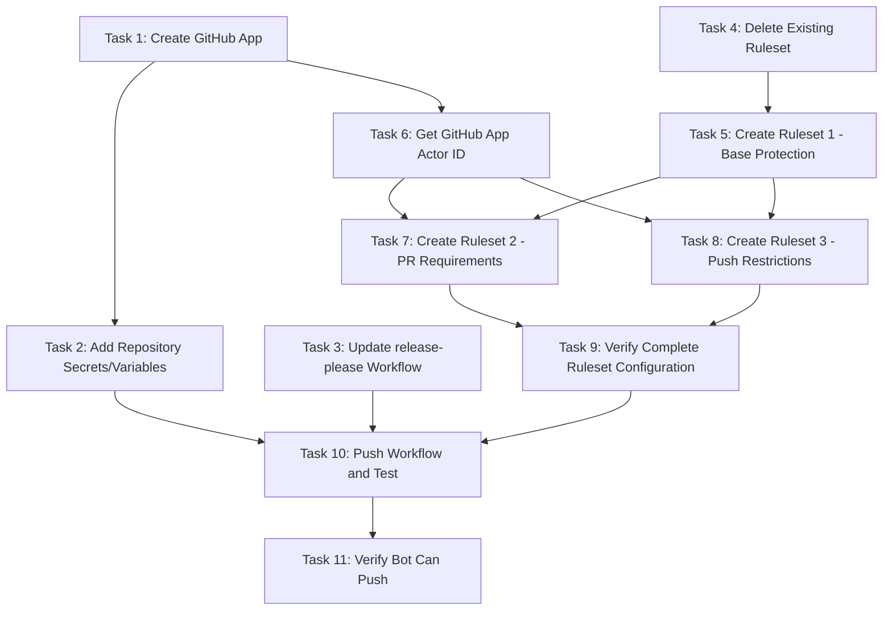

# GitHub App + Rulesets for Release-Please Implementation Plan

> **For Claude:** REQUIRED SUB-SKILL: Use super:executing-plans to implement this plan task-by-task.

**Goal:** Configure a GitHub App and 3-ruleset pattern so release-please can push version bumps/tags to `master` while enforcing PR requirements for developers.

**Architecture:** Create a GitHub App with Contents and Pull Requests permissions. Update the workflow to use `actions/create-github-app-token` to generate a token. Configure three rulesets: base protection (no bypass), PR requirements (bot exempt), and push restrictions (bot exempt).

**Tech Stack:** GitHub Apps, GitHub Rulesets, GitHub Actions, `gh` CLI

---

## Diagrams

### Task Dependencies



**Parallel Execution Opportunities:**
- Tasks 3 and 4 can run in parallel with Task 1
- Tasks 7 and 8 can run in parallel after their dependencies complete

---

## Prerequisites

- `gh` CLI authenticated with admin access to the repository
- Repository owner access to create GitHub Apps

---

### Task 1: Create GitHub App

**Files:**
- None (GitHub web UI operation, documented for reference)

**Step 1: Create the GitHub App via GitHub web UI**

Navigate to: https://github.com/settings/apps/new

Configure with these exact settings:

| Field | Value |
|-------|-------|
| GitHub App name | `release-please-dot-claude` |
| Homepage URL | `https://github.com/pproenca/dot-claude` |
| Webhook Active | **Unchecked** (not needed) |

**Permissions (Repository):**
| Permission | Access |
|------------|--------|
| Contents | Read and write |
| Pull requests | Read and write |
| Metadata | Read-only (auto-granted) |

Leave all other permissions as "No access".

**Where can this GitHub App be installed?** Select "Only on this account"

Click "Create GitHub App".

**Step 2: Note the App ID**

After creation, you'll see the App ID on the settings page (e.g., `123456`). Save this value.

**Step 3: Generate a private key**

On the same page, scroll to "Private keys" section and click "Generate a private key".

A `.pem` file will download. Save it securely.

**Step 4: Install the App on the repository**

1. Go to the App's settings page
2. Click "Install App" in the left sidebar
3. Select your account
4. Choose "Only select repositories"
5. Select `dot-claude`
6. Click "Install"

**Step 5: Verify installation and get Installation ID (optional, for debugging)**

Run:
```bash
gh api user/installations --jq '.installations[] | select(.app_slug == "release-please-dot-claude") | {id, app_id, app_slug}'
```

Expected output: JSON with installation details.

---

### Task 2: Add Repository Secrets and Variables

**Files:**
- None (GitHub settings via `gh` CLI)

**Step 1: Add APP_ID as a repository variable**

Run:
```bash
gh variable set RELEASE_PLEASE_APP_ID --body "YOUR_APP_ID_HERE" --repo pproenca/dot-claude
```

Replace `YOUR_APP_ID_HERE` with the numeric App ID from Task 1.

Expected: No output (success).

**Step 2: Verify the variable was created**

Run:
```bash
gh variable list --repo pproenca/dot-claude
```

Expected output includes:
```
RELEASE_PLEASE_APP_ID  YOUR_APP_ID  Updated ...
```

**Step 3: Add private key as a repository secret**

Run:
```bash
gh secret set RELEASE_PLEASE_PRIVATE_KEY --body "$(cat /path/to/your-app.private-key.pem)" --repo pproenca/dot-claude
```

Replace `/path/to/your-app.private-key.pem` with actual path to downloaded key.

Expected: No output (success).

**Step 4: Verify the secret was created**

Run:
```bash
gh secret list --repo pproenca/dot-claude
```

Expected output includes:
```
RELEASE_PLEASE_PRIVATE_KEY  Updated ...
```

**Step 5: Securely delete the local private key file**

Run:
```bash
rm /path/to/your-app.private-key.pem
```

---

### Task 3: Update release-please Workflow

**Files:**
- Modify: `.github/workflows/release-please.yml`

**Step 1: Update the workflow file**

Replace the entire contents of `.github/workflows/release-please.yml` with:

```yaml
name: release-please

on:
  push:
    branches:
      - master

permissions:
  contents: read

jobs:
  validate:
    runs-on: ubuntu-latest
    steps:
      - uses: actions/checkout@v4
      - name: Validate plugin JSON files
        run: |
          echo "Validating JSON syntax..."
          for f in .claude-plugin/marketplace.json plugins/*/.claude-plugin/plugin.json; do
            echo "  Checking: $f"
            jq empty "$f" || exit 1
            jq -e '.name and .version' "$f" > /dev/null || { echo "Missing required fields in $f"; exit 1; }
          done
          echo "All validations passed"

  release-please:
    needs: validate
    runs-on: ubuntu-latest
    steps:
      - name: Generate GitHub App token
        uses: actions/create-github-app-token@v1
        id: app-token
        with:
          app-id: ${{ vars.RELEASE_PLEASE_APP_ID }}
          private-key: ${{ secrets.RELEASE_PLEASE_PRIVATE_KEY }}

      - uses: googleapis/release-please-action@v4
        with:
          token: ${{ steps.app-token.outputs.token }}
          config-file: release-please-config.json
          manifest-file: .release-please-manifest.json
```

**Step 2: Verify syntax**

Run:
```bash
python3 -c "import yaml; yaml.safe_load(open('.github/workflows/release-please.yml'))" && echo "YAML syntax valid"
```

Expected: `YAML syntax valid`

**Step 3: Commit the change**

Run:
```bash
git add .github/workflows/release-please.yml
git commit -m "ci: use GitHub App token for release-please

Replace GITHUB_TOKEN with GitHub App token to enable
pushing through rulesets. The app has Contents and
Pull requests write permissions.

Refs: googleapis/release-please-action"
```

---

### Task 4: Delete Existing Ruleset

**Files:**
- None (GitHub API via `gh` CLI)

**Step 1: Delete the disabled "Protect master" ruleset**

Run:
```bash
gh api --method DELETE repos/pproenca/dot-claude/rulesets/10568965
```

Expected: No output (HTTP 204 No Content = success).

**Step 2: Verify deletion**

Run:
```bash
gh api repos/pproenca/dot-claude/rulesets --jq 'length'
```

Expected: `0`

---

### Task 5: Create Ruleset 1 - Base Protection (No Bypass)

**Files:**
- None (GitHub API via `gh` CLI)

**Step 1: Create the base protection ruleset**

Run:
```bash
gh api --method POST repos/pproenca/dot-claude/rulesets \
  --input - <<'EOF'
{
  "name": "master-base-protection",
  "target": "branch",
  "enforcement": "active",
  "conditions": {
    "ref_name": {
      "include": ["refs/heads/master"],
      "exclude": []
    }
  },
  "bypass_actors": [],
  "rules": [
    {"type": "deletion"},
    {"type": "non_fast_forward"},
    {"type": "required_linear_history"}
  ]
}
EOF
```

Expected: JSON response with `"id": <new_id>`, `"enforcement": "active"`.

**Step 2: Verify creation**

Run:
```bash
gh api repos/pproenca/dot-claude/rulesets --jq '.[] | select(.name == "master-base-protection") | {id, name, enforcement}'
```

Expected:
```json
{"id":NNNN,"name":"master-base-protection","enforcement":"active"}
```

---

### Task 6: Get GitHub App Actor ID

**Files:**
- None (GitHub API via `gh` CLI)

**Step 1: Find the App's actor ID for ruleset bypass**

Run:
```bash
gh api users/release-please-dot-claude[bot] --jq '{id, login, type}'
```

If app name differs, adjust the `[bot]` username. The format is `<app-slug>[bot]`.

Expected output:
```json
{"id":NNNNN,"login":"release-please-dot-claude[bot]","type":"Bot"}
```

Note the `id` value for the next tasks.

**Alternative if the above fails (app not yet active):**

Run:
```bash
gh api apps/release-please-dot-claude --jq '{id: .id, slug: .slug}'
```

The App ID from this can be used with `actor_type: "Integration"` instead.

---

### Task 7: Create Ruleset 2 - PR Requirements (Bot Exempt)

**Files:**
- None (GitHub API via `gh` CLI)

**Step 1: Create the PR requirements ruleset**

Replace `BOT_ACTOR_ID` with the ID from Task 6:

```bash
gh api --method POST repos/pproenca/dot-claude/rulesets \
  --input - <<'EOF'
{
  "name": "master-pr-requirements",
  "target": "branch",
  "enforcement": "active",
  "conditions": {
    "ref_name": {
      "include": ["refs/heads/master"],
      "exclude": []
    }
  },
  "bypass_actors": [
    {
      "actor_id": BOT_ACTOR_ID,
      "actor_type": "Integration",
      "bypass_mode": "always"
    }
  ],
  "rules": [
    {
      "type": "pull_request",
      "parameters": {
        "required_approving_review_count": 1,
        "dismiss_stale_reviews_on_push": true,
        "require_code_owner_review": false,
        "require_last_push_approval": false,
        "required_review_thread_resolution": false
      }
    },
    {
      "type": "required_status_checks",
      "parameters": {
        "required_status_checks": [
          {"context": "validate"}
        ],
        "strict_required_status_checks_policy": true
      }
    }
  ]
}
EOF
```

Expected: JSON response with `"id": <new_id>`.

**Step 2: Verify creation**

Run:
```bash
gh api repos/pproenca/dot-claude/rulesets --jq '.[] | select(.name == "master-pr-requirements") | {id, name, enforcement, bypass_count: (.bypass_actors | length)}'
```

Expected:
```json
{"id":NNNN,"name":"master-pr-requirements","enforcement":"active","bypass_count":1}
```

---

### Task 8: Create Ruleset 3 - Push Restrictions (Bot Exempt)

**Files:**
- None (GitHub API via `gh` CLI)

**Step 1: Create the push restrictions ruleset**

Replace `BOT_ACTOR_ID` with the ID from Task 6:

```bash
gh api --method POST repos/pproenca/dot-claude/rulesets \
  --input - <<'EOF'
{
  "name": "master-restrict-pushes",
  "target": "branch",
  "enforcement": "active",
  "conditions": {
    "ref_name": {
      "include": ["refs/heads/master"],
      "exclude": []
    }
  },
  "bypass_actors": [
    {
      "actor_id": BOT_ACTOR_ID,
      "actor_type": "Integration",
      "bypass_mode": "always"
    }
  ],
  "rules": [
    {
      "type": "creation"
    }
  ]
}
EOF
```

Expected: JSON response with `"id": <new_id>`.

**Step 2: Verify creation**

Run:
```bash
gh api repos/pproenca/dot-claude/rulesets --jq '.[] | select(.name == "master-restrict-pushes") | {id, name, enforcement}'
```

Expected:
```json
{"id":NNNN,"name":"master-restrict-pushes","enforcement":"active"}
```

---

### Task 9: Verify Complete Ruleset Configuration

**Files:**
- None (verification only)

**Step 1: List all rulesets**

Run:
```bash
gh api repos/pproenca/dot-claude/rulesets --jq '.[] | {id, name, enforcement, bypass_count: (.bypass_actors | length)}'
```

Expected output (3 rulesets):
```json
{"id":NNN1,"name":"master-base-protection","enforcement":"active","bypass_count":0}
{"id":NNN2,"name":"master-pr-requirements","enforcement":"active","bypass_count":1}
{"id":NNN3,"name":"master-restrict-pushes","enforcement":"active","bypass_count":1}
```

**Step 2: Verify protection is active on master**

Run:
```bash
gh api repos/pproenca/dot-claude/rules/branches/master --jq 'length'
```

Expected: `5` or more (sum of all rules across rulesets).

---

### Task 10: Push Workflow and Test

**Files:**
- None (git operations)

**Step 1: Push the workflow change to master via PR**

First, create a feature branch:
```bash
git checkout -b ci/github-app-release-please
git push -u origin ci/github-app-release-please
```

**Step 2: Create a PR**

Run:
```bash
gh pr create --title "ci: use GitHub App token for release-please" \
  --body "## Summary
- Replace GITHUB_TOKEN with GitHub App token
- Enables release-please to push through rulesets
- App has Contents and Pull requests write permissions

## Test Plan
1. Merge this PR
2. Push a conventional commit to master
3. Verify release-please creates a release PR" \
  --base master
```

**Step 3: After PR approval and merge, trigger release-please**

Make a small conventional commit change and push to master (after merging the workflow PR):

```bash
git checkout master
git pull
# Make a trivial change to trigger release-please
echo "" >> CHANGELOG.md
git add CHANGELOG.md
git commit -m "chore: trigger release-please test"
git push
```

**Step 4: Verify release-please workflow runs**

Run:
```bash
gh run list --workflow=release-please.yml --limit 1
```

Expected: Shows a running or completed workflow.

**Step 5: Check for release PR creation**

Run:
```bash
gh pr list --label "autorelease: pending" --state open
```

Expected: A release PR created by `release-please-dot-claude[bot]`.

---

### Task 11: Verify Bot Can Push (End-to-End Test)

**Files:**
- None (verification only)

**Step 1: Approve and merge the release PR**

```bash
gh pr merge <PR_NUMBER> --squash --admin
```

**Step 2: Verify tag was created**

Run:
```bash
gh release list --limit 1
```

Expected: Shows the new release with correct version tag.

**Step 3: Verify bot pushed to master**

Run:
```bash
git fetch origin
git log origin/master -1 --format='%an <%ae> - %s'
```

Expected: Shows commit from `release-please-dot-claude[bot]`.

---

## Rollback Plan

If issues occur, disable rulesets temporarily:

```bash
# List rulesets
gh api repos/pproenca/dot-claude/rulesets --jq '.[] | {id, name}'

# Disable each ruleset (set enforcement to "disabled")
gh api --method PUT repos/pproenca/dot-claude/rulesets/<ID> \
  --field enforcement=disabled
```

To revert workflow:
```bash
git revert HEAD  # if workflow change was the last commit
git push
```

---

## Troubleshooting

**Issue:** Workflow fails with "Resource not accessible by integration"

**Cause:** App permissions not sufficient or not installed correctly.

**Fix:**
1. Verify app is installed: `gh api user/installations --jq '.installations[].app_slug'`
2. Check app permissions in GitHub App settings
3. Reinstall the app on the repository

---

**Issue:** Bot cannot bypass rulesets

**Cause:** Wrong actor ID or actor type in bypass configuration.

**Fix:**
1. Get correct actor ID: `gh api users/<app-slug>[bot] --jq '.id'`
2. Update ruleset with correct actor: `gh api --method PUT repos/pproenca/dot-claude/rulesets/<ID> --input <updated-json>`

---

**Issue:** "Required status check 'validate' is expected" error

**Cause:** Status check name doesn't match job name.

**Fix:** Ensure the job name in workflow (`validate`) matches the required status check context in ruleset.
