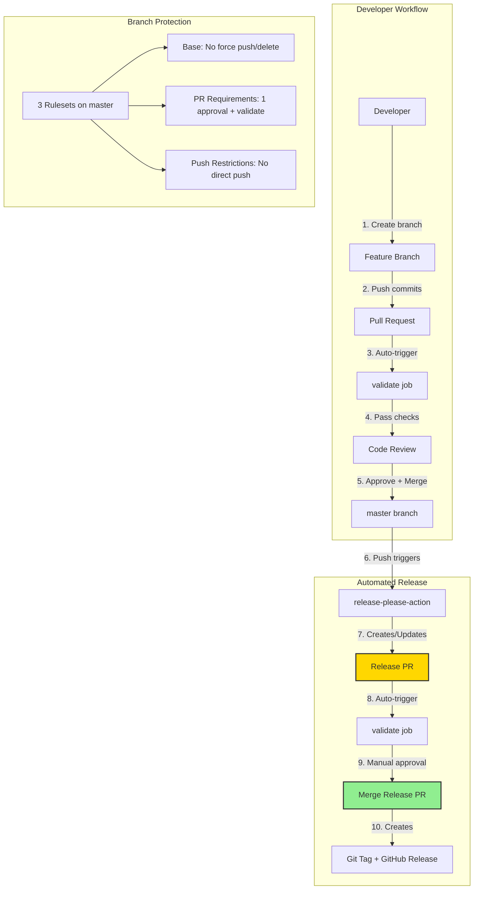
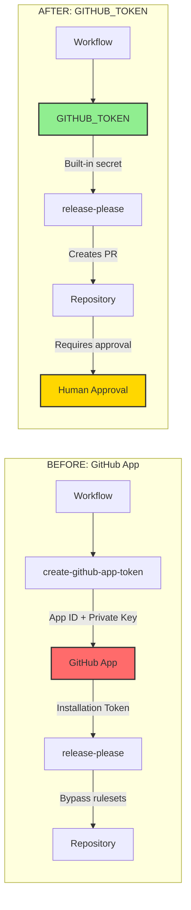
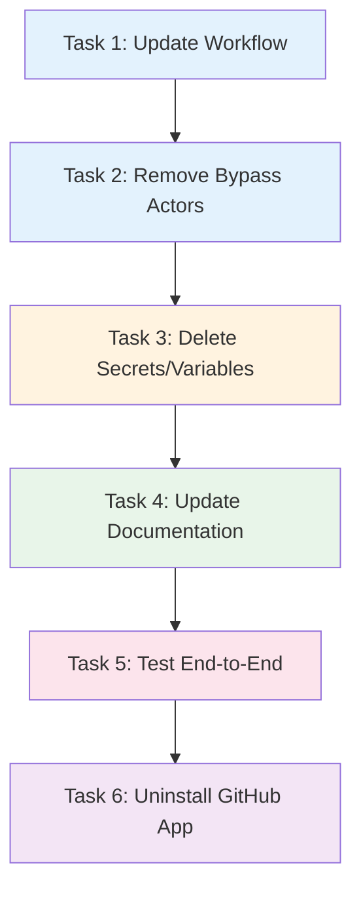
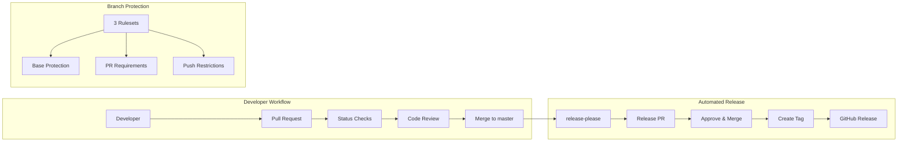

# Remove GitHub App and Simplify release-please Implementation Plan

> **For Claude:** REQUIRED SUB-SKILL: Use super:executing-plans to implement this plan task-by-task.

**Goal:** Remove the custom `release-please-dot-claude` GitHub App and switch to using `GITHUB_TOKEN` for simpler, maintenance-free release automation.

**Architecture:** The current setup uses a custom GitHub App to bypass branch protection rulesets. We'll switch to `GITHUB_TOKEN` which requires manual approval of Release PRs but eliminates app maintenance. The `validate` workflow will still run on PRs, and release-please will auto-create Release PRs on push to master.

**Tech Stack:** GitHub Actions, googleapis/release-please-action@v4, GitHub Rulesets API

---

## Diagrams

### Development Workflow (After Migration)



### Authentication Flow Comparison



### Task Dependencies



---

## Trade-offs

| Aspect | GitHub App (Current) | GITHUB_TOKEN (New) |
|--------|---------------------|-------------------|
| **Maintenance** | Requires app management, key rotation | Zero maintenance |
| **Release PR approval** | Can auto-merge (bypasses rules) | Requires manual approval |
| **Workflow triggers** | Release PR triggers CI workflows | Release PR triggers CI workflows |
| **Security** | Private key stored as secret | Built-in, no secrets |
| **Audit trail** | App-specific audit log | Standard workflow audit |

**Decision:** The minor inconvenience of manually approving Release PRs is outweighed by eliminating app maintenance overhead.

---

### Task 1: Update Workflow File

**Files:**
- Modify: `.github/workflows/release-please.yml`

**Step 1: Read current workflow**

Verify current state before modification.

**Step 2: Replace workflow content**

Replace the entire `release-please.yml` with simplified version:

```yaml
name: release-please

on:
  push:
    branches:
      - master
  pull_request:
    branches:
      - master

permissions:
  contents: write
  pull-requests: write

jobs:
  validate:
    runs-on: ubuntu-latest
    steps:
      - uses: actions/checkout@v4
      - name: Validate plugin JSON files
        run: |
          echo "Validating JSON syntax..."
          for f in .claude-plugin/marketplace.json plugins/*/.claude-plugin/plugin.json; do
            echo "  Checking: $f"
            jq empty "$f" || exit 1
            jq -e '.name and .version' "$f" > /dev/null || { echo "Missing required fields in $f"; exit 1; }
          done
          echo "All validations passed"

  release-please:
    if: github.event_name == 'push'
    needs: validate
    runs-on: ubuntu-latest
    steps:
      - uses: googleapis/release-please-action@v4
        with:
          config-file: release-please-config.json
          manifest-file: .release-please-manifest.json
```

Key changes:
- Removed `permissions: contents: read` (now `contents: write` + `pull-requests: write`)
- Removed `actions/create-github-app-token@v1` step
- Removed `token:` parameter (defaults to `GITHUB_TOKEN`)

**Step 3: Commit the workflow change**

```bash
git add .github/workflows/release-please.yml
git commit -m "ci: switch release-please from GitHub App to GITHUB_TOKEN

- Remove custom app token generation step
- Use built-in GITHUB_TOKEN (requires manual PR approval)
- Add write permissions for contents and pull-requests
- Simplifies maintenance by removing app dependency"
```

---

### Task 2: Remove GitHub App from Ruleset Bypass

**Files:**
- None (API calls only)

**Step 1: Remove bypass actor from master-pr-requirements ruleset**

```bash
gh api repos/pproenca/dot-claude/rulesets/10570028 -X PUT --input - << 'EOF'
{
  "name": "master-pr-requirements",
  "target": "branch",
  "enforcement": "active",
  "conditions": {
    "ref_name": {
      "include": ["refs/heads/master"],
      "exclude": []
    }
  },
  "rules": [
    {
      "type": "pull_request",
      "parameters": {
        "required_approving_review_count": 1,
        "dismiss_stale_reviews_on_push": true,
        "required_reviewers": [],
        "require_code_owner_review": false,
        "require_last_push_approval": false,
        "required_review_thread_resolution": false,
        "automatic_copilot_code_review_enabled": false,
        "allowed_merge_methods": ["merge", "squash", "rebase"]
      }
    },
    {
      "type": "required_status_checks",
      "parameters": {
        "strict_required_status_checks_policy": true,
        "do_not_enforce_on_create": false,
        "required_status_checks": [{"context": "validate"}]
      }
    }
  ],
  "bypass_actors": []
}
EOF
```

Expected output: JSON response with `"bypass_actors": []`

**Step 2: Remove bypass actor from master-restrict-pushes ruleset**

```bash
gh api repos/pproenca/dot-claude/rulesets/10570027 -X PUT --input - << 'EOF'
{
  "name": "master-restrict-pushes",
  "target": "branch",
  "enforcement": "active",
  "conditions": {
    "ref_name": {
      "include": ["refs/heads/master"],
      "exclude": []
    }
  },
  "rules": [
    {"type": "creation"}
  ],
  "bypass_actors": []
}
EOF
```

Expected output: JSON response with `"bypass_actors": []`

**Step 3: Verify bypass actors removed**

```bash
gh api repos/pproenca/dot-claude/rulesets/10570028 --jq '.bypass_actors'
gh api repos/pproenca/dot-claude/rulesets/10570027 --jq '.bypass_actors'
```

Expected output: `[]` for both

---

### Task 3: Delete Repository Secrets and Variables

**Files:**
- None (gh CLI commands)

**Step 1: Delete the variable**

```bash
gh variable delete RELEASE_PLEASE_APP_ID
```

Expected: Success message or silent success

**Step 2: Delete the secret**

```bash
gh secret delete RELEASE_PLEASE_PRIVATE_KEY
```

Expected: Success message or silent success

**Step 3: Verify deletion**

```bash
gh variable list
gh secret list
```

Expected: Neither `RELEASE_PLEASE_APP_ID` nor `RELEASE_PLEASE_PRIVATE_KEY` appear

---

### Task 4: Update Documentation

**Files:**
- Modify: `docs/CI-CD.md`

**Step 1: Read current documentation**

Review `docs/CI-CD.md` to understand what sections need updating.

**Step 2: Update CI-CD.md**

Replace the "GitHub App Authentication" section and update diagrams:

```markdown
# CI/CD

This document describes the CI/CD setup for dot-claude, including automated releases and branch protection.

## Overview



## Release Process

We use [release-please](https://github.com/googleapis/release-please) for automated versioning and changelog generation.

### How It Works

1. **Conventional Commits**: All commits to `master` must follow [Conventional Commits](https://www.conventionalcommits.org/) format
2. **Release PR**: release-please automatically creates/updates a Release PR with:
   - Version bump based on commit types (`feat:` = minor, `fix:` = patch)
   - Generated CHANGELOG.md entries
   - Updated version in all plugin.json files
3. **Manual Approval**: Release PRs require human approval (same as feature PRs)
4. **Release**: Merging the Release PR triggers:
   - Git tag creation
   - GitHub Release with release notes

### Commit Types and Versioning

| Commit Type | Version Bump | Changelog Section |
|-------------|--------------|-------------------|
| `feat:` | Minor (0.X.0) | Features |
| `fix:` | Patch (0.0.X) | Bug Fixes |
| `perf:` | Patch | Performance |
| `refactor:` | Patch | Code Refactoring |
| `docs:` | Patch | Documentation |
| `chore:` | None | Hidden |

### Configuration Files

| File | Purpose |
|------|---------|
| `release-please-config.json` | Release configuration (type, changelog sections, extra files) |
| `.release-please-manifest.json` | Current version tracking |
| `.github/workflows/release-please.yml` | GitHub Actions workflow |

## Authentication

The release-please workflow uses the built-in `GITHUB_TOKEN` for authentication.

### Why GITHUB_TOKEN?

- **Zero maintenance**: No secrets to rotate, no apps to manage
- **Built-in security**: Token automatically scoped to repository
- **Standard workflow**: Release PRs go through normal approval process

### Workflow Permissions

```yaml
permissions:
  contents: write      # Create releases, tags, update files
  pull-requests: write # Create and update Release PRs
```

### Trade-off

Release PRs require manual approval like any other PR. This adds a small manual step but eliminates maintenance overhead of managing a GitHub App.

## Branch Protection Rulesets

The `master` branch is protected by three rulesets:

### Ruleset 1: Base Protection

Applies to **everyone**, no exceptions.

| Rule | Purpose |
|------|---------|
| Restrict deletions | Cannot delete master branch |
| Restrict force pushes | Cannot force push |
| Require linear history | No merge commits |

### Ruleset 2: PR Requirements

Applies to **everyone**, no exceptions.

| Rule | Purpose |
|------|---------|
| Require pull request | All changes via PR |
| Required approvals: 1 | At least one review |
| Dismiss stale reviews | Re-review after push |
| Require status checks | `validate` must pass |

### Ruleset 3: Push Restrictions

Applies to **everyone**, no exceptions.

| Rule | Purpose |
|------|---------|
| Restrict pushes | Cannot push directly to master |

### Visual Summary

```
+-----------------------------------------------------------+
|                    MASTER BRANCH                          |
+-----------------------------------------------------------+
|  Ruleset 1: Base Protection                               |
|  - No force push                                          |
|  - No deletion                                            |
|  - Linear history                                         |
+-----------------------------------------------------------+
|  Ruleset 2: PR Requirements                               |
|  - Require PR with 1+ approval                            |
|  - Require status checks (validate)                       |
|  - Dismiss stale reviews                                  |
+-----------------------------------------------------------+
|  Ruleset 3: Push Restrictions                             |
|  - Block direct pushes                                    |
+-----------------------------------------------------------+

All PRs (feature + release): Create PR -> Pass checks -> Get approval -> Merge
```

## Validation Workflow

Before release-please runs, a validation job checks all plugin JSON files:

```yaml
validate:
  runs-on: ubuntu-latest
  steps:
    - uses: actions/checkout@v4
    - name: Validate plugin JSON files
      run: |
        for f in .claude-plugin/marketplace.json plugins/*/.claude-plugin/plugin.json; do
          jq empty "$f" || exit 1
          jq -e '.name and .version' "$f" > /dev/null || exit 1
        done
```

This ensures:
- Valid JSON syntax in all plugin manifests
- Required fields (`name`, `version`) are present

## Troubleshooting

### Release PR Not Created

1. Check workflow ran: `gh run list --workflow=release-please.yml`
2. Verify commits follow Conventional Commits format
3. Check for existing Release PR: `gh pr list --label "autorelease: pending"`

### Status Checks Failing

1. Check `validate` job output in workflow run
2. Verify JSON syntax: `jq empty plugins/*/.claude-plugin/plugin.json`
3. Check required fields: `jq '.name, .version' plugins/*/.claude-plugin/plugin.json`
```

**Step 3: Commit documentation update**

```bash
git add docs/CI-CD.md
git commit -m "docs: update CI-CD.md for GITHUB_TOKEN auth

- Remove GitHub App documentation
- Simplify authentication section
- Update rulesets to show no bypass actors
- Remove setup reference (no longer needed)"
```

---

### Task 5: Test End-to-End

**Files:**
- None (verification only)

**Step 1: Create PR with workflow changes**

```bash
git checkout -b ci/remove-github-app
git push -u origin ci/remove-github-app
gh pr create --title "ci: remove GitHub App, use GITHUB_TOKEN for release-please" \
  --body "$(cat << 'EOF'
## Summary

- Switch release-please authentication from custom GitHub App to built-in GITHUB_TOKEN
- Remove app from ruleset bypass actors
- Delete associated secrets and variables
- Update documentation

## Trade-off

Release PRs now require manual approval (same as feature PRs). This is acceptable given the elimination of app maintenance overhead.

## Test Plan

- [ ] Workflow runs successfully on PR
- [ ] Merge PR to master
- [ ] Verify release-please creates/updates Release PR
- [ ] Approve and merge Release PR
- [ ] Verify tag and release created
EOF
)"
```

**Step 2: Verify validate job passes**

```bash
gh pr checks
```

Expected: `validate` check passes

**Step 3: Merge PR after approval**

```bash
gh pr merge --rebase
```

**Step 4: Verify release-please creates Release PR**

```bash
# Wait ~60 seconds for workflow to complete
sleep 60
gh pr list --label "autorelease: pending"
```

Expected: New Release PR appears (or existing one is updated)

---

### Task 6: Uninstall GitHub App

**Files:**
- None (GitHub web UI)

**Step 1: Navigate to GitHub App settings**

Go to: https://github.com/settings/apps/release-please-dot-claude

**Step 2: Delete the GitHub App**

1. Scroll to "Danger Zone"
2. Click "Delete GitHub App"
3. Confirm deletion

**Step 3: Verify app is gone**

```bash
gh api /apps/release-please-dot-claude 2>&1 | head -1
```

Expected: `{"message":"Not Found"...}`

---

## Rollback Plan

If issues arise, restore the GitHub App setup:

1. Recreate GitHub App at https://github.com/settings/apps/new
2. Set `vars.RELEASE_PLEASE_APP_ID` and `secrets.RELEASE_PLEASE_PRIVATE_KEY`
3. Revert workflow: `git revert <commit-sha>`
4. Re-add bypass actors to rulesets

---

## Verification Checklist

- [ ] Workflow file updated and committed
- [ ] Bypass actors removed from both rulesets
- [ ] `RELEASE_PLEASE_APP_ID` variable deleted
- [ ] `RELEASE_PLEASE_PRIVATE_KEY` secret deleted
- [ ] `docs/CI-CD.md` updated
- [ ] PR merged to master
- [ ] release-please creates Release PR
- [ ] GitHub App uninstalled
