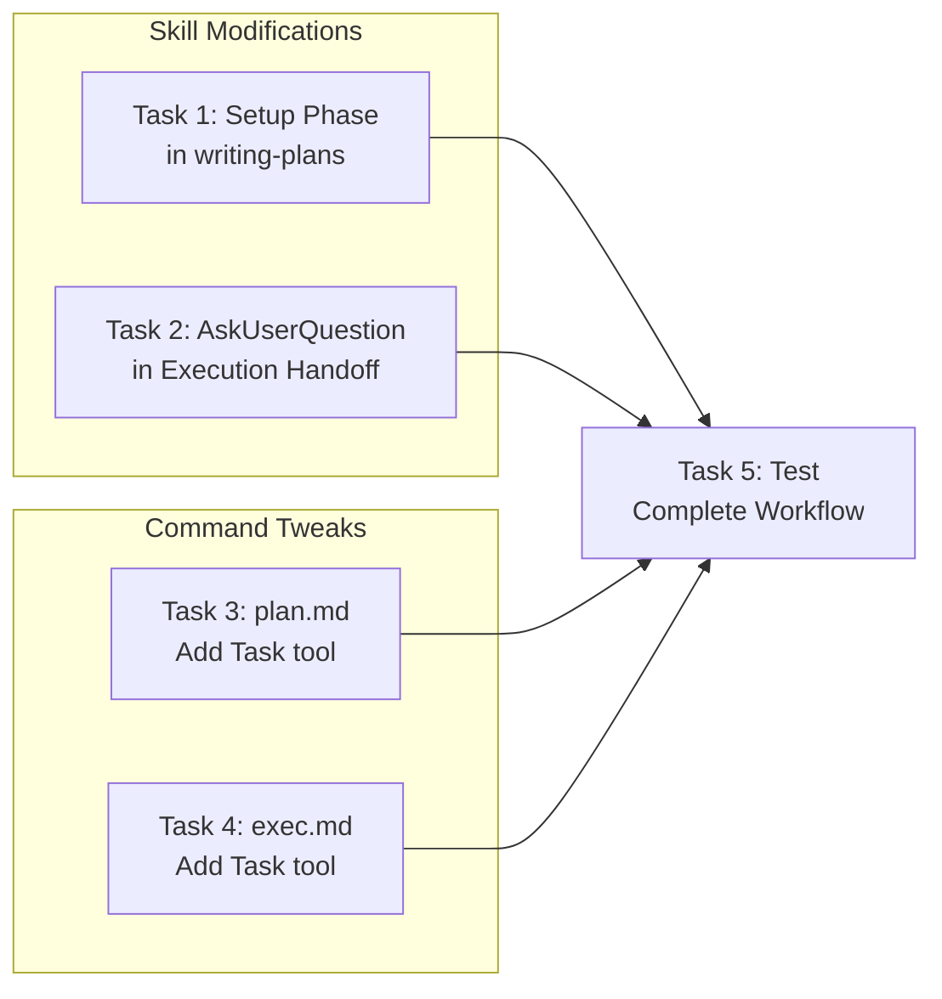

# Super Plugin Workflow Fixes Implementation Plan

> **For Claude:** REQUIRED SUB-SKILL: Use super:executing-plans to implement this plan task-by-task.

**Goal:** Fix the super plugin workflow so it properly asks users at decision points, offers branch/worktree creation when planning, and provides clear entry points.

**Architecture:** Add minimal "Setup Phase" guidance to writing-plans (following progressive disclosure - Claude already knows git/AskUserQuestion). Use AskUserQuestion for execution handoff. Keep commands thin - they delegate to skills.

**Tech Stack:** Markdown skill files, YAML frontmatter

---

## Diagrams

### Task Dependencies Flowchart

**Purpose:** Shows parallel execution opportunities and the convergence point for final testing.



### Workflow Architecture Diagram

**Purpose:** Shows how user entry commands route through skills after fixes.

```mermaid
graph TB
    subgraph "Entry Commands"
        CMD_PLAN[/super:plan]
        CMD_EXEC[/super:exec]
        CMD_BRAIN[/super:brainstorm]
    end

    subgraph "Core Skills"
        SK_BRAIN[brainstorming]
        SK_WRITE[writing-plans]
        SK_EXEC[executing-plans]
    end

    subgraph "Supporting Skills"
        SK_GIT[using-git-worktrees]
        SK_SUB[subagent-driven-development]
        SK_FIN[finishing-a-development-branch]
    end

    CMD_BRAIN --> SK_BRAIN
    CMD_PLAN --> SK_WRITE
    SK_BRAIN -.-> SK_WRITE
    SK_WRITE --> SK_GIT
    SK_WRITE -.-> CMD_EXEC

    CMD_EXEC --> SK_EXEC
    SK_EXEC --> SK_SUB
    SK_EXEC --> SK_FIN
```

| Arrow Type | Meaning |
|------------|---------|
| `-->` | Direct invocation / required flow |
| `-.->` | Optional or conditional flow |

---

## Problems Being Fixed

| Problem | Current Behavior | Fixed Behavior |
|---------|------------------|----------------|
| No branch setup in /super:plan | Skips worktree if not from brainstorm | Minimal guidance to ask and create |
| Plain-text execution choice | "Which approach?" as prose | AskUserQuestion with options |
| No context in plan command | Just "use writing-plans" | Add Task tool for discovery |
| No plan discovery in exec | Expects path, doesn't help | Add Task tool for discovery |

**Removed from original plan:**
- Task 5 (workflow-entry-points skill) - Claude already knows command purposes from descriptions
- Task 6 (brainstorm.md enhancements) - Current version is sufficient

---

### Task 1: Add Minimal Setup Phase to writing-plans

**Files:**
- Modify: `plugins/super/skills/writing-plans/SKILL.md`

**Design rationale:** Per skill-creator principles, Claude already knows git commands and AskUserQuestion. Only add what Claude doesn't know: that this workflow expects workspace isolation decisions.

**Step 1: Read the current file**

Run: `Read plugins/super/skills/writing-plans/SKILL.md`

**Step 2: Add minimal Setup Phase after Overview**

Insert after "Announce at start:" line, before "## Optional: Track Plan Writing Phases":

```markdown

## Setup Phase

Before writing, determine workspace isolation (unless already set by brainstorming skill):

1. Ask about isolation preference (worktree/branch/current)
2. If worktree: **REQUIRED SUB-SKILL:** Use super:using-git-worktrees
3. If new branch: `git checkout -b <branch-name>`
4. Then proceed to plan writing
```

**Step 3: Update context note**

Change line 27 from:
```markdown
**Context:** This should be run in a dedicated worktree (created by brainstorming skill).
```
To:
```markdown
**Context:** Ideally run in a dedicated worktree (created by Setup Phase or brainstorming skill).
```

**Step 4: Verify the edit**

Run: `Read plugins/super/skills/writing-plans/SKILL.md` and verify the new section exists and is minimal (~6 lines).

**Step 5: Commit**

```bash
git add plugins/super/skills/writing-plans/SKILL.md
git commit -m "feat(super): add minimal setup phase to writing-plans"
```

---

### Task 2: Convert Execution Handoff to AskUserQuestion

**Files:**
- Modify: `plugins/super/skills/writing-plans/SKILL.md` (Execution Handoff section)

**Step 1: Locate the Execution Handoff section**

Find lines 172-189 in the current file.

**Step 2: Replace with AskUserQuestion format**

Replace the current execution handoff text (lines 172-189) with:

```markdown
## Execution Handoff

After saving the plan, use AskUserQuestion:

```
Question: "Plan saved. How would you like to proceed?"
Header: "Execute"
Options:
- Subagent-driven: Stay here, dispatch fresh subagent per task with code review
- Parallel session: Open new session to execute with batch checkpoints
- Later: I will handle execution separately
```

**If Subagent-driven:** Use super:subagent-driven-development
**If Parallel session:** Guide to open new session and run `/super:exec`
**If Later:** Report plan location and offer `/super:exec` for later
```

**Step 3: Verify the edit**

Run: `Read plugins/super/skills/writing-plans/SKILL.md` and confirm AskUserQuestion format (~15 lines, down from ~18).

**Step 4: Commit**

```bash
git add plugins/super/skills/writing-plans/SKILL.md
git commit -m "feat(super): convert execution handoff to AskUserQuestion"
```

---

### Task 3: Add Task Tool to plan.md Command

**Files:**
- Modify: `plugins/super/commands/plan.md`

**Design rationale:** Keep command thin. Add Task tool so skill can dispatch explorers for context gathering. Don't embed discovery logic in the command.

**Step 1: Read current file**

Run: `Read plugins/super/commands/plan.md`

**Step 2: Add Task tool to allowed-tools**

Change line 3 from:
```yaml
allowed-tools: Skill, Bash(git:*), Read, Glob, Grep, AskUserQuestion
```
To:
```yaml
allowed-tools: Skill, Bash(git:*), Read, Glob, Grep, AskUserQuestion, Task
```

**Step 3: Verify the edit**

Run: `Read plugins/super/commands/plan.md`

**Step 4: Commit**

```bash
git add plugins/super/commands/plan.md
git commit -m "feat(super): add Task tool to plan command for context gathering"
```

---

### Task 4: Add Task Tool to exec.md Command

**Files:**
- Modify: `plugins/super/commands/exec.md`

**Design rationale:** Keep command thin. Add Task tool so skill can dispatch explorers for plan discovery.

**Step 1: Read current file**

Run: `Read plugins/super/commands/exec.md`

**Step 2: Add Task tool to allowed-tools**

Change line 3 from:
```yaml
allowed-tools: Skill, Bash(git:*), Read, Glob, Grep, AskUserQuestion, TodoWrite
```
To:
```yaml
allowed-tools: Skill, Bash(git:*), Read, Glob, Grep, AskUserQuestion, TodoWrite, Task
```

**Step 3: Verify the edit**

Run: `Read plugins/super/commands/exec.md`

**Step 4: Commit**

```bash
git add plugins/super/commands/exec.md
git commit -m "feat(super): add Task tool to exec command for plan discovery"
```

---

### Task 5: Test the Complete Workflow

**Files:**
- Test all modified files

**Step 1: Verify all files parse correctly**

Check YAML frontmatter is valid in all modified files:

```bash
for f in plugins/super/skills/writing-plans/SKILL.md \
         plugins/super/commands/plan.md \
         plugins/super/commands/exec.md; do
  echo "=== $f ==="
  head -10 "$f"
  echo ""
done
```

**Step 2: Verify skill line count**

Confirm writing-plans stays under 500 lines (skill-creator limit):

```bash
wc -l plugins/super/skills/writing-plans/SKILL.md
```

Expected: ~200 lines (was 190, added ~10)

**Step 3: Verify required sub-skills exist**

Check that all referenced skills exist:

```bash
for skill in brainstorming writing-plans executing-plans using-git-worktrees \
             subagent-driven-development finishing-a-development-branch; do
  if [ -f "plugins/super/skills/$skill/SKILL.md" ]; then
    echo "OK: $skill"
  else
    echo "MISSING: $skill"
  fi
done
```

**Step 4: Report results**

If all checks pass, workflow is ready. If any fail, report specific issues.

---

## Summary of Changes

| File | Change | Lines Added |
|------|--------|-------------|
| `skills/writing-plans/SKILL.md` | Minimal Setup Phase | ~6 |
| `skills/writing-plans/SKILL.md` | AskUserQuestion for Execution Handoff | ~0 (net) |
| `commands/plan.md` | Add Task tool | 1 word |
| `commands/exec.md` | Add Task tool | 1 word |

**Total context overhead:** ~6 lines (vs original plan's ~120 lines)

## What Was Removed

Per skill-creator validation:

| Original Task | Why Removed |
|---------------|-------------|
| Task 5: workflow-entry-points skill | Claude already infers this from command descriptions |
| Task 6: brainstorm.md enhancements | Current version is sufficient |
| Verbose AskUserQuestion templates | Claude knows how to use AskUserQuestion |
| Complex command logic | Commands should delegate to skills, not embed logic |

## Verification

After all tasks complete:
1. Run `/super:plan` - should trigger Setup Phase asking about isolation
2. After plan creation - should see AskUserQuestion for execution choice
3. Run `/super:exec` - should work with Task tool for discovery
