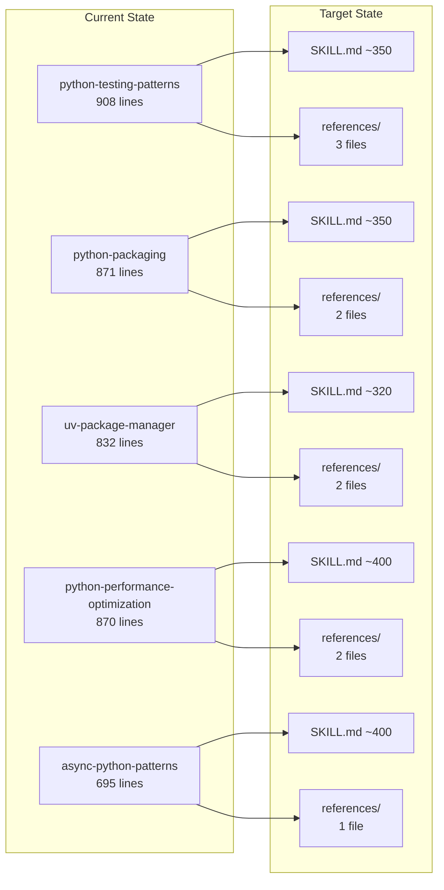
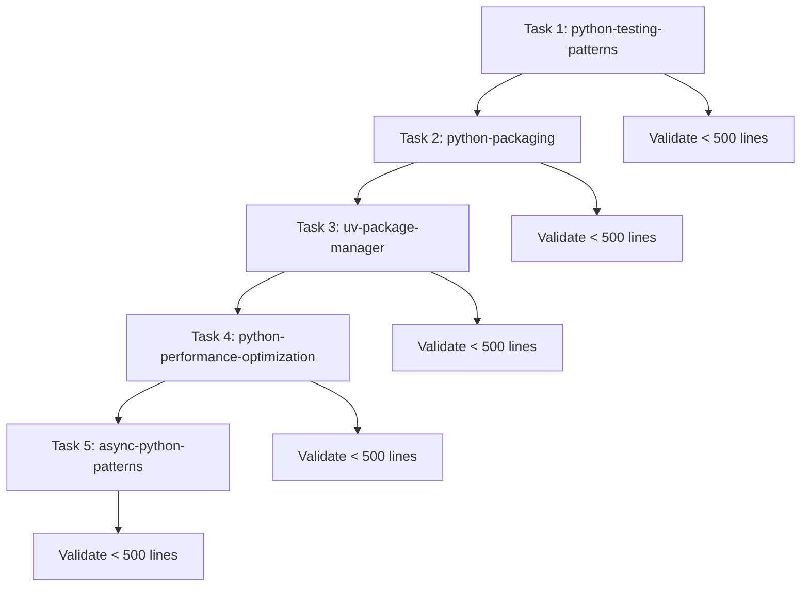

# Dev Plugin Skills Refactoring Implementation Plan

> **For Claude:** REQUIRED SUB-SKILL: Use super:executing-plans to implement this plan task-by-task.

**Goal:** Refactor 5 dev plugin skills to follow skill-creator best practices, reducing them from ~835 avg lines to ~365 avg lines by applying progressive disclosure with reference files.

**Architecture:** Each skill will be trimmed to <500 lines by removing redundant sections (When to Use, Core Concepts, Quick Start) and moving advanced content to `references/` directories. The amazon-writing skill pattern serves as the model.

**Tech Stack:** Markdown files, YAML frontmatter for skill metadata

---

## Diagrams





---

## Validation Checklist (Apply to Each Task)

Before committing each skill:

- [ ] SKILL.md < 500 lines (`wc -l SKILL.md`)
- [ ] No "When to Use This Skill" section in body (triggers in frontmatter description only)
- [ ] No "Core Concepts" section (Claude knows these fundamentals)
- [ ] No trivial "Quick Start" section
- [ ] Reference navigation table present after frontmatter
- [ ] All referenced files exist in `references/`
- [ ] Reference files have table of contents if > 100 lines
- [ ] Frontmatter valid (name, description, allowed-tools)

---

### Task 1: Refactor python-testing-patterns

**Files:**
- Modify: `plugins/dev/skills/python-testing-patterns/SKILL.md` (lines 1-908)
- Create: `plugins/dev/skills/python-testing-patterns/references/advanced-patterns.md`
- Create: `plugins/dev/skills/python-testing-patterns/references/database-testing.md`
- Create: `plugins/dev/skills/python-testing-patterns/references/ci-cd-integration.md`

**Step 1: Create references directory**

Run: `mkdir -p plugins/dev/skills/python-testing-patterns/references`
Expected: Directory created

**Step 2: Create advanced-patterns.md reference file**

Create file `plugins/dev/skills/python-testing-patterns/references/advanced-patterns.md` with content extracted from SKILL.md lines 366-616:

```markdown
# Advanced Testing Patterns

## Table of Contents
- [Pattern 6: Testing Async Code](#pattern-6-testing-async-code)
- [Pattern 7: Monkeypatch for Testing](#pattern-7-monkeypatch-for-testing)
- [Pattern 8: Temporary Files and Directories](#pattern-8-temporary-files-and-directories)
- [Pattern 9: Custom Fixtures and Conftest](#pattern-9-custom-fixtures-and-conftest)
- [Pattern 10: Property-Based Testing](#pattern-10-property-based-testing)

## Pattern 6: Testing Async Code

[Content from lines 368-412]

## Pattern 7: Monkeypatch for Testing

[Content from lines 414-460]

## Pattern 8: Temporary Files and Directories

[Content from lines 462-514]

## Pattern 9: Custom Fixtures and Conftest

[Content from lines 516-570]

## Pattern 10: Property-Based Testing

[Content from lines 572-616]
```

**Step 3: Create database-testing.md reference file**

Create file `plugins/dev/skills/python-testing-patterns/references/database-testing.md` with content from SKILL.md lines 730-801:

```markdown
# Database Testing

Testing database code with SQLAlchemy, in-memory databases, and constraint validation.

## SQLAlchemy Testing Pattern

[Content from lines 732-801 - the full Testing Database Code section]
```

**Step 4: Create ci-cd-integration.md reference file**

Create file `plugins/dev/skills/python-testing-patterns/references/ci-cd-integration.md` with content from SKILL.md lines 803-840:

```markdown
# CI/CD Integration

## GitHub Actions Workflow

[Content from lines 803-840 - the CI/CD Integration section]
```

**Step 5: Rewrite SKILL.md**

Replace SKILL.md with refactored version:

```markdown
---
name: python-testing-patterns
description: Use when writing Python tests, setting up test suites, or implementing testing best practices. Covers pytest, fixtures, mocking, and test-driven development.
allowed-tools: Bash(pytest:*), Read
---

# Python Testing Patterns

Patterns for implementing robust testing in Python using pytest.

## Reference Files

| Topic | When to Load | File |
|-------|--------------|------|
| Async, fixtures, property-based | Complex testing patterns | `references/advanced-patterns.md` |
| SQLAlchemy, in-memory DBs | Database testing | `references/database-testing.md` |
| GitHub Actions, coverage | CI/CD setup | `references/ci-cd-integration.md` |

## Fundamental Patterns

### Pattern 1: Basic pytest Tests

[Keep lines 68-126 - Calculator class and basic tests]

### Pattern 2: Fixtures for Setup and Teardown

[Keep lines 128-202 - Database fixture examples]

### Pattern 3: Parameterized Tests

[Keep lines 204-251 - Parameterized test examples]

### Pattern 4: Mocking with unittest.mock

[Keep lines 253-323 - Mock examples with APIClient]

### Pattern 5: Testing Exceptions

[Keep lines 325-364 - Exception testing examples]

## Test Organization

[Condensed version of lines 618-666 - Test Organization and Test Naming, ~30 lines]

## Test Markers

[Keep lines 670-708 - Markers section]

## Configuration Files

[Keep lines 842-886 - pytest.ini and pyproject.toml config]

## Best Practices Summary

1. Write tests first (TDD) or alongside code
2. One assertion per test when possible
3. Use descriptive test names that explain behavior
4. Keep tests independent and isolated
5. Use fixtures for setup and teardown
6. Mock external dependencies appropriately
7. Parametrize tests to reduce duplication
8. Test edge cases and error conditions
9. Measure coverage but focus on quality
10. Run tests in CI/CD on every commit
```

**Step 6: Verify line count**

Run: `wc -l plugins/dev/skills/python-testing-patterns/SKILL.md`
Expected: Output shows < 500 lines (target ~350)

**Step 7: Verify reference files exist**

Run: `ls -la plugins/dev/skills/python-testing-patterns/references/`
Expected: Shows 3 files: advanced-patterns.md, database-testing.md, ci-cd-integration.md

**Step 8: Commit**

```bash
git add plugins/dev/skills/python-testing-patterns/
git commit -m "refactor(dev): apply progressive disclosure to python-testing-patterns

- Remove redundant When to Use, Core Concepts, Quick Start sections
- Move advanced patterns (async, monkeypatch, property-based) to references/
- Move database testing to references/database-testing.md
- Move CI/CD integration to references/ci-cd-integration.md
- Add reference navigation table
- Reduce from 908 to ~350 lines"
```

---

### Task 2: Refactor python-packaging

**Files:**
- Modify: `plugins/dev/skills/python-packaging/SKILL.md` (lines 1-871)
- Create: `plugins/dev/skills/python-packaging/references/advanced-patterns.md`
- Create: `plugins/dev/skills/python-packaging/references/templates.md`

**Step 1: Create references directory**

Run: `mkdir -p plugins/dev/skills/python-packaging/references`
Expected: Directory created

**Step 2: Create advanced-patterns.md reference file**

Create file `plugins/dev/skills/python-packaging/references/advanced-patterns.md` with content:

```markdown
# Advanced Packaging Patterns

## Table of Contents
- [Pattern 11: Including Data Files](#pattern-11-including-data-files)
- [Pattern 12: Namespace Packages](#pattern-12-namespace-packages)
- [Pattern 13: C Extensions](#pattern-13-c-extensions)
- [Pattern 14: Semantic Versioning](#pattern-14-semantic-versioning)
- [Pattern 15: Git-Based Versioning](#pattern-15-git-based-versioning)
- [Pattern 19: Multi-Architecture Wheels](#pattern-19-multi-architecture-wheels)
- [Pattern 20: Private Package Index](#pattern-20-private-package-index)

## Pattern 11: Including Data Files

[Content from lines 500-530]

## Pattern 12: Namespace Packages

[Content from lines 532-575]

## Pattern 13: C Extensions

[Content from lines 577-604]

## Pattern 14: Semantic Versioning

[Content from lines 606-628]

## Pattern 15: Git-Based Versioning

[Content from lines 630-650]

## Pattern 19: Multi-Architecture Wheels

[Content from lines 739-766]

## Pattern 20: Private Package Index

[Content from lines 768-781]
```

**Step 3: Create templates.md reference file**

Create file `plugins/dev/skills/python-packaging/references/templates.md` with content:

```markdown
# File Templates

## .gitignore for Python Packages

[Content from lines 785-819]

## MANIFEST.in

[Content from lines 821-833]
```

**Step 4: Rewrite SKILL.md**

Replace SKILL.md with refactored version (~350 lines):

```markdown
---
name: python-packaging
description: Use when packaging Python libraries, creating CLI tools, or distributing Python code. Covers proper project structure, pyproject.toml, and publishing to PyPI.
allowed-tools: Bash(uv:*), Bash(python:*), Read, Write
---

# Python Packaging

Modern Python packaging using pyproject.toml and setuptools.

## Reference Files

| Topic | When to Load | File |
|-------|--------------|------|
| Data files, namespace packages, C extensions, versioning | Advanced packaging | `references/advanced-patterns.md` |
| .gitignore, MANIFEST.in | File templates | `references/templates.md` |

## Package Structure Patterns

### Pattern 1: Source Layout (Recommended)

[Keep lines 92-123]

### Pattern 2: Flat Layout

[Keep lines 125-140]

### Pattern 3: Multi-Package Project

[Keep lines 142-155]

## Complete pyproject.toml Examples

### Pattern 4: Full-Featured pyproject.toml

[Keep lines 159-279]

### Pattern 5: Dynamic Versioning

[Keep lines 281-309]

## Command-Line Interface (CLI) Patterns

### Pattern 6: CLI with Click

[Keep lines 311-359]

### Pattern 7: CLI with argparse

[Keep lines 361-406]

## Building and Publishing

### Pattern 8: Build Package Locally

[Keep lines 408-426]

### Pattern 9: Publishing to PyPI

[Keep lines 428-459]

### Pattern 10: Automated Publishing with GitHub Actions

[Keep lines 461-498]

## Testing Installation

### Pattern 16: Editable Install

[Keep lines 652-664]

### Pattern 17: Testing in Isolated Environment

[Keep lines 666-686]

## Checklist for Publishing

[Keep lines 835-849 - Publishing checklist]

## Best Practices Summary

[Keep lines 860-871]
```

**Step 5: Verify line count**

Run: `wc -l plugins/dev/skills/python-packaging/SKILL.md`
Expected: Output shows < 500 lines (target ~350)

**Step 6: Verify reference files exist**

Run: `ls -la plugins/dev/skills/python-packaging/references/`
Expected: Shows 2 files: advanced-patterns.md, templates.md

**Step 7: Commit**

```bash
git add plugins/dev/skills/python-packaging/
git commit -m "refactor(dev): apply progressive disclosure to python-packaging

- Remove redundant When to Use, Core Concepts, Quick Start sections
- Remove README.md Template (Claude can write markdown)
- Move advanced patterns (data files, namespace, C extensions) to references/
- Move file templates to references/templates.md
- Add reference navigation table
- Reduce from 871 to ~350 lines"
```

---

### Task 3: Refactor uv-package-manager

**Files:**
- Modify: `plugins/dev/skills/uv-package-manager/SKILL.md` (lines 1-832)
- Create: `plugins/dev/skills/uv-package-manager/references/advanced-workflows.md`
- Create: `plugins/dev/skills/uv-package-manager/references/migration.md`

**Step 1: Create references directory**

Run: `mkdir -p plugins/dev/skills/uv-package-manager/references`
Expected: Directory created

**Step 2: Create advanced-workflows.md reference file**

Create file `plugins/dev/skills/uv-package-manager/references/advanced-workflows.md` with content:

```markdown
# Advanced UV Workflows

## Table of Contents
- [Pattern 12: Monorepo Support](#pattern-12-monorepo-support)
- [Pattern 13: CI/CD Integration](#pattern-13-cicd-integration)
- [Pattern 14: Docker Integration](#pattern-14-docker-integration)
- [Pattern 15: Lockfile Workflows](#pattern-15-lockfile-workflows)

## Pattern 12: Monorepo Support

[Content from lines 343-366]

## Pattern 13: CI/CD Integration

[Content from lines 368-401]

## Pattern 14: Docker Integration

[Content from lines 403-456]

## Pattern 15: Lockfile Workflows

[Content from lines 458-481]
```

**Step 3: Create migration.md reference file**

Create file `plugins/dev/skills/uv-package-manager/references/migration.md` with content:

```markdown
# Migration Guide

## From pip + requirements.txt

[Content from lines 737-751]

## From Poetry

[Content from lines 753-766]

## From pip-tools

[Content from lines 768-778]
```

**Step 4: Rewrite SKILL.md**

Replace SKILL.md with refactored version (~320 lines):

```markdown
---
name: uv-package-manager
description: Use when setting up Python projects, managing dependencies, or optimizing Python development workflows with uv. Covers fast dependency management, virtual environments, and modern project workflows.
allowed-tools: Bash(uv:*), Read
---

# UV Package Manager

Fast Python package management with uv.

**Installation:** `curl -LsSf https://astral.sh/uv/install.sh | sh`

## Reference Files

| Topic | When to Load | File |
|-------|--------------|------|
| Monorepo, CI/CD, Docker, lockfiles | Advanced workflows | `references/advanced-workflows.md` |
| pip, poetry, pip-tools migration | Migrating to uv | `references/migration.md` |

## Virtual Environment Management

### Pattern 1: Creating Virtual Environments

[Keep lines 115-132]

### Pattern 2: Activating Virtual Environments

[Keep lines 134-149]

### Pattern 3: Using uv run

[Keep lines 151-166]

## Package Management

### Pattern 4: Adding Dependencies

[Keep lines 168-199]

### Pattern 5: Removing Dependencies

[Keep lines 201-212]

### Pattern 6: Upgrading Dependencies

[Keep lines 214-228]

### Pattern 7: Locking Dependencies

[Keep lines 230-244]

## Python Version Management

### Pattern 8: Installing Python Versions

[Keep lines 246-265]

### Pattern 9: Setting Python Version

[Keep lines 267-280]

## Project Configuration

### Pattern 10: pyproject.toml with uv

[Keep lines 282-324]

### Pattern 11: Using uv with Existing Projects

[Keep lines 326-341]

## Performance Optimization

### Pattern 16: Using Global Cache

[Keep lines 483-498]

### Pattern 17: Parallel Installation

[Keep lines 500-510]

### Pattern 18: Offline Mode

[Keep lines 512-520]

## Common Workflows

### Pattern 19: Starting a New Project

[Keep lines 569-596]

### Pattern 20: Maintaining Existing Project

[Keep lines 598-626]

## Tool Integration

### Pattern 21: Pre-commit Hooks

[Keep lines 628-654]

### Pattern 22: VS Code Integration

[Keep lines 656-672]

## Troubleshooting

[Keep lines 674-699]

## Command Reference

[Keep lines 780-811]

## Best Practices Summary

[Keep lines 821-832]
```

**Step 5: Verify line count**

Run: `wc -l plugins/dev/skills/uv-package-manager/SKILL.md`
Expected: Output shows < 500 lines (target ~320)

**Step 6: Verify reference files exist**

Run: `ls -la plugins/dev/skills/uv-package-manager/references/`
Expected: Shows 2 files: advanced-workflows.md, migration.md

**Step 7: Commit**

```bash
git add plugins/dev/skills/uv-package-manager/
git commit -m "refactor(dev): apply progressive disclosure to uv-package-manager

- Remove redundant When to Use, Core Concepts sections
- Remove marketing copy (What is uv?, UV vs Traditional Tools)
- Condense installation to single line
- Move monorepo/CI/CD/Docker workflows to references/
- Move migration guide to references/migration.md
- Add reference navigation table
- Reduce from 832 to ~320 lines"
```

---

### Task 4: Refactor python-performance-optimization

**Files:**
- Modify: `plugins/dev/skills/python-performance-optimization/SKILL.md` (lines 1-870)
- Create: `plugins/dev/skills/python-performance-optimization/references/database-optimization.md`
- Create: `plugins/dev/skills/python-performance-optimization/references/memory-optimization.md`

**Step 1: Create references directory**

Run: `mkdir -p plugins/dev/skills/python-performance-optimization/references`
Expected: Directory created

**Step 2: Create database-optimization.md reference file**

Create file `plugins/dev/skills/python-performance-optimization/references/database-optimization.md` with content:

```markdown
# Database Optimization

## Table of Contents
- [Pattern 16: Batch Database Operations](#pattern-16-batch-database-operations)
- [Pattern 17: Query Optimization](#pattern-17-query-optimization)

## Pattern 16: Batch Database Operations

[Content from lines 605-649]

## Pattern 17: Query Optimization

[Content from lines 651-678]
```

**Step 3: Create memory-optimization.md reference file**

Create file `plugins/dev/skills/python-performance-optimization/references/memory-optimization.md` with content:

```markdown
# Memory Optimization

## Table of Contents
- [Pattern 13: Using __slots__ for Memory](#pattern-13-using-__slots__-for-memory)
- [Pattern 18: Detecting Memory Leaks](#pattern-18-detecting-memory-leaks)
- [Pattern 19: Iterators vs Lists](#pattern-19-iterators-vs-lists)
- [Pattern 20: Weakref for Caches](#pattern-20-weakref-for-caches)

## Pattern 13: Using __slots__ for Memory

[Content from lines 487-521]

## Pattern 18: Detecting Memory Leaks

[Content from lines 680-724]

## Pattern 19: Iterators vs Lists

[Content from lines 726-744]

## Pattern 20: Weakref for Caches

[Content from lines 746-777]
```

**Step 4: Rewrite SKILL.md**

Replace SKILL.md with refactored version (~400 lines):

```markdown
---
name: python-performance-optimization
description: Use when debugging slow Python code, optimizing bottlenecks, or improving application performance. Covers cProfile, memory profilers, and performance best practices.
allowed-tools: Bash(python:*), Bash(cProfile:*), Read
---

# Python Performance Optimization

Profiling and optimizing Python code for better performance.

## Reference Files

| Topic | When to Load | File |
|-------|--------------|------|
| Query optimization, batch operations, connection pooling | Database performance | `references/database-optimization.md` |
| __slots__, memory leaks, generators, weakref | Memory optimization | `references/memory-optimization.md` |

## Profiling Tools

### Pattern 1: cProfile - CPU Profiling

[Keep lines 74-127]

### Pattern 2: line_profiler - Line-by-Line Profiling

[Keep lines 129-169]

### Pattern 3: memory_profiler - Memory Usage

[Keep lines 171-197]

### Pattern 4: py-spy - Production Profiling

[Keep lines 199-215]

## Optimization Patterns

### Pattern 5: List Comprehensions vs Loops

[Keep lines 217-251]

### Pattern 6: Generator Expressions for Memory

[Keep lines 253-276]

### Pattern 7: String Concatenation

[Keep lines 278-309]

### Pattern 8: Dictionary Lookups vs List Searches

[Keep lines 311-344]

### Pattern 9: Local Variable Access

[Keep lines 346-376]

### Pattern 10: Function Call Overhead

[Keep lines 378-407]

## Advanced Optimization

### Pattern 11: NumPy for Numerical Operations

[Keep lines 409-453]

### Pattern 12: Caching with functools.lru_cache

[Keep lines 455-485]

### Pattern 14: Multiprocessing for CPU-Bound Tasks

[Keep lines 523-555]

### Pattern 15: Async I/O for I/O-Bound Tasks

[Keep lines 557-603]

## Benchmarking Tools

### Custom Benchmark Decorator

[Keep lines 779-805]

### Performance Testing with pytest-benchmark

[Keep lines 807-823]

## Best Practices

[Keep lines 825-837]

## Common Pitfalls

[Keep lines 839-847]

## Performance Checklist

[Keep lines 859-870]
```

**Step 5: Verify line count**

Run: `wc -l plugins/dev/skills/python-performance-optimization/SKILL.md`
Expected: Output shows < 500 lines (target ~400)

**Step 6: Verify reference files exist**

Run: `ls -la plugins/dev/skills/python-performance-optimization/references/`
Expected: Shows 2 files: database-optimization.md, memory-optimization.md

**Step 7: Commit**

```bash
git add plugins/dev/skills/python-performance-optimization/
git commit -m "refactor(dev): apply progressive disclosure to python-performance-optimization

- Remove redundant When to Use, Core Concepts, Quick Start sections
- Move database optimization patterns to references/
- Move memory optimization (__slots__, weakref, leaks) to references/
- Add reference navigation table
- Reduce from 870 to ~400 lines"
```

---

### Task 5: Refactor async-python-patterns

**Files:**
- Modify: `plugins/dev/skills/async-python-patterns/SKILL.md` (lines 1-695)
- Create: `plugins/dev/skills/async-python-patterns/references/real-world-examples.md`

**Step 1: Create references directory**

Run: `mkdir -p plugins/dev/skills/async-python-patterns/references`
Expected: Directory created

**Step 2: Create real-world-examples.md reference file**

Create file `plugins/dev/skills/async-python-patterns/references/real-world-examples.md` with content:

```markdown
# Real-World Async Examples

## Table of Contents
- [Web Scraping with aiohttp](#web-scraping-with-aiohttp)
- [Async Database Operations](#async-database-operations)
- [WebSocket Server](#websocket-server)

## Web Scraping with aiohttp

[Content from lines 399-438]

## Async Database Operations

[Content from lines 440-480]

## WebSocket Server

[Content from lines 482-540]
```

**Step 3: Rewrite SKILL.md**

Replace SKILL.md with refactored version (~400 lines):

```markdown
---
name: async-python-patterns
description: Use when building async APIs, concurrent systems, or I/O-bound applications requiring non-blocking operations. Covers asyncio, concurrent programming, and async/await patterns.
allowed-tools: Bash(python:*), Read, Write
---

# Async Python Patterns

Asynchronous Python programming with asyncio.

## Reference Files

| Topic | When to Load | File |
|-------|--------------|------|
| aiohttp scraping, async database, WebSocket | Practical applications | `references/real-world-examples.md` |

## Fundamental Patterns

### Pattern 1: Basic Async/Await

[Keep lines 69-86]

### Pattern 2: Concurrent Execution with gather()

[Keep lines 88-111]

### Pattern 3: Task Creation and Management

[Keep lines 113-141]

### Pattern 4: Error Handling in Async Code

[Keep lines 143-177]

### Pattern 5: Timeout Handling

[Keep lines 179-198]

## Advanced Patterns

### Pattern 6: Async Context Managers

[Keep lines 200-234]

### Pattern 7: Async Iterators and Generators

[Keep lines 236-268]

### Pattern 8: Producer-Consumer Pattern

[Keep lines 270-324]

### Pattern 9: Semaphore for Rate Limiting

[Keep lines 326-352]

### Pattern 10: Async Locks and Synchronization

[Keep lines 354-395]

## Performance Best Practices

### 1. Use Connection Pools

[Keep lines 542-558]

### 2. Batch Operations

[Keep lines 560-576]

### 3. Avoid Blocking Operations

[Keep lines 578-602]

## Common Pitfalls

### 1. Forgetting await

[Keep lines 604-613]

### 2. Blocking the Event Loop

[Keep lines 615-627]

### 3. Not Handling Cancellation

[Keep lines 629-642]

### 4. Mixing Sync and Async Code

[Keep lines 644-655]

## Testing Async Code

[Keep lines 657-674]

## Best Practices Summary

[Keep lines 684-695]
```

**Step 4: Verify line count**

Run: `wc -l plugins/dev/skills/async-python-patterns/SKILL.md`
Expected: Output shows < 500 lines (target ~400)

**Step 5: Verify reference files exist**

Run: `ls -la plugins/dev/skills/async-python-patterns/references/`
Expected: Shows 1 file: real-world-examples.md

**Step 6: Commit**

```bash
git add plugins/dev/skills/async-python-patterns/
git commit -m "refactor(dev): apply progressive disclosure to async-python-patterns

- Remove redundant When to Use, Core Concepts, Quick Start sections
- Move real-world examples (scraping, database, WebSocket) to references/
- Add reference navigation table
- Reduce from 695 to ~400 lines"
```

---

## Final Validation

After all 5 tasks complete:

**Step 1: Run line count validation**

Run: `wc -l plugins/dev/skills/*/SKILL.md`
Expected: All files < 500 lines

**Step 2: Verify all reference files exist**

Run: `find plugins/dev/skills -name "references" -type d -exec ls {} \;`
Expected: 10 total reference files across 5 skills

**Step 3: Run plugin validation**

Run: `./scripts/validate-plugins.sh`
Expected: All plugins valid

**Step 4: Final commit (if needed)**

Only if any cleanup required after validation.

---

## Target Metrics Summary

| Skill | Before | After | Reference Files |
|-------|--------|-------|-----------------|
| python-testing-patterns | 908 | ~350 | 3 |
| python-packaging | 871 | ~350 | 2 |
| uv-package-manager | 832 | ~320 | 2 |
| python-performance-optimization | 870 | ~400 | 2 |
| async-python-patterns | 695 | ~400 | 1 |
| **Total** | **4,176** | **~1,820** | **10** |

**Overall reduction: 56%**
