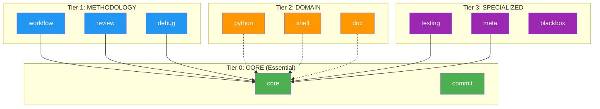
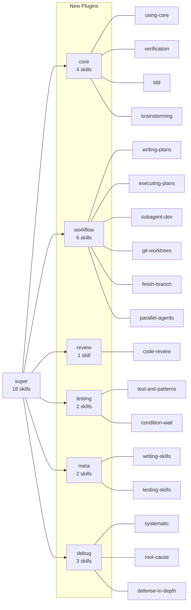
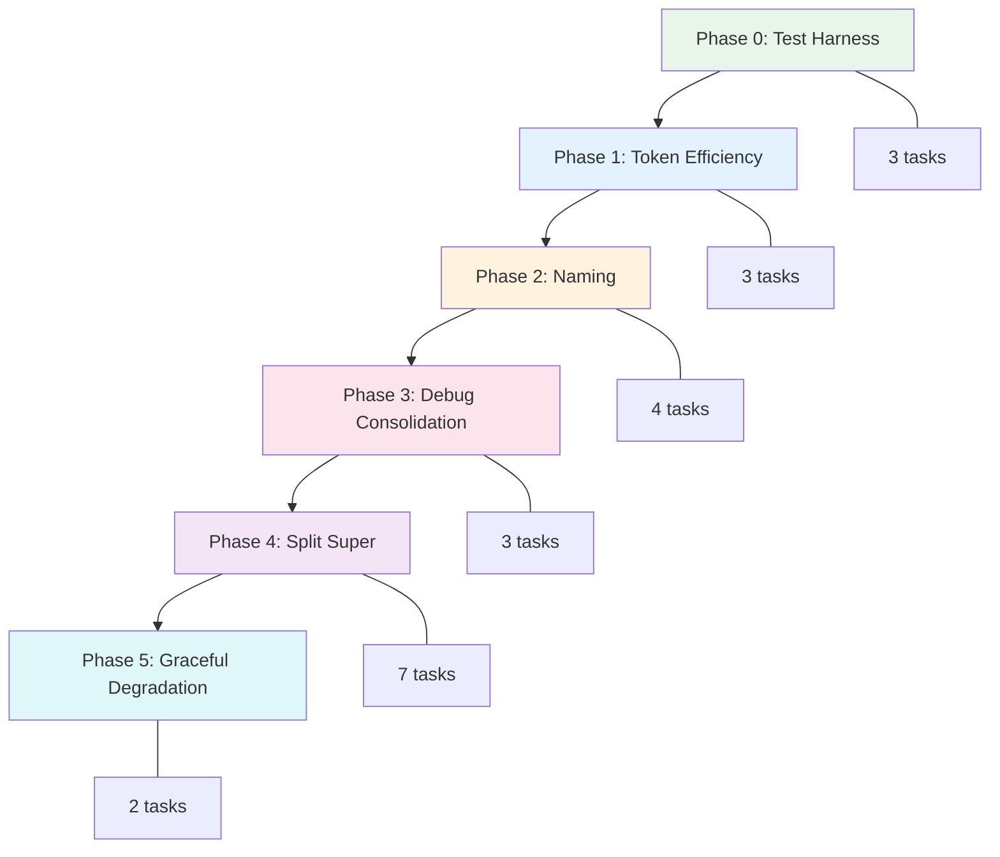

# Streamline dot-claude Plugins Structure Implementation Plan

> **For Claude:** REQUIRED SUB-SKILL: Use super:executing-plans to implement this plan task-by-task.
> **Python Skills:** Reference python:python-testing-patterns for tests, python:uv-package-manager for commands.

**Goal:** Restructure dot-claude plugins from an overloaded `super` plugin into a three-tier architecture with focused, modular plugins that support progressive disclosure.

**Architecture:** Split `super` (18 skills) into `core` (essential), `workflow` (planning/execution), `review` (code review), `testing` (test patterns), and `meta` (plugin development). Consolidate debugging skills from `super` into `debug` plugin. Reduce verbose agents through extraction and delegation.

**Tech Stack:** Python 3.12+, pytest, Claude Code plugin system (plugin.json, SKILL.md, hooks.json)

**Commands:** All Python commands use `uv run` prefix

---

## Diagrams

### Three-Tier Architecture



### Super Plugin Decomposition



### Phase Execution Flow



---

## Phase 0: Test Harness (Before Any Changes)

### Task 0.1: Create Test Directory Structure

**Files:**
- Create: `tests/conftest.py`
- Create: `tests/test_plugin_structure.py`

**Step 1: Write the conftest.py with shared fixtures**

```python
# tests/conftest.py
"""Shared fixtures for plugin structure tests."""

from __future__ import annotations

import json
from pathlib import Path
from typing import Any, Generator

import pytest


@pytest.fixture(scope="session")
def repo_root() -> Path:
    """Return the repository root directory."""
    return Path(__file__).resolve().parent.parent


@pytest.fixture(scope="session")
def plugins_dir(repo_root: Path) -> Path:
    """Return the plugins directory."""
    return repo_root / "plugins"


@pytest.fixture(scope="session")
def marketplace_data(repo_root: Path) -> dict[str, Any]:
    """Load and return marketplace.json data."""
    marketplace_path = repo_root / ".claude-plugin" / "marketplace.json"
    return json.loads(marketplace_path.read_text())


@pytest.fixture
def all_skills(plugins_dir: Path) -> list[dict[str, Any]]:
    """Return all skills with their metadata."""
    skills = []
    for skill_md in plugins_dir.rglob("**/SKILL.md"):
        content = skill_md.read_text()
        # Parse YAML frontmatter
        if content.startswith("---"):
            _, frontmatter, _ = content.split("---", 2)
            import yaml
            metadata = yaml.safe_load(frontmatter)
            if metadata:
                metadata["path"] = skill_md
                metadata["plugin"] = skill_md.parent.parent.parent.name
                skills.append(metadata)
    return skills


@pytest.fixture
def all_agents(plugins_dir: Path) -> list[Path]:
    """Return all agent markdown files."""
    return list(plugins_dir.rglob("**/agents/*.md"))


def count_lines(file_path: Path) -> int:
    """Count non-empty lines in a file."""
    return len([line for line in file_path.read_text().splitlines() if line.strip()])


def skill_exists(plugins_dir: Path, qualified_name: str) -> bool:
    """Check if a skill exists by qualified name (plugin:skill)."""
    if ":" not in qualified_name:
        return False
    plugin, skill = qualified_name.split(":", 1)
    skill_path = plugins_dir / plugin / "skills" / skill / "SKILL.md"
    return skill_path.exists()


def plugin_exists(plugins_dir: Path, plugin_name: str) -> bool:
    """Check if a plugin exists."""
    plugin_path = plugins_dir / plugin_name / ".claude-plugin" / "plugin.json"
    return plugin_path.exists()
```

**Step 2: Run to verify fixtures work**

Run: `uv run pytest tests/conftest.py --collect-only`
Expected: Collection succeeds with no errors

**Step 3: Commit**

```bash
git add tests/conftest.py
git commit -m "test: add conftest.py with shared fixtures for plugin structure tests"
```

---

### Task 0.2: Create Baseline Validation Tests

**Files:**
- Create: `tests/test_plugin_structure.py`

**Step 1: Write failing tests for current structure**

```python
# tests/test_plugin_structure.py
"""Tests for plugin structure validation."""

from __future__ import annotations

import subprocess
from pathlib import Path
from typing import Any

import pytest

from conftest import count_lines, plugin_exists, skill_exists


class TestPluginValidation:
    """Tests that all plugins pass claude plugin validate."""

    def test_all_plugins_validate(self, plugins_dir: Path) -> None:
        """All plugins should pass claude plugin validate."""
        for plugin_path in plugins_dir.iterdir():
            if plugin_path.is_dir():
                result = subprocess.run(
                    ["claude", "plugin", "validate", str(plugin_path)],
                    capture_output=True,
                )
                assert result.returncode == 0, f"Plugin {plugin_path.name} failed validation"


class TestSkillMetadata:
    """Tests for skill YAML frontmatter."""

    def test_all_skills_have_name(self, all_skills: list[dict[str, Any]]) -> None:
        """All skills must have a name in frontmatter."""
        for skill in all_skills:
            assert "name" in skill, f"Skill at {skill.get('path')} missing name"

    def test_all_skills_have_description(self, all_skills: list[dict[str, Any]]) -> None:
        """All skills must have a description in frontmatter."""
        for skill in all_skills:
            assert "description" in skill, f"Skill {skill.get('name')} missing description"


class TestCrossReferences:
    """Tests for cross-plugin reference integrity."""

    def test_super_skill_references_exist(self, plugins_dir: Path) -> None:
        """All super:* references should point to existing skills."""
        import re

        super_refs = set()
        for md_file in plugins_dir.rglob("*.md"):
            content = md_file.read_text()
            # Match super:skill-name patterns
            refs = re.findall(r"super:([a-z0-9-]+)", content)
            super_refs.update(refs)

        for ref in super_refs:
            assert skill_exists(plugins_dir, f"super:{ref}"), f"Reference super:{ref} not found"

    def test_python_skill_references_exist(self, plugins_dir: Path) -> None:
        """All python:* references should point to existing skills."""
        import re

        python_refs = set()
        for md_file in plugins_dir.rglob("*.md"):
            content = md_file.read_text()
            refs = re.findall(r"python:([a-z0-9-]+)", content)
            python_refs.update(refs)

        for ref in python_refs:
            assert skill_exists(plugins_dir, f"python:{ref}"), f"Reference python:{ref} not found"


class TestCurrentState:
    """Tests documenting current state (baseline)."""

    def test_super_plugin_exists(self, plugins_dir: Path) -> None:
        """Super plugin should exist in current state."""
        assert plugin_exists(plugins_dir, "super")

    def test_super_has_expected_skill_count(self, all_skills: list[dict[str, Any]]) -> None:
        """Super should have 18 skills in current state."""
        super_skills = [s for s in all_skills if s.get("plugin") == "super"]
        assert len(super_skills) == 18, f"Expected 18 super skills, found {len(super_skills)}"

    def test_debug_plugin_exists(self, plugins_dir: Path) -> None:
        """Debug plugin should exist."""
        assert plugin_exists(plugins_dir, "debug")
```

**Step 2: Run tests to verify baseline passes**

Run: `uv run pytest tests/test_plugin_structure.py -v`
Expected: All tests PASS (documenting current state)

**Step 3: Commit**

```bash
git add tests/test_plugin_structure.py
git commit -m "test: add baseline plugin structure tests"
```

---

### Task 0.3: Add PyYAML Dependency

**Files:**
- Modify: `pyproject.toml`

**Step 1: Add pyyaml to dev dependencies**

```toml
[dependency-groups]
dev = [
    "pre-commit>=4.5.0",
    "pytest>=8.0.0",
    "pyyaml>=6.0.0",
]
```

**Step 2: Sync dependencies**

Run: `uv sync`
Expected: Dependencies installed successfully

**Step 3: Run tests to verify**

Run: `uv run pytest tests/ -v`
Expected: All tests PASS

**Step 4: Commit**

```bash
git add pyproject.toml uv.lock
git commit -m "build: add pytest and pyyaml to dev dependencies"
```

---

## Phase 1: Token Efficiency (No Breaking Changes)

### Task 1.1: Extract Mermaid Syntax Reference

**Files:**
- Create: `plugins/doc/agents/references/mermaid-syntax.md`
- Modify: `plugins/doc/agents/mermaid-expert.md`

**Step 1: Write test for extraction**

Add to `tests/test_plugin_structure.py`:

```python
class TestPhase1TokenEfficiency:
    """Tests for Phase 1: Token efficiency improvements."""

    def test_mermaid_expert_under_100_lines(self, plugins_dir: Path) -> None:
        """Mermaid expert agent should be <100 lines after extraction."""
        agent_path = plugins_dir / "doc" / "agents" / "mermaid-expert.md"
        lines = count_lines(agent_path)
        assert lines < 100, f"mermaid-expert.md has {lines} lines, expected <100"

    def test_mermaid_reference_exists(self, plugins_dir: Path) -> None:
        """Mermaid syntax reference file should exist."""
        ref_path = plugins_dir / "doc" / "agents" / "references" / "mermaid-syntax.md"
        assert ref_path.exists(), "mermaid-syntax.md reference not found"
```

**Step 2: Run test to see it fail**

Run: `uv run pytest tests/test_plugin_structure.py::TestPhase1TokenEfficiency -v`
Expected: FAIL (mermaid-expert.md has 451 lines)

**Step 3: Read the mermaid-expert.md file**

Read the file to understand what to extract.

**Step 4: Create references directory and extract syntax**

Create `plugins/doc/agents/references/mermaid-syntax.md` with the syntax reference content extracted from mermaid-expert.md.

**Step 5: Trim mermaid-expert.md**

Keep only:
- Role definition
- When to use
- Core workflow steps
- Reference to the extracted file

Target structure:
```markdown
# Mermaid Diagram Expert

[Role and capabilities - 10 lines]

## When to Use
[Trigger conditions - 5 lines]

## Workflow
[Core steps - 20 lines]

## Syntax Reference
Load `references/mermaid-syntax.md` for detailed syntax when needed.

## Best Practices
[Key guidelines - 15 lines]
```

**Step 6: Run test to verify it passes**

Run: `uv run pytest tests/test_plugin_structure.py::TestPhase1TokenEfficiency::test_mermaid_expert_under_100_lines -v`
Expected: PASS

**Step 7: Commit**

```bash
git add plugins/doc/agents/references/mermaid-syntax.md plugins/doc/agents/mermaid-expert.md
git commit -m "refactor(doc): extract mermaid syntax to reference file"
```

---

### Task 1.2: Trim DevOps Troubleshooter

**Files:**
- Modify: `plugins/debug/agents/devops-troubleshooter.md`

**Step 1: Write test**

Add to `tests/test_plugin_structure.py`:

```python
    def test_devops_troubleshooter_under_80_lines(self, plugins_dir: Path) -> None:
        """DevOps troubleshooter should be <80 lines after trimming."""
        agent_path = plugins_dir / "debug" / "agents" / "devops-troubleshooter.md"
        lines = count_lines(agent_path)
        assert lines < 80, f"devops-troubleshooter.md has {lines} lines, expected <80"
```

**Step 2: Run test to see it fail**

Run: `uv run pytest tests/test_plugin_structure.py::TestPhase1TokenEfficiency::test_devops_troubleshooter_under_80_lines -v`
Expected: FAIL (181 lines)

**Step 3: Read and analyze current content**

Read `plugins/debug/agents/devops-troubleshooter.md` to identify:
- Exhaustive tool lists (remove)
- Redundant examples (consolidate)
- Verbose explanations (summarize)

**Step 4: Trim the agent**

Keep:
- Core role definition
- Key workflows (condensed)
- Essential tool references (not exhaustive lists)

**Step 5: Run test to verify**

Run: `uv run pytest tests/test_plugin_structure.py::TestPhase1TokenEfficiency::test_devops_troubleshooter_under_80_lines -v`
Expected: PASS

**Step 6: Commit**

```bash
git add plugins/debug/agents/devops-troubleshooter.md
git commit -m "refactor(debug): trim devops-troubleshooter agent"
```

---

### Task 1.3: Simplify Diagram Generator via Delegation

**Files:**
- Modify: `plugins/super/agents/diagram-generator.md`

**Step 1: Write test**

Add to `tests/test_plugin_structure.py`:

```python
    def test_diagram_generator_under_50_lines(self, plugins_dir: Path) -> None:
        """Diagram generator should delegate to mermaid-expert."""
        agent_path = plugins_dir / "super" / "agents" / "diagram-generator.md"
        lines = count_lines(agent_path)
        assert lines < 50, f"diagram-generator.md has {lines} lines, expected <50"

    def test_diagram_generator_delegates(self, plugins_dir: Path) -> None:
        """Diagram generator should reference mermaid-expert."""
        agent_path = plugins_dir / "super" / "agents" / "diagram-generator.md"
        content = agent_path.read_text()
        assert "mermaid-expert" in content.lower() or "doc:" in content
```

**Step 2: Run tests to see failure**

Run: `uv run pytest tests/test_plugin_structure.py::TestPhase1TokenEfficiency::test_diagram_generator_under_50_lines -v`
Expected: FAIL (336 lines)

**Step 3: Rewrite diagram-generator.md**

New content should:
- Define role as "orchestrator"
- Delegate Mermaid syntax details to `doc:mermaid-expert`
- Keep only diagram type selection logic

**Step 4: Run tests to verify**

Run: `uv run pytest tests/test_plugin_structure.py::TestPhase1TokenEfficiency -v`
Expected: All PASS

**Step 5: Commit**

```bash
git add plugins/super/agents/diagram-generator.md
git commit -m "refactor(super): simplify diagram-generator to delegate to mermaid-expert"
```

---

## Phase 2: Naming Improvements

### Task 2.1: Add Skill Name Length Test

**Files:**
- Modify: `tests/test_plugin_structure.py`

**Step 1: Write test for skill name length**

```python
class TestPhase2Naming:
    """Tests for Phase 2: Naming improvements."""

    def test_skill_names_are_concise(self, all_skills: list[dict[str, Any]]) -> None:
        """No skill name should exceed 20 characters."""
        long_names = []
        for skill in all_skills:
            name = skill.get("name", "")
            if len(name) > 20:
                long_names.append(f"{name} ({len(name)} chars)")
        assert not long_names, f"Skills with names >20 chars: {long_names}"
```

**Step 2: Run test to see current state**

Run: `uv run pytest tests/test_plugin_structure.py::TestPhase2Naming::test_skill_names_are_concise -v`
Expected: FAIL (lists skills exceeding 20 chars)

**Step 3: Commit test**

```bash
git add tests/test_plugin_structure.py
git commit -m "test: add skill name length validation"
```

---

### Task 2.2: Rename Verbose Skills

**Files:**
- Rename directories and update SKILL.md frontmatter for each:

| Current | New |
|---------|-----|
| `verification-before-completion` | `verification` |
| `finishing-a-development-branch` | `finish-branch` |
| `dispatching-parallel-agents` | `parallel-agents` |
| `subagent-driven-development` | `subagent-dev` |
| `condition-based-waiting` | `condition-wait` |
| `testing-anti-patterns` | `test-anti-patterns` |
| `testing-skills-with-subagents` | `testing-skills` |

**Step 1: Rename first skill directory**

```bash
cd /Users/pedroproenca/Documents/Projects/dot-claude/plugins/super/skills
mv verification-before-completion verification
```

**Step 2: Update SKILL.md frontmatter**

Edit `plugins/super/skills/verification/SKILL.md`:
- Change `name: verification-before-completion` to `name: verification`

**Step 3: Repeat for each skill**

Do Steps 1-2 for each skill in the table above.

**Step 4: Run tests**

Run: `uv run pytest tests/test_plugin_structure.py::TestPhase2Naming -v`
Expected: PASS

**Step 5: Commit**

```bash
git add plugins/super/skills/
git commit -m "refactor(super): rename verbose skill names to be concise"
```

---

### Task 2.3: Update Cross-References

**Files:**
- All files referencing renamed skills

**Step 1: Find all references to old names**

```bash
grep -r "verification-before-completion" plugins/ --include="*.md"
grep -r "finishing-a-development-branch" plugins/ --include="*.md"
# ... repeat for each renamed skill
```

**Step 2: Update each reference**

For each file found, update the reference to use the new name.

**Step 3: Run cross-reference tests**

Run: `uv run pytest tests/test_plugin_structure.py::TestCrossReferences -v`
Expected: PASS

**Step 4: Commit**

```bash
git add -u
git commit -m "refactor: update cross-references to use new skill names"
```

---

### Task 2.4: Add Description Pattern Test

**Files:**
- Modify: `tests/test_plugin_structure.py`

**Step 1: Write test for "Use when" pattern**

```python
    def test_descriptions_use_when_pattern(self, all_skills: list[dict[str, Any]]) -> None:
        """All descriptions should start with 'Use when'."""
        non_compliant = []
        for skill in all_skills:
            desc = skill.get("description", "")
            if not desc.lower().startswith("use when"):
                non_compliant.append(f"{skill.get('name')}: {desc[:50]}...")
        assert not non_compliant, f"Skills not starting with 'Use when': {non_compliant}"
```

**Step 2: Run test to identify non-compliant skills**

Run: `uv run pytest tests/test_plugin_structure.py::TestPhase2Naming::test_descriptions_use_when_pattern -v`
Expected: FAIL (lists non-compliant skills)

**Step 3: Fix non-compliant descriptions**

Update each non-compliant skill's description to start with "Use when".

**Step 4: Run test to verify**

Run: `uv run pytest tests/test_plugin_structure.py::TestPhase2Naming -v`
Expected: All PASS

**Step 5: Commit**

```bash
git add -u
git commit -m "docs: update skill descriptions to use 'Use when' pattern"
```

---

## Phase 3: Consolidate Debugging

### Task 3.1: Create Debug Skills Directory Structure

**Files:**
- Create: `plugins/debug/skills/systematic/SKILL.md`
- Create: `plugins/debug/skills/root-cause/SKILL.md`
- Create: `plugins/debug/skills/defense-in-depth/SKILL.md`

**Step 1: Write test for debugging skills in debug plugin**

Add to `tests/test_plugin_structure.py`:

```python
class TestPhase3Debugging:
    """Tests for Phase 3: Consolidate debugging."""

    def test_debugging_skills_in_debug_plugin(self, plugins_dir: Path) -> None:
        """All debugging skills should be in debug plugin."""
        debug_skills = ["systematic", "root-cause", "defense-in-depth"]
        for skill in debug_skills:
            assert skill_exists(plugins_dir, f"debug:{skill}"), f"debug:{skill} not found"

    def test_super_no_debugging_skills(self, plugins_dir: Path) -> None:
        """Super should not have debugging skills after move."""
        old_skills = ["systematic-debugging", "root-cause-tracing", "defense-in-depth"]
        for skill in old_skills:
            assert not skill_exists(plugins_dir, f"super:{skill}"), f"super:{skill} should be removed"
```

**Step 2: Run test to see failure**

Run: `uv run pytest tests/test_plugin_structure.py::TestPhase3Debugging -v`
Expected: FAIL (skills not in debug plugin yet)

**Step 3: Create debug skills directory**

```bash
mkdir -p plugins/debug/skills/systematic
mkdir -p plugins/debug/skills/root-cause
mkdir -p plugins/debug/skills/defense-in-depth
```

**Step 4: Move systematic-debugging skill**

```bash
cp plugins/super/skills/systematic-debugging/SKILL.md plugins/debug/skills/systematic/SKILL.md
```

Edit `plugins/debug/skills/systematic/SKILL.md`:
- Change `name: systematic-debugging` to `name: systematic`
- Update any internal references

**Step 5: Move root-cause-tracing skill**

```bash
cp plugins/super/skills/root-cause-tracing/SKILL.md plugins/debug/skills/root-cause/SKILL.md
```

Edit `plugins/debug/skills/root-cause/SKILL.md`:
- Change `name: root-cause-tracing` to `name: root-cause`

**Step 6: Move defense-in-depth skill**

```bash
cp plugins/super/skills/defense-in-depth/SKILL.md plugins/debug/skills/defense-in-depth/SKILL.md
```

Edit `plugins/debug/skills/defense-in-depth/SKILL.md`:
- Keep name as `defense-in-depth`

**Step 7: Run first test to verify skills exist**

Run: `uv run pytest tests/test_plugin_structure.py::TestPhase3Debugging::test_debugging_skills_in_debug_plugin -v`
Expected: PASS

**Step 8: Commit move (before deletion)**

```bash
git add plugins/debug/skills/
git commit -m "feat(debug): add debugging skills (moved from super)"
```

---

### Task 3.2: Remove Old Debugging Skills from Super

**Files:**
- Remove: `plugins/super/skills/systematic-debugging/`
- Remove: `plugins/super/skills/root-cause-tracing/`
- Remove: `plugins/super/skills/defense-in-depth/`

**Step 1: Remove old skill directories**

```bash
rm -rf plugins/super/skills/systematic-debugging
rm -rf plugins/super/skills/root-cause-tracing
rm -rf plugins/super/skills/defense-in-depth
```

**Step 2: Run test to verify removal**

Run: `uv run pytest tests/test_plugin_structure.py::TestPhase3Debugging -v`
Expected: All PASS

**Step 3: Commit deletion**

```bash
git add -u
git commit -m "refactor(super): remove debugging skills (moved to debug plugin)"
```

---

### Task 3.3: Update Cross-References for Debug Skills

**Files:**
- Modify: `plugins/python/agents/python-expert.md`
- Modify: `plugins/super/skills/writing-plans/SKILL.md`
- Any other files referencing old skill names

**Step 1: Find all references**

```bash
grep -r "super:systematic-debugging" plugins/ --include="*.md"
grep -r "super:root-cause-tracing" plugins/ --include="*.md"
grep -r "super:defense-in-depth" plugins/ --include="*.md"
```

**Step 2: Update references**

Change:
- `super:systematic-debugging` → `debug:systematic`
- `super:root-cause-tracing` → `debug:root-cause`
- `super:defense-in-depth` → `debug:defense-in-depth`

**Step 3: Run cross-reference tests**

Run: `uv run pytest tests/test_plugin_structure.py::TestCrossReferences -v`
Expected: PASS

**Step 4: Run plugin validation**

Run: `python3 scripts/validate-plugins.py`
Expected: All validations passed

**Step 5: Commit**

```bash
git add -u
git commit -m "refactor: update references to use debug:* skill names"
```

---

## Phase 4: Split Super Plugin

### Task 4.1: Create Core Plugin

**Files:**
- Create: `plugins/core/.claude-plugin/plugin.json`
- Move skills: `using-superpowers` → `using-core`, `verification`, `tdd`, `brainstorming`
- Move hooks: SessionStart and Stop hooks
- Move command: `context.md`

**Step 1: Write test for core plugin**

Add to `tests/test_plugin_structure.py`:

```python
class TestPhase4SplitSuper:
    """Tests for Phase 4: Split super plugin."""

    def test_core_plugin_exists(self, plugins_dir: Path) -> None:
        """Core plugin should exist."""
        assert plugin_exists(plugins_dir, "core")

    def test_core_has_essential_skills(self, plugins_dir: Path) -> None:
        """Core should have essential skills."""
        essential = ["using-core", "verification", "tdd", "brainstorming"]
        for skill in essential:
            assert skill_exists(plugins_dir, f"core:{skill}"), f"core:{skill} not found"
```

**Step 2: Run test to see failure**

Run: `uv run pytest tests/test_plugin_structure.py::TestPhase4SplitSuper::test_core_plugin_exists -v`
Expected: FAIL (core plugin doesn't exist)

**Step 3: Create core plugin directory structure**

```bash
mkdir -p plugins/core/.claude-plugin
mkdir -p plugins/core/skills/using-core
mkdir -p plugins/core/skills/verification
mkdir -p plugins/core/skills/tdd
mkdir -p plugins/core/skills/brainstorming
mkdir -p plugins/core/hooks
mkdir -p plugins/core/commands
```

**Step 4: Create plugin.json**

```json
{
  "name": "core",
  "version": "1.0.0",
  "description": "Core workflows: TDD, verification, brainstorming - essential capabilities always loaded"
}
```

**Step 5: Move using-superpowers → using-core**

```bash
cp plugins/super/skills/using-superpowers/SKILL.md plugins/core/skills/using-core/SKILL.md
```

Edit to rename skill to `using-core`.

**Step 6: Move verification skill**

```bash
cp plugins/super/skills/verification/SKILL.md plugins/core/skills/verification/SKILL.md
```

**Step 7: Move tdd skill (renamed from test-driven-development)**

```bash
cp plugins/super/skills/test-driven-development/SKILL.md plugins/core/skills/tdd/SKILL.md
```

Edit to rename skill to `tdd`.

**Step 8: Move brainstorming skill**

```bash
cp plugins/super/skills/brainstorming/SKILL.md plugins/core/skills/brainstorming/SKILL.md
```

**Step 9: Move context.md command**

```bash
cp plugins/super/commands/context.md plugins/core/commands/context.md
```

**Step 10: Move relevant hooks**

Copy SessionStart and Stop hooks from `plugins/super/hooks/` to `plugins/core/hooks/`.

**Step 11: Run tests**

Run: `uv run pytest tests/test_plugin_structure.py::TestPhase4SplitSuper -v`
Expected: PASS

**Step 12: Commit**

```bash
git add plugins/core/
git commit -m "feat: create core plugin with essential skills"
```

---

### Task 4.2: Create Workflow Plugin

**Files:**
- Create: `plugins/workflow/.claude-plugin/plugin.json`
- Move skills: `writing-plans`, `executing-plans`, `subagent-dev`, `git-worktrees`, `finish-branch`, `parallel-agents`
- Move commands: `plan.md`, `exec.md`, `brainstorm.md`, `notes.md`

**Step 1: Write test**

```python
    def test_workflow_plugin_exists(self, plugins_dir: Path) -> None:
        """Workflow plugin should exist."""
        assert plugin_exists(plugins_dir, "workflow")

    def test_workflow_has_planning_skills(self, plugins_dir: Path) -> None:
        """Workflow should have planning skills."""
        planning = ["writing-plans", "executing-plans", "subagent-dev", "git-worktrees", "finish-branch", "parallel-agents"]
        for skill in planning:
            assert skill_exists(plugins_dir, f"workflow:{skill}"), f"workflow:{skill} not found"
```

**Step 2: Run test to see failure**

Run: `uv run pytest tests/test_plugin_structure.py::TestPhase4SplitSuper::test_workflow_plugin_exists -v`
Expected: FAIL

**Step 3: Create workflow plugin structure**

```bash
mkdir -p plugins/workflow/.claude-plugin
mkdir -p plugins/workflow/skills/writing-plans
mkdir -p plugins/workflow/skills/executing-plans
mkdir -p plugins/workflow/skills/subagent-dev
mkdir -p plugins/workflow/skills/git-worktrees
mkdir -p plugins/workflow/skills/finish-branch
mkdir -p plugins/workflow/skills/parallel-agents
mkdir -p plugins/workflow/commands
```

**Step 4: Create plugin.json**

```json
{
  "name": "workflow",
  "version": "1.0.0",
  "description": "Planning and execution workflows: plans, subagents, git worktrees, branch completion"
}
```

**Step 5: Move skills**

Copy each skill from super to workflow, updating names as needed.

**Step 6: Move commands**

```bash
cp plugins/super/commands/plan.md plugins/workflow/commands/
cp plugins/super/commands/exec.md plugins/workflow/commands/
cp plugins/super/commands/brainstorm.md plugins/workflow/commands/
cp plugins/super/commands/notes.md plugins/workflow/commands/
```

**Step 7: Run tests**

Run: `uv run pytest tests/test_plugin_structure.py::TestPhase4SplitSuper -v`
Expected: PASS

**Step 8: Commit**

```bash
git add plugins/workflow/
git commit -m "feat: create workflow plugin with planning/execution skills"
```

---

### Task 4.3: Create Review Plugin

**Files:**
- Create: `plugins/review/.claude-plugin/plugin.json`
- Create: `plugins/review/skills/code-review/SKILL.md` (merged from requesting + receiving)
- Move: `plugins/super/agents/code-reviewer.md`

**Step 1: Write test**

```python
    def test_review_plugin_exists(self, plugins_dir: Path) -> None:
        """Review plugin should exist."""
        assert plugin_exists(plugins_dir, "review")

    def test_review_has_code_review_skill(self, plugins_dir: Path) -> None:
        """Review should have merged code-review skill."""
        assert skill_exists(plugins_dir, "review:code-review")
```

**Step 2: Create review plugin structure**

```bash
mkdir -p plugins/review/.claude-plugin
mkdir -p plugins/review/skills/code-review
mkdir -p plugins/review/agents
```

**Step 3: Create plugin.json**

```json
{
  "name": "review",
  "version": "1.0.0",
  "description": "Code review workflows: requesting reviews, receiving feedback, review best practices"
}
```

**Step 4: Merge requesting + receiving into code-review**

Read both `plugins/super/skills/requesting-code-review/SKILL.md` and `plugins/super/skills/receiving-code-review/SKILL.md`.

Create merged `plugins/review/skills/code-review/SKILL.md` with:
- Combined frontmatter
- Sections for "Requesting Review" and "Receiving Feedback"

**Step 5: Move code-reviewer agent**

```bash
cp plugins/super/agents/code-reviewer.md plugins/review/agents/
```

**Step 6: Run tests**

Run: `uv run pytest tests/test_plugin_structure.py::TestPhase4SplitSuper -v`
Expected: PASS

**Step 7: Commit**

```bash
git add plugins/review/
git commit -m "feat: create review plugin with merged code-review skill"
```

---

### Task 4.4: Create Testing Plugin

**Files:**
- Create: `plugins/testing/.claude-plugin/plugin.json`
- Move: `test-anti-patterns`, `condition-wait`

**Step 1: Write test**

```python
    def test_testing_plugin_exists(self, plugins_dir: Path) -> None:
        """Testing plugin should exist."""
        assert plugin_exists(plugins_dir, "testing")

    def test_testing_has_skills(self, plugins_dir: Path) -> None:
        """Testing should have anti-patterns and condition-wait."""
        skills = ["test-anti-patterns", "condition-wait"]
        for skill in skills:
            assert skill_exists(plugins_dir, f"testing:{skill}"), f"testing:{skill} not found"
```

**Step 2: Create testing plugin**

```bash
mkdir -p plugins/testing/.claude-plugin
mkdir -p plugins/testing/skills/test-anti-patterns
mkdir -p plugins/testing/skills/condition-wait
```

**Step 3: Create plugin.json**

```json
{
  "name": "testing",
  "version": "1.0.0",
  "description": "Testing patterns: anti-patterns to avoid, condition-based waiting for async tests"
}
```

**Step 4: Move skills**

```bash
cp plugins/super/skills/testing-anti-patterns/SKILL.md plugins/testing/skills/test-anti-patterns/
cp plugins/super/skills/condition-based-waiting/SKILL.md plugins/testing/skills/condition-wait/
```

Update skill names in frontmatter.

**Step 5: Run tests and commit**

```bash
git add plugins/testing/
git commit -m "feat: create testing plugin with test patterns"
```

---

### Task 4.5: Create Meta Plugin

**Files:**
- Create: `plugins/meta/.claude-plugin/plugin.json`
- Move: `writing-skills`, `testing-skills`
- Move: analyze plugin contents

**Step 1: Write test**

```python
    def test_meta_plugin_exists(self, plugins_dir: Path) -> None:
        """Meta plugin should exist."""
        assert plugin_exists(plugins_dir, "meta")

    def test_meta_has_skills(self, plugins_dir: Path) -> None:
        """Meta should have plugin development skills."""
        skills = ["writing-skills", "testing-skills"]
        for skill in skills:
            assert skill_exists(plugins_dir, f"meta:{skill}"), f"meta:{skill} not found"
```

**Step 2: Create meta plugin**

```bash
mkdir -p plugins/meta/.claude-plugin
mkdir -p plugins/meta/skills/writing-skills
mkdir -p plugins/meta/skills/testing-skills
mkdir -p plugins/meta/agents
```

**Step 3: Create plugin.json**

```json
{
  "name": "meta",
  "version": "1.0.0",
  "description": "Plugin development: writing skills, testing skills, marketplace analysis"
}
```

**Step 4: Move skills from super**

```bash
cp plugins/super/skills/writing-skills/SKILL.md plugins/meta/skills/writing-skills/
cp plugins/super/skills/testing-skills-with-subagents/SKILL.md plugins/meta/skills/testing-skills/
```

**Step 5: Move agents from analyze**

```bash
cp plugins/analyze/agents/*.md plugins/meta/agents/
cp plugins/analyze/skills/marketplace-analysis/SKILL.md plugins/meta/skills/marketplace-analysis/
```

**Step 6: Run tests and commit**

```bash
git add plugins/meta/
git commit -m "feat: create meta plugin for plugin development"
```

---

### Task 4.6: Deprecate Super Plugin

**Files:**
- Modify: `plugins/super/.claude-plugin/plugin.json`
- Remove: All moved skills from `plugins/super/skills/`

**Step 1: Write test**

```python
    def test_super_deprecated(self, plugins_dir: Path) -> None:
        """Super should have deprecation notice."""
        plugin_json = plugins_dir / "super" / ".claude-plugin" / "plugin.json"
        import json
        data = json.loads(plugin_json.read_text())
        assert "deprecated" in data.get("description", "").lower()
```

**Step 2: Update super plugin.json**

```json
{
  "name": "super",
  "version": "2.0.0",
  "description": "DEPRECATED: Use core, workflow, review, testing, meta plugins instead. This plugin remains as an alias for backward compatibility.",
  "dependencies": ["core", "workflow", "review"]
}
```

**Step 3: Remove moved skills**

```bash
rm -rf plugins/super/skills/using-superpowers
rm -rf plugins/super/skills/verification
rm -rf plugins/super/skills/test-driven-development
rm -rf plugins/super/skills/brainstorming
rm -rf plugins/super/skills/writing-plans
rm -rf plugins/super/skills/executing-plans
rm -rf plugins/super/skills/subagent-driven-development
rm -rf plugins/super/skills/using-git-worktrees
rm -rf plugins/super/skills/finishing-a-development-branch
rm -rf plugins/super/skills/dispatching-parallel-agents
rm -rf plugins/super/skills/requesting-code-review
rm -rf plugins/super/skills/receiving-code-review
rm -rf plugins/super/skills/testing-anti-patterns
rm -rf plugins/super/skills/condition-based-waiting
rm -rf plugins/super/skills/writing-skills
rm -rf plugins/super/skills/testing-skills-with-subagents
```

**Step 4: Run all tests**

Run: `uv run pytest tests/test_plugin_structure.py -v`
Expected: All PASS

**Step 5: Run plugin validation**

Run: `python3 scripts/validate-plugins.py`
Expected: All validations passed

**Step 6: Commit**

```bash
git add -u
git commit -m "refactor(super): deprecate super plugin, remove moved skills"
```

---

### Task 4.7: Update Marketplace Configuration

**Files:**
- Modify: `.claude-plugin/marketplace.json`
- Modify: `release-please-config.json`

**Step 1: Update marketplace.json**

Add entries for new plugins:

```json
{
  "plugins": [
    {"source": "./plugins/core"},
    {"source": "./plugins/workflow"},
    {"source": "./plugins/review"},
    {"source": "./plugins/testing"},
    {"source": "./plugins/meta"},
    // ... existing plugins
  ]
}
```

**Step 2: Update release-please-config.json**

Add extra-files entries for each new plugin's plugin.json.

**Step 3: Run validation**

Run: `python3 scripts/validate-plugins.py`
Expected: All validations passed

**Step 4: Commit**

```bash
git add .claude-plugin/marketplace.json release-please-config.json
git commit -m "build: add new plugins to marketplace and release config"
```

---

## Phase 5: Graceful Degradation

### Task 5.1: Add Fallback Text to Python Plugin

**Files:**
- Modify: `plugins/python/skills/*/SKILL.md`

**Step 1: Write test**

Add to `tests/test_plugin_structure.py`:

```python
class TestPhase5Degradation:
    """Tests for Phase 5: Graceful degradation."""

    def test_python_has_fallback_text(self, plugins_dir: Path) -> None:
        """Python skills should have fallback text for core dependency."""
        python_skill = plugins_dir / "python" / "skills" / "python-testing-patterns" / "SKILL.md"
        content = python_skill.read_text()
        assert "If the `core` plugin is installed" in content or "core:verification" not in content
```

**Step 2: Update Python skills with fallback text**

For each Python skill that references core skills, add fallback:

```markdown
<!-- Before -->
**Use `core:verification`** before claiming complete.

<!-- After -->
**Before claiming complete:** Run verification commands (tests, build, lint).
If the `core` plugin is installed, use `core:verification` skill.
```

**Step 3: Run tests and commit**

```bash
git add plugins/python/
git commit -m "docs(python): add fallback text for graceful degradation"
```

---

### Task 5.2: Add Optional Dependencies

**Files:**
- Modify: `plugins/python/.claude-plugin/plugin.json`
- Modify: `plugins/shell/.claude-plugin/plugin.json`
- Modify: `plugins/doc/.claude-plugin/plugin.json`

**Step 1: Write test**

```python
    def test_optional_dependencies_declared(self, plugins_dir: Path) -> None:
        """Domain plugins should declare optional dependencies."""
        import json
        for plugin in ["python", "shell", "doc"]:
            plugin_json = plugins_dir / plugin / ".claude-plugin" / "plugin.json"
            data = json.loads(plugin_json.read_text())
            assert "optionalDependencies" in data, f"{plugin} missing optionalDependencies"
```

**Step 2: Update plugin.json files**

Add to each domain plugin:

```json
{
  "name": "python",
  "version": "1.0.0",
  "description": "Python development patterns...",
  "optionalDependencies": ["core"]
}
```

**Step 3: Run tests**

Run: `uv run pytest tests/test_plugin_structure.py::TestPhase5Degradation -v`
Expected: All PASS

**Step 4: Run full validation**

Run: `python3 scripts/validate-plugins.py`
Expected: All validations passed

**Step 5: Commit**

```bash
git add plugins/
git commit -m "build: add optionalDependencies to domain plugins"
```

---

## Final Verification

### Task 6.1: Run Full Test Suite

**Step 1: Run all tests**

Run: `uv run pytest tests/ -v`
Expected: All tests PASS

**Step 2: Run plugin validation**

Run: `python3 scripts/validate-plugins.py`
Expected: All validations passed

**Step 3: Verify skill invocation manually**

In Claude Code session, test:
- `Skill(skill: "core:tdd")` → Should work
- `Skill(skill: "workflow:writing-plans")` → Should work
- `Skill(skill: "debug:systematic")` → Should work

---

### Task 6.2: Update CLAUDE.md

**Files:**
- Modify: `CLAUDE.md`

**Step 1: Update plugin table**

Update the architecture section with new plugin structure:

```markdown
| Plugin | Purpose |
|--------|---------|
| **core** | Essential: TDD, verification, brainstorming |
| **workflow** | Planning: plans, execution, subagents, worktrees |
| **review** | Code review: requesting, receiving, best practices |
| **testing** | Test patterns: anti-patterns, condition waiting |
| **meta** | Plugin dev: writing skills, marketplace analysis |
| **commit** | Git: Conventional Commits, PR creation |
| **python** | Python: uv, async, FastAPI, Django patterns |
| **doc** | Documentation: API docs, memos, Mermaid |
| **shell** | Shell: Google Style Guide |
| **debug** | Debugging: systematic, root-cause, defense-in-depth |
| **blackbox** | Telemetry: flight recorder hooks |
```

**Step 2: Commit**

```bash
git add CLAUDE.md
git commit -m "docs: update CLAUDE.md with new plugin structure"
```

---

### Task 6.3: Create Migration Guide

**Files:**
- Create: `docs/MIGRATION.md`

**Step 1: Write migration guide**

```markdown
# Migration Guide: super → Focused Plugins

## Skill Name Changes

| Old Name | New Name |
|----------|----------|
| `super:using-superpowers` | `core:using-core` |
| `super:verification-before-completion` | `core:verification` |
| `super:test-driven-development` | `core:tdd` |
| `super:brainstorming` | `core:brainstorming` |
| `super:writing-plans` | `workflow:writing-plans` |
| `super:executing-plans` | `workflow:executing-plans` |
| `super:subagent-driven-development` | `workflow:subagent-dev` |
| `super:using-git-worktrees` | `workflow:git-worktrees` |
| `super:finishing-a-development-branch` | `workflow:finish-branch` |
| `super:dispatching-parallel-agents` | `workflow:parallel-agents` |
| `super:requesting-code-review` | `review:code-review` |
| `super:receiving-code-review` | `review:code-review` |
| `super:systematic-debugging` | `debug:systematic` |
| `super:root-cause-tracing` | `debug:root-cause` |
| `super:defense-in-depth` | `debug:defense-in-depth` |
| `super:testing-anti-patterns` | `testing:test-anti-patterns` |
| `super:condition-based-waiting` | `testing:condition-wait` |
| `super:writing-skills` | `meta:writing-skills` |
| `super:testing-skills-with-subagents` | `meta:testing-skills` |

## Backward Compatibility

The `super` plugin remains available but is deprecated. It re-exports skills from core, workflow, and review for backward compatibility.
```

**Step 2: Commit**

```bash
git add docs/MIGRATION.md
git commit -m "docs: add migration guide for plugin restructure"
```
