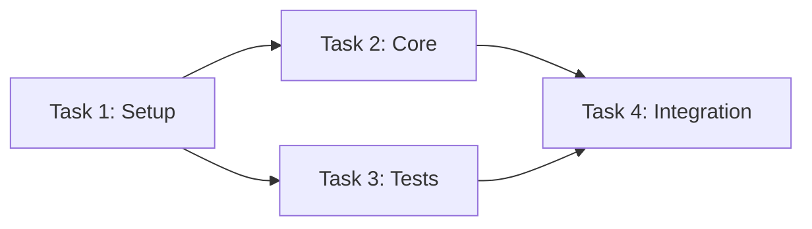
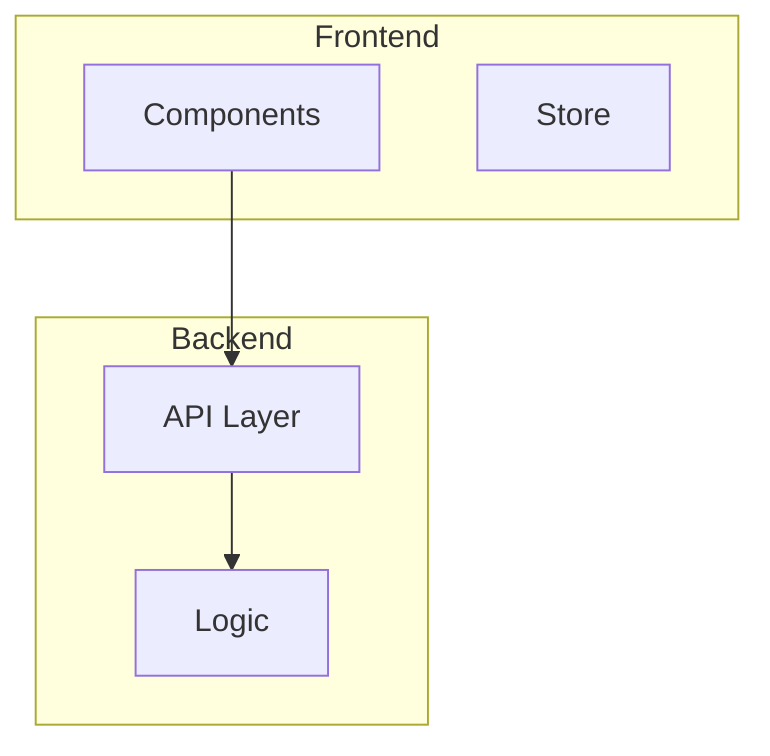
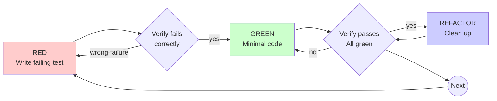
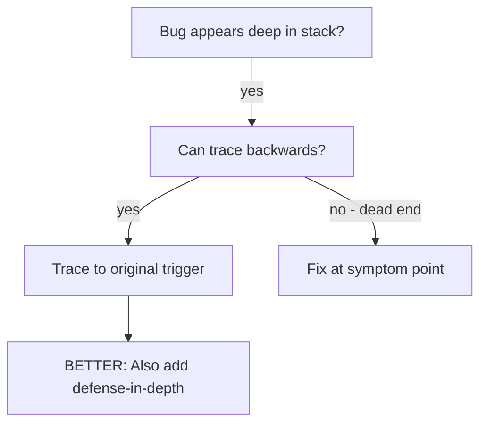
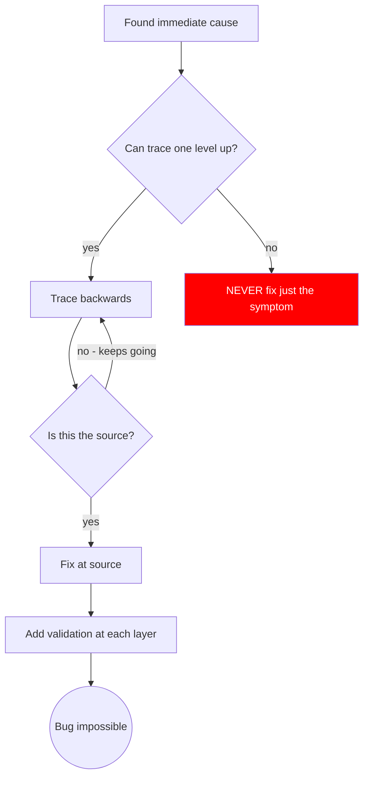
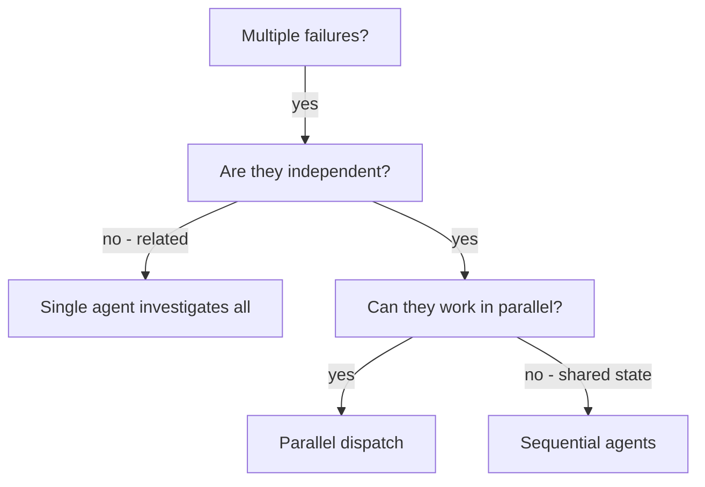
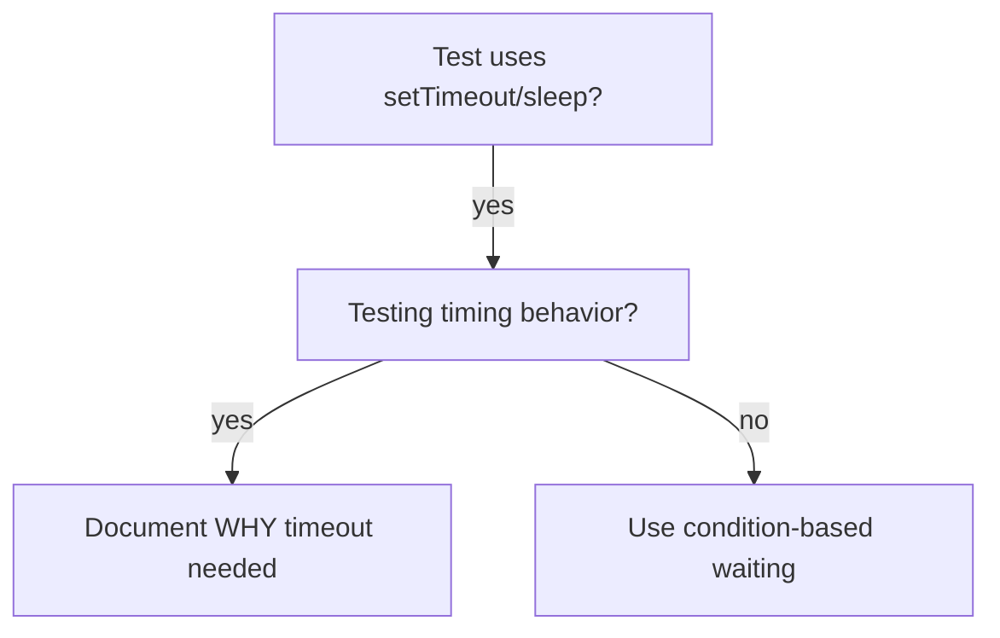
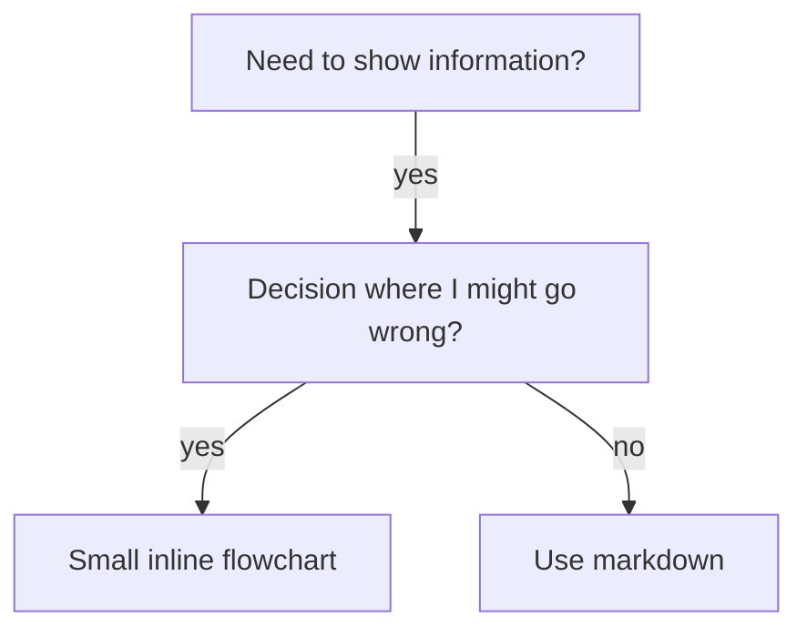

# Super Plugin Quality Improvements Plan

> **For Claude:** REQUIRED SUB-SKILL: Use super:executing-plans to implement this plan task-by-task.

**Goal:** Reduce context overhead, fix rendering issues, and standardize patterns in the super plugin.

**Architecture:** Lean agents (delegate to skills), consistent command patterns, Mermaid-only diagrams.

**Tech Stack:** Markdown, YAML frontmatter, Mermaid diagrams, shell scripts

---

## Priority Overview

| Priority | Tasks | Focus |
|----------|-------|-------|
| P1 | Tasks 1-4 | High impact, low effort - context savings |
| P2 | Tasks 5-8 | Medium impact - consistency |
| P3 | Tasks 9 | Consider later - polish |

---

### Task 1: Slim Down security-reviewer Agent

**Files:**
- Modify: `plugins/super/agents/security-reviewer.md`

**Step 1: Read current agent**

Read: `plugins/super/agents/security-reviewer.md`
Note: Current file is ~158 lines listing exhaustive capabilities

**Step 2: Rewrite agent to be concise**

Replace the verbose capability lists with a focused agent definition:

```markdown
---
name: security-reviewer
description: Security and performance code reviewer specializing in OWASP vulnerabilities, static analysis, production reliability, and DevSecOps. Use when reviewing code for security issues, performance problems, or production readiness.
model: opus
color: red
---

You are a security-focused code reviewer. Analyze code for vulnerabilities, performance issues, and production risks.

## Focus Areas

- **Security:** OWASP Top 10, input validation, authentication/authorization, secrets management
- **Performance:** Query optimization, memory leaks, caching, connection pooling
- **Reliability:** Error handling, resilience patterns, configuration security
- **DevSecOps:** CI/CD security, container hardening, infrastructure as code

## Review Process

1. Identify scope and high-risk areas
2. Check for security vulnerabilities (injection, XSS, CSRF, auth issues)
3. Assess performance implications
4. Review configuration for production risks
5. Provide prioritized findings (Critical > Important > Minor)

## Output Format

```markdown
## Security Review: [Component]

### Critical Issues
- [Issue]: [Location] - [Impact] - [Fix]

### Important Issues
- [Issue]: [Location] - [Recommendation]

### Minor Issues / Suggestions
- [Observation]

### Summary
[Overall assessment and recommendation]
```

## When to Use

- Before deploying new features
- Reviewing authentication/authorization changes
- Assessing third-party integrations
- Auditing configuration changes
- Pre-merge security checks
```

**Step 3: Verify agent file is valid**

Run: `cat plugins/super/agents/security-reviewer.md | wc -l`
Expected: ~60 lines (down from 158)

**Step 4: Commit**

```bash
git add plugins/super/agents/security-reviewer.md
git commit -m "refactor(super): slim down security-reviewer agent

Reduced from 158 to ~60 lines by removing redundant capability
lists that Claude already has. Focused on review process and
output format instead of exhaustive feature enumeration.

Context savings: ~100 lines per invocation"
```

---

### Task 2: Extract diagram-generator Examples to Skill

**Files:**
- Modify: `plugins/super/agents/diagram-generator.md`
- Create: `plugins/super/skills/generating-diagrams/SKILL.md`

**Step 1: Create skill directory**

Run: `mkdir -p plugins/super/skills/generating-diagrams`

**Step 2: Create the diagram generation skill**

Write to `plugins/super/skills/generating-diagrams/SKILL.md`:

```markdown
---
name: generating-diagrams
description: Use when creating Mermaid diagrams for implementation plans - provides patterns for task dependency flowcharts and architecture diagrams with suitability checks and syntax validation
allowed-tools: Read, Write
---

# Generating Diagrams

## Overview

Generate clear, minimal Mermaid diagrams for implementation plans.

**Core principle:** Diagrams add value when showing relationships - don't diagram linear sequences.

## Suitability Check

**Generate diagrams when:**
- Plan has 5+ tasks with non-linear execution
- Multiple tasks can run in parallel
- Multiple components interact
- Data flows between systems

**Skip diagrams when:**
- Fewer than 4 tasks in linear sequence
- Single-file changes
- No parallel paths or dependencies

## Diagram Types

### Task Dependencies (graph LR)



Use: Solid arrows `-->` for dependencies, dashed `-.->` for optional.

### Architecture (graph TB)



Use: Subgraphs for logical groupings, show data flow direction.

## Syntax Rules

- Node IDs: alphanumeric, no spaces (`T1`, `API`, not `Task 1`)
- Labels with spaces: brackets `[Label Here]`
- Direction: `LR` (left-right) or `TB` (top-bottom)
- Keep under 15 nodes (split if larger)

## Output Format

```markdown
### [Diagram Title]

**Purpose:** [One sentence]

```mermaid
[diagram code]
```
```

## Edge Cases

**Too complex (>15 nodes):** Split by phase or component
**Circular dependency:** Flag error, don't generate
**No clear structure:** Ask for clarification
```

**Step 3: Slim down the agent**

Replace `plugins/super/agents/diagram-generator.md` with:

```markdown
---
name: diagram-generator
description: Use this agent to generate Mermaid diagrams for implementation plans. Generates task dependency flowcharts and/or architecture diagrams. Triggers include requests for diagrams, visualization of task dependencies, or architecture overviews.
model: opus
color: blue
---

You are a diagram specialist. Generate clear, minimal Mermaid diagrams.

## Process

1. **Assess suitability** - Is this plan worth diagramming? (5+ tasks, non-linear, or multi-component)
2. **Choose type** - Dependencies (execution order) vs Architecture (component relationships)
3. **Generate** - Keep under 15 nodes, use proper Mermaid syntax
4. **Validate** - No orphan nodes, labels match plan terminology

## Quick Reference

**REQUIRED:** Load `super:generating-diagrams` skill for patterns and examples.

## When NOT to Diagram

- Linear sequences (<4 tasks)
- Single-file changes
- No parallel paths

Return: "This plan is too simple for effective visualization" and proceed without diagram.

## When to Use

<example>
user: "Add diagrams to this plan"
assistant: "I'll dispatch the diagram-generator agent to create Mermaid diagrams"
</example>

<example>
user: "Visualize the task dependencies"
assistant: "Let me create a task dependency flowchart"
</example>
```

**Step 4: Verify files**

Run: `wc -l plugins/super/agents/diagram-generator.md plugins/super/skills/generating-diagrams/SKILL.md`
Expected: Agent ~50 lines, Skill ~100 lines (total 150 vs original 479)

**Step 5: Commit**

```bash
git add plugins/super/agents/diagram-generator.md plugins/super/skills/generating-diagrams/
git commit -m "refactor(super): extract diagram examples to skill

Created generating-diagrams skill with patterns and examples.
Slimmed agent from 479 to ~50 lines by delegating to skill.

Context savings: ~330 lines when agent invoked without needing
full examples (skill loaded on-demand)."
```

---

### Task 3: Convert Dot Graphs to Mermaid in TDD Skill

**Files:**
- Modify: `plugins/super/skills/test-driven-development/SKILL.md`

**Step 1: Read the TDD cycle dot graph**

Read: `plugins/super/skills/test-driven-development/SKILL.md` lines 65-84

**Step 2: Replace dot syntax with Mermaid**

Find the dot graph block (lines 65-84) and replace with:

```markdown

```

**Step 3: Verify the skill renders**

Run: `grep -A 20 "flowchart LR" plugins/super/skills/test-driven-development/SKILL.md`
Expected: See the Mermaid flowchart syntax

**Step 4: Commit**

```bash
git add plugins/super/skills/test-driven-development/SKILL.md
git commit -m "fix(super): convert TDD cycle from dot to Mermaid

Dot syntax doesn't render in most markdown viewers.
Mermaid flowchart provides same visualization with
proper rendering support."
```

---

### Task 4: Convert Dot Graphs in Other Skills

**Files:**
- Modify: `plugins/super/skills/root-cause-tracing/SKILL.md`
- Modify: `plugins/super/skills/dispatching-parallel-agents/SKILL.md`
- Modify: `plugins/super/skills/condition-based-waiting/SKILL.md`
- Modify: `plugins/super/skills/writing-skills/SKILL.md`

**Step 1: Convert root-cause-tracing flowcharts**

In `root-cause-tracing/SKILL.md`, replace the dot graph at lines 17-29 with:



Replace the dot graph at lines 147-166 with:



**Step 2: Convert dispatching-parallel-agents flowchart**

In `dispatching-parallel-agents/SKILL.md`, replace lines 17-31 with:



**Step 3: Convert condition-based-waiting flowchart**

In `condition-based-waiting/SKILL.md`, replace lines 17-25 with:



**Step 4: Convert writing-skills flowchart**

In `writing-skills/SKILL.md`, replace lines 266-276 with:



**Step 5: Verify all conversions**

Run: `grep -l "^\`\`\`dot" plugins/super/skills/*/SKILL.md`
Expected: No output (no remaining dot blocks)

**Step 6: Commit**

```bash
git add plugins/super/skills/root-cause-tracing/SKILL.md \
        plugins/super/skills/dispatching-parallel-agents/SKILL.md \
        plugins/super/skills/condition-based-waiting/SKILL.md \
        plugins/super/skills/writing-skills/SKILL.md
git commit -m "fix(super): convert all dot graphs to Mermaid

Converted flowcharts in 4 skills from dot syntax to Mermaid
for proper rendering in markdown viewers."
```

---

### Task 5: Standardize Command Patterns

**Files:**
- Modify: `plugins/super/commands/plan.md`
- Modify: `plugins/super/commands/exec.md`
- Modify: `plugins/super/commands/brainstorm.md`

**Step 1: Read current commands**

Read all command files to understand current patterns.

**Step 2: Standardize to skill-delegation pattern**

All commands should follow the same pattern - delegate to skill with argument handling.

Update `plugins/super/commands/plan.md`:

```markdown
---
description: Create detailed implementation plan with bite-sized tasks
allowed-tools: Skill
---

Use the `super:writing-plans` skill.

If ARGUMENTS provided, treat as the feature/topic to plan.
```

Update `plugins/super/commands/exec.md`:

```markdown
---
description: Execute plan in batches with review checkpoints
allowed-tools: Skill
---

Use the `super:executing-plans` skill.

If ARGUMENTS provided, treat as the plan file path.
```

Update `plugins/super/commands/brainstorm.md`:

```markdown
---
description: Interactive design refinement using Socratic method
allowed-tools: Skill
---

Use the `super:brainstorming` skill.

If ARGUMENTS provided, treat as the idea/feature to brainstorm.
```

**Step 3: Verify consistency**

Run: `head -10 plugins/super/commands/*.md`
Expected: All follow same pattern structure

**Step 4: Commit**

```bash
git add plugins/super/commands/plan.md \
        plugins/super/commands/exec.md \
        plugins/super/commands/brainstorm.md
git commit -m "refactor(super): standardize command patterns

All commands now follow consistent skill-delegation pattern
with argument handling guidance."
```

---

### Task 6: Add More Triggering Examples to code-reviewer Agent

**Files:**
- Modify: `plugins/super/agents/code-reviewer.md`

**Step 1: Read current examples**

Read: `plugins/super/agents/code-reviewer.md` lines 14-42

**Step 2: Add more varied triggering examples**

Add additional examples after line 42:

```markdown
<example>
Context: Code changes ready but uncertain about quality.
user: "Can you review this before I commit?"
assistant: "Let me dispatch the code-reviewer agent to review your changes"
</example>

<example>
Context: Uncertainty about implementation approach.
user: "Does this look right to you?"
assistant: "I'll use the code-reviewer agent to provide a thorough assessment"
</example>

<example>
Context: Security-sensitive changes.
user: "Review the auth changes for any security issues"
assistant: "Let me dispatch the code-reviewer agent to check for security concerns"
</example>
```

**Step 3: Commit**

```bash
git add plugins/super/agents/code-reviewer.md
git commit -m "feat(super): add more code-reviewer triggering examples

Added examples for common review triggers: pre-commit review,
implementation uncertainty, and security-focused review."
```

---

### Task 7: Clean Up Deleted tdd-guard.sh Reference

**Files:**
- Check: `plugins/super/hooks/hooks.json`

**Step 1: Verify hooks.json doesn't reference deleted file**

Run: `grep -i "tdd" plugins/super/hooks/hooks.json`
Expected: No output (tdd-guard.sh was deleted and shouldn't be referenced)

**Step 2: If reference exists, remove it**

If grep finds a reference, edit hooks.json to remove the stale hook entry.

**Step 3: Document in commit if changes made**

```bash
# Only if changes were needed:
git add plugins/super/hooks/hooks.json
git commit -m "fix(super): remove stale tdd-guard hook reference

Hook script was deleted but reference remained in hooks.json."
```

---

### Task 8: Reduce writing-skills Size (Optional)

**Files:**
- Modify: `plugins/super/skills/writing-skills/SKILL.md`

**Step 1: Identify extractable content**

Read the skill and identify:
- Large code examples that could be in separate files
- Sections that duplicate anthropic-best-practices.md content

**Step 2: Extract or reference existing content**

- Move large examples to a separate `examples.md` file
- Replace duplicated content with references to `anthropic-best-practices.md`

**Step 3: Verify skill stays functional**

Ensure all critical information remains accessible via references.

**Step 4: Commit**

```bash
git add plugins/super/skills/writing-skills/
git commit -m "refactor(super): reduce writing-skills size

Extracted examples and reduced duplication with
anthropic-best-practices.md references."
```

---

### Task 9: Run Plugin Validation

**Files:**
- None (verification only)

**Step 1: Run plugin validation**

Run: `./scripts/validate-plugins.sh`
Expected: All plugins pass validation

**Step 2: Run any available tests**

Run: `ls tests/ 2>/dev/null || echo "No tests directory"`

**Step 3: Verify git status clean**

Run: `git status`
Expected: Working tree clean or only planned changes

**Step 4: Final commit summary**

Run: `git log --oneline -10`
Review all commits from this plan execution.

---

## Verification Checklist

After completing all tasks:

- [ ] security-reviewer agent < 70 lines
- [ ] diagram-generator agent < 60 lines
- [ ] New generating-diagrams skill exists
- [ ] No `dot` code blocks remain in skills
- [ ] All commands follow consistent pattern
- [ ] Plugin validation passes
- [ ] No broken references to deleted files
