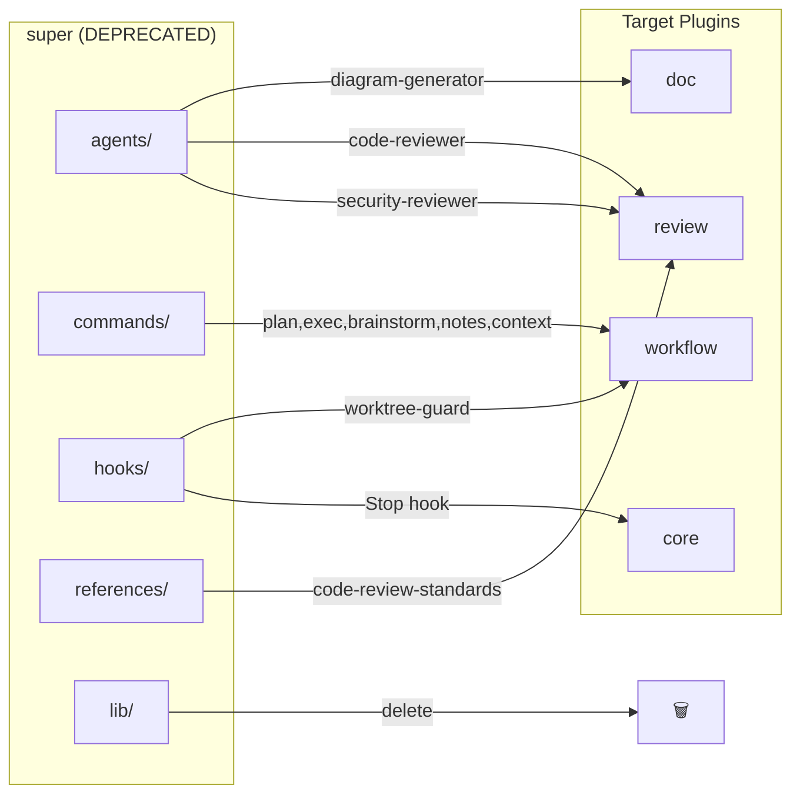
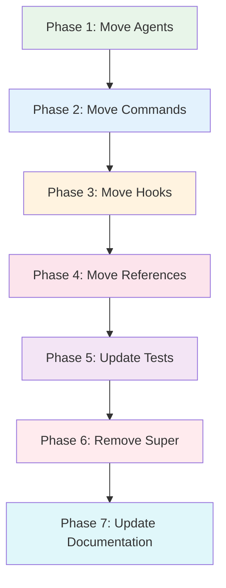

# Complete Migration & Remove Deprecated Super Plugin

> **For Claude:** REQUIRED SUB-SKILL: Use super:executing-plans to implement this plan task-by-task.
> **Python Skills:** Reference python:python-testing-patterns for tests, python:uv-package-manager for commands.

**Goal:** Complete the plugin migration by moving remaining assets from `super` to appropriate plugins and removing the deprecated `super` plugin entirely.

**Architecture:** Move agents, commands, hooks, and references from `super` to `workflow`, `review`, and `doc` plugins. Update all cross-references. Remove `super` plugin directory. Update tests and documentation.

**Tech Stack:** Python 3.12+, pytest, Claude Code plugin system

**Commands:** All Python commands use `uv run` prefix

---

## Diagrams

### Migration Flow



### Phase Execution



---

## Phase 1: Move Agents

### Task 1.1: Move diagram-generator to doc plugin

**Files:**
- Move: `plugins/super/agents/diagram-generator.md` → `plugins/doc/agents/diagram-generator.md`

**Step 1: Verify doc/agents directory exists**

Run: `ls plugins/doc/agents/`
Expected: Shows existing agents (mermaid-expert.md, etc.)

**Step 2: Copy diagram-generator**

```bash
cp plugins/super/agents/diagram-generator.md plugins/doc/agents/diagram-generator.md
```

**Step 3: Verify the move**

Run: `cat plugins/doc/agents/diagram-generator.md | head -10`
Expected: Shows agent frontmatter and content

**Step 4: Commit**

```bash
git add plugins/doc/agents/diagram-generator.md
git commit -m "feat(doc): move diagram-generator agent from super"
```

---

### Task 1.2: Move security-reviewer to review plugin

**Files:**
- Move: `plugins/super/agents/security-reviewer.md` → `plugins/review/agents/security-reviewer.md`

**Step 1: Create review/agents directory**

```bash
mkdir -p plugins/review/agents
```

**Step 2: Copy security-reviewer**

```bash
cp plugins/super/agents/security-reviewer.md plugins/review/agents/security-reviewer.md
```

**Step 3: Verify**

Run: `cat plugins/review/agents/security-reviewer.md | head -10`
Expected: Shows security-reviewer content

**Step 4: Commit**

```bash
git add plugins/review/agents/
git commit -m "feat(review): move security-reviewer agent from super"
```

---

### Task 1.3: Verify code-reviewer exists in review plugin

**Files:**
- Verify: `plugins/review/agents/code-reviewer.md`

The code-reviewer already exists in review plugin (confirmed earlier). No action needed, but verify it references updated paths.

**Step 1: Check code-reviewer references**

Run: `grep -n "super/" plugins/review/agents/code-reviewer.md`
Expected: Line 12 references `plugins/super/references/code-review-standards.md`

**Step 2: Note for later**

After Task 4.1 moves references, update this file to use `plugins/review/references/code-review-standards.md`.

---

## Phase 2: Move Commands

### Task 2.1: Move slash commands to workflow plugin

**Files:**
- Move: `plugins/super/commands/*.md` → `plugins/workflow/commands/*.md`

**Step 1: Create workflow/commands directory**

```bash
mkdir -p plugins/workflow/commands
```

**Step 2: Copy all commands**

```bash
cp plugins/super/commands/plan.md plugins/workflow/commands/
cp plugins/super/commands/exec.md plugins/workflow/commands/
cp plugins/super/commands/brainstorm.md plugins/workflow/commands/
cp plugins/super/commands/notes.md plugins/workflow/commands/
cp plugins/super/commands/context.md plugins/workflow/commands/
```

**Step 3: Verify commands copied**

Run: `ls plugins/workflow/commands/`
Expected: `brainstorm.md  context.md  exec.md  notes.md  plan.md`

**Step 4: Commit**

```bash
git add plugins/workflow/commands/
git commit -m "feat(workflow): move slash commands from super"
```

---

## Phase 3: Move Hooks

### Task 3.1: Move worktree-guard hook to workflow plugin

**Files:**
- Move: `plugins/super/hooks/worktree-guard.sh` → `plugins/workflow/hooks/worktree-guard.sh`
- Create: `plugins/workflow/hooks/hooks.json`

**Step 1: Create workflow/hooks directory**

```bash
mkdir -p plugins/workflow/hooks
```

**Step 2: Copy worktree-guard.sh**

```bash
cp plugins/super/hooks/worktree-guard.sh plugins/workflow/hooks/worktree-guard.sh
```

**Step 3: Update reference in worktree-guard.sh**

Edit `plugins/workflow/hooks/worktree-guard.sh`:
- Change `super:using-git-worktrees` → `workflow:git-worktrees` on line 69

**Step 4: Create hooks.json for workflow**

Create `plugins/workflow/hooks/hooks.json`:

```json
{
  "hooks": {
    "PreToolUse": [
      {
        "matcher": "Write|Edit",
        "hooks": [
          {
            "type": "command",
            "command": "${CLAUDE_PLUGIN_ROOT}/hooks/worktree-guard.sh",
            "timeout": 3
          }
        ]
      }
    ]
  }
}
```

**Step 5: Verify hooks.json is valid JSON**

Run: `jq . plugins/workflow/hooks/hooks.json`
Expected: Formatted JSON output without errors

**Step 6: Commit**

```bash
git add plugins/workflow/hooks/
git commit -m "feat(workflow): move worktree-guard hook from super"
```

---

### Task 3.2: Move Stop hook to core plugin

**Files:**
- Modify: `plugins/core/hooks/hooks.json`

**Step 1: Read current core hooks.json**

Run: `cat plugins/core/hooks/hooks.json`
Expected: Shows SessionStart hook only

**Step 2: Add Stop hook to core hooks.json**

Edit `plugins/core/hooks/hooks.json` to add the Stop hook:

```json
{
  "hooks": {
    "SessionStart": [
      {
        "matcher": "startup|resume|clear|compact",
        "hooks": [
          {
            "type": "command",
            "command": "${CLAUDE_PLUGIN_ROOT}/hooks/session-start.sh"
          }
        ]
      }
    ],
    "Stop": [
      {
        "matcher": "*",
        "hooks": [
          {
            "type": "prompt",
            "prompt": "Review the conversation for two conditions:\n\n1. VERIFICATION: If the agent claimed work is 'complete', 'fixed', 'passing', or 'done', check if verification commands (test, build, lint) were run with actual output shown BEFORE the claim.\n\n2. FINISHING WORKFLOW: If the conversation involved executing a plan (look for 'executing-plans', 'subagent-driven-development', or similar workflow language), check if 'finish-branch' skill was used to present the 4 options (merge, PR, keep, discard).\n\nReturn {\"decision\": \"block\", \"reason\": \"Missing verification evidence (core:verification)\"} if condition 1 fails.\nReturn {\"decision\": \"block\", \"reason\": \"Plan execution detected but finish-branch not used. Use workflow:finish-branch to present merge/PR/keep/discard options.\"} if condition 2 fails.\nReturn {\"decision\": \"approve\"} if all conditions pass or don't apply.",
            "timeout": 30
          }
        ]
      }
    ]
  }
}
```

**Step 3: Verify hooks.json is valid**

Run: `jq . plugins/core/hooks/hooks.json`
Expected: Valid JSON

**Step 4: Commit**

```bash
git add plugins/core/hooks/hooks.json
git commit -m "feat(core): add Stop hook for verification enforcement"
```

---

## Phase 4: Move References

### Task 4.1: Move code-review-standards to review plugin

**Files:**
- Move: `plugins/super/references/code-review-standards.md` → `plugins/review/references/code-review-standards.md`

**Step 1: Create review/references directory**

```bash
mkdir -p plugins/review/references
```

**Step 2: Copy code-review-standards**

```bash
cp plugins/super/references/code-review-standards.md plugins/review/references/
```

**Step 3: Update reference in code-reviewer.md**

Edit `plugins/review/agents/code-reviewer.md` line 12:
- Change `plugins/super/references/code-review-standards.md` → `plugins/review/references/code-review-standards.md`

**Step 4: Commit**

```bash
git add plugins/review/
git commit -m "feat(review): move code-review-standards reference from super"
```

---

## Phase 5: Update Tests

### Task 5.1: Update tests for super plugin removal

**Files:**
- Modify: `tests/test_plugin_structure.py`

**Step 1: Remove TestCurrentState.test_super_plugin_exists**

This test checks that super plugin exists - we're removing it.

**Step 2: Update TestPhase1TokenEfficiency tests**

The diagram-generator tests reference `plugins/super/agents/diagram-generator.md`. Update to `plugins/doc/agents/diagram-generator.md`.

**Step 3: Remove or update TestCurrentState.test_super_has_expected_skill_count**

This test is no longer relevant after removal.

**Step 4: Update TestCrossReferences.test_super_skill_references_exist**

After super removal, this test should verify NO super:* references exist (or the test should be removed).

**Step 5: Update TestPhase2Naming.test_skill_names_are_concise**

Remove the super-specific logic since super plugin is being removed.

**Step 6: Run tests to verify**

Run: `uv run pytest tests/test_plugin_structure.py -v`
Expected: Some failures until super is removed

**Step 7: Commit test updates**

```bash
git add tests/test_plugin_structure.py
git commit -m "test: update tests for super plugin removal"
```

---

### Task 5.2: Add test for no deprecated references

**Files:**
- Modify: `tests/test_plugin_structure.py`

**Step 1: Add test to verify no super:* references remain**

Add to `tests/test_plugin_structure.py`:

```python
class TestNoDeprecatedReferences:
    """Tests to ensure deprecated patterns are removed."""

    def test_no_super_skill_references(self, plugins_dir: Path) -> None:
        """No super:* references should exist after migration."""
        import re

        super_refs = []
        for md_file in plugins_dir.rglob("*.md"):
            content = md_file.read_text()
            refs = re.findall(r"super:([a-z0-9-]+)", content)
            if refs:
                super_refs.append((md_file.name, refs))

        assert not super_refs, f"Found deprecated super:* references: {super_refs}"

    def test_super_plugin_removed(self, plugins_dir: Path) -> None:
        """Super plugin directory should not exist."""
        super_path = plugins_dir / "super"
        assert not super_path.exists(), "super plugin should be removed"
```

**Step 2: Commit**

```bash
git add tests/test_plugin_structure.py
git commit -m "test: add tests for deprecated reference removal"
```

---

## Phase 6: Remove Super Plugin

### Task 6.1: Update all super:* references

**Files:**
- All files with `super:*` references

**Step 1: Find all remaining super:* references**

Run: `grep -r "super:" plugins/ --include="*.md" | grep -v ".git"`

**Step 2: Update each reference**

| Old Reference | New Reference |
|---------------|---------------|
| `super:using-superpowers` | `core:using-core` |
| `super:verification` | `core:verification` |
| `super:tdd` | `core:tdd` |
| `super:brainstorming` | `core:brainstorming` |
| `super:writing-plans` | `workflow:writing-plans` |
| `super:executing-plans` | `workflow:executing-plans` |
| `super:subagent-dev` | `workflow:subagent-dev` |
| `super:git-worktrees` | `workflow:git-worktrees` |
| `super:finish-branch` | `workflow:finish-branch` |
| `super:parallel-agents` | `workflow:parallel-agents` |
| `super:code-review` | `review:code-review` |
| `super:code-reviewer` | `review:code-reviewer` |
| `super:diagram-generator` | `doc:diagram-generator` |
| `super:security-reviewer` | `review:security-reviewer` |

**Step 3: Verify no super:* references in plugins/**

Run: `grep -r "super:" plugins/ --include="*.md" | wc -l`
Expected: 0

**Step 4: Commit**

```bash
git add -u
git commit -m "refactor: update all super:* references to new plugin names"
```

---

### Task 6.2: Remove super plugin directory

**Files:**
- Remove: `plugins/super/` (entire directory)

**Step 1: Verify all assets migrated**

Checklist:
- [ ] Agents moved to doc/review
- [ ] Commands moved to workflow
- [ ] Hooks moved to workflow/core
- [ ] References moved to review
- [ ] Skills were already moved in Phase 4

**Step 2: Remove super directory**

```bash
rm -rf plugins/super
```

**Step 3: Verify removal**

Run: `ls plugins/`
Expected: No `super` directory

**Step 4: Run tests**

Run: `uv run pytest tests/test_plugin_structure.py -v`
Expected: All tests pass

**Step 5: Commit**

```bash
git add -u
git commit -m "refactor!: remove deprecated super plugin

BREAKING CHANGE: super plugin removed. Use core, workflow, review, testing, meta, debug plugins instead.

Migration mapping:
- super:using-superpowers → core:using-core
- super:verification-before-completion → core:verification
- super:test-driven-development → core:tdd
- super:brainstorming → core:brainstorming
- super:writing-plans → workflow:writing-plans
- super:executing-plans → workflow:executing-plans
- super:subagent-driven-development → workflow:subagent-dev
- super:using-git-worktrees → workflow:git-worktrees
- super:finishing-a-development-branch → workflow:finish-branch
- super:dispatching-parallel-agents → workflow:parallel-agents
- super:requesting-code-review → review:code-review
- super:receiving-code-review → review:code-review
- super:systematic-debugging → debug:systematic
- super:root-cause-tracing → debug:root-cause
- super:defense-in-depth → debug:defense-in-depth
- super:testing-anti-patterns → testing:anti-patterns
- super:condition-based-waiting → testing:condition-wait
- super:writing-skills → meta:writing-skills
- super:testing-skills-with-subagents → meta:testing-skills"
```

---

## Phase 7: Update Documentation

### Task 7.1: Update CLAUDE.md

**Files:**
- Modify: `CLAUDE.md`

**Step 1: Remove super from plugin table**

Remove the row:
```
| **super** | DEPRECATED: backward-compatible alias |
```

**Step 2: Update any /super:* command references**

Change `/super:plan` → `/workflow:plan`, etc.

**Step 3: Commit**

```bash
git add CLAUDE.md
git commit -m "docs: remove super plugin from CLAUDE.md"
```

---

### Task 7.2: Update MIGRATION.md

**Files:**
- Modify: `docs/MIGRATION.md`

**Step 1: Update migration guide**

Add "Completion" section noting super plugin has been removed:

```markdown
## Migration Complete

As of v5.0.0, the `super` plugin has been fully removed. All functionality is now in:
- **core** - Essential workflows (TDD, verification, brainstorming)
- **workflow** - Planning and execution
- **review** - Code review
- **testing** - Test patterns
- **meta** - Plugin development
- **debug** - Debugging skills

If you have any references to `super:*` in your own configurations or documentation, update them using the mapping table above.
```

**Step 2: Commit**

```bash
git add docs/MIGRATION.md
git commit -m "docs: mark migration complete in MIGRATION.md"
```

---

### Task 7.3: Update marketplace.json

**Files:**
- Modify: `.claude-plugin/marketplace.json`

**Step 1: Remove super plugin entry**

Remove the entry for `./plugins/super` from the plugins array.

**Step 2: Verify marketplace.json is valid**

Run: `jq . .claude-plugin/marketplace.json`
Expected: Valid JSON

**Step 3: Commit**

```bash
git add .claude-plugin/marketplace.json
git commit -m "build: remove super from marketplace.json"
```

---

### Task 7.4: Update release-please-config.json

**Files:**
- Modify: `release-please-config.json`

**Step 1: Remove super plugin references**

Remove any `plugins/super` entries from extra-files.

**Step 2: Commit**

```bash
git add release-please-config.json
git commit -m "build: remove super from release-please config"
```

---

## Final Verification

### Task 8.1: Run full test suite

**Step 1: Run all tests**

Run: `uv run pytest tests/ -v`
Expected: All tests PASS

**Step 2: Run plugin validation**

Run: `python3 scripts/validate-plugins.py`
Expected: All validations passed (super not listed)

**Step 3: Verify no super references**

Run: `grep -r "super:" plugins/ docs/ --include="*.md" | grep -v "MIGRATION.md" | grep -v "plans/"`
Expected: No output (historical docs can keep references for context)

---

### Task 8.2: Test skill invocation

**Step 1: Test new skill paths work**

In a Claude Code session, verify:
- `Skill(skill: "core:tdd")` → Works
- `Skill(skill: "workflow:writing-plans")` → Works
- `Skill(skill: "review:code-review")` → Works
- `Skill(skill: "debug:systematic")` → Works

---

## Summary

| Phase | Tasks | Purpose |
|-------|-------|---------|
| 1 | 3 | Move agents to doc/review |
| 2 | 1 | Move commands to workflow |
| 3 | 2 | Move hooks to workflow/core |
| 4 | 1 | Move references to review |
| 5 | 2 | Update and add tests |
| 6 | 2 | Remove super plugin |
| 7 | 4 | Update documentation |
| 8 | 2 | Final verification |

**Total: 17 tasks**
