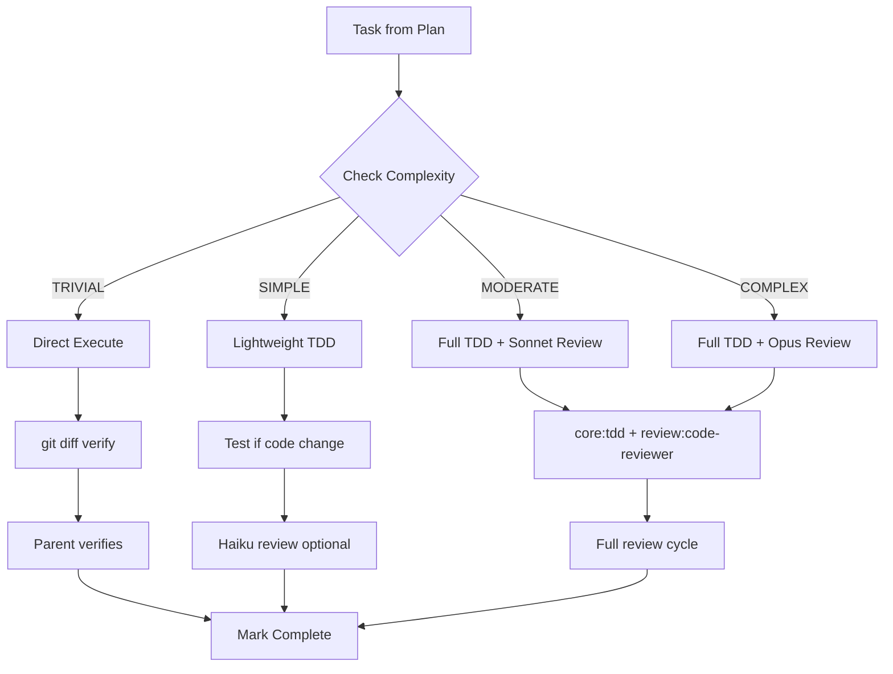

# Task Complexity Optimization Implementation Plan

> **For Claude:** REQUIRED SUB-SKILL: Use workflow:executing-plans to implement this plan task-by-task.

**Goal:** Reduce tool usage and token consumption for trivial tasks by introducing complexity-aware task execution.

**Architecture:** Add task complexity tags (TRIVIAL/SIMPLE/MODERATE/COMPLEX) to plan writing, then branch execution logic based on complexity - skipping TDD and code review for trivial tasks, using lightweight reviews for simple tasks.

**Tech Stack:** Markdown skill files, no code changes

---

## Diagrams



---

### Task 1: Add Complexity Tag to writing-plans Task Structure

**Complexity:** SIMPLE

**Files:**

- Modify: `plugins/methodology/workflow/skills/writing-plans/SKILL.md:169-211`

**Step 1: Read the current task structure section**

The current task structure in writing-plans needs a complexity field added.

**Step 2: Update the Task Structure template**

Find the `## Task Structure` section and update it to include complexity:

```markdown
## Task Structure

```markdown
### Task N: [Component Name]

**Complexity:** [TRIVIAL | SIMPLE | MODERATE | COMPLEX]

**Files:**
- Create: `exact/path/to/file.py`
- Modify: `exact/path/to/existing.py:123-145`
- Test: `tests/exact/path/to/test.py`
```

**Step 3: Add Complexity Classification Guide**

Add a new section after "Bite-Sized Task Granularity" explaining complexity levels:

```markdown
## Task Complexity Classification

Every task MUST include a complexity tag. This enables efficient execution.

| Complexity | Examples | TDD? | Code Review? |
|------------|----------|------|--------------|
| **TRIVIAL** | Delete file, rename, typo fix, config update | No | Parent verifies git diff |
| **SIMPLE** | Small refactor, single-file change, add comment | If code changes | Haiku (optional) |
| **MODERATE** | Feature implementation, bug fix with tests | Yes | Sonnet |
| **COMPLEX** | Multi-file feature, architectural change | Yes | Opus |

**Classification heuristics:**

- **TRIVIAL:** No new logic, no tests needed, <10 lines changed
- **SIMPLE:** Minor logic changes, one test file, <50 lines changed
- **MODERATE:** New functionality, multiple test cases, 50-200 lines
- **COMPLEX:** Multiple files, architectural decisions, >200 lines or high risk
```

**Step 4: Verify the edit**

Run: `grep -A 5 "Task Structure" plugins/methodology/workflow/skills/writing-plans/SKILL.md`
Expected: See the updated template with Complexity field

**Step 5: Commit**

```bash
git add plugins/methodology/workflow/skills/writing-plans/SKILL.md
git commit -m "feat(workflow): add task complexity classification to writing-plans"
```

---

### Task 2: Update executing-plans with Complexity Branching

**Complexity:** MODERATE

**Files:**

- Modify: `plugins/methodology/workflow/skills/executing-plans/SKILL.md:54-68`

**Step 1: Read current Step 2 section**

The current "Step 2: Execute Batch" section applies TDD to all tasks uniformly.

**Step 2: Replace Step 2 with complexity-aware execution**

Replace the "Step 2: Execute Batch" section with:

```markdown
### Step 2: Execute Batch

**Default: First 3 tasks**

For each task, check its **Complexity** tag and execute accordingly:

#### TRIVIAL Tasks (delete, rename, typo, config)

1. Mark as in_progress
2. Execute the change directly (no TDD - nothing to test)
3. Verify with `git diff` that change is correct
4. Mark as completed
5. **Skip code review** - parent agent verifies git diff directly

#### SIMPLE Tasks (small refactor, single-file)

1. Mark as in_progress
2. **If modifying production code:** Use core:tdd skill (write test first)
3. **If config/docs only:** Skip TDD
4. Run verifications as specified
5. Mark as completed
6. **Lightweight review:** Check git diff, no subagent needed

#### MODERATE Tasks (features, bug fixes)

1. Mark as in_progress
2. **Use core:tdd skill** - Write failing test FIRST, then implement
3. Follow each step exactly
4. Run verifications as specified
5. **Use core:verification skill** - Verify tests pass
6. Mark as completed
7. **Dispatch code-reviewer** (Sonnet model)

#### COMPLEX Tasks (multi-file, architectural)

1. Mark as in_progress
2. **Use core:tdd skill** - Write failing test FIRST, then implement
3. Follow each step exactly
4. Run verifications as specified
5. **Use core:verification skill** - Verify tests pass
6. Mark as completed
7. **Dispatch code-reviewer** (Opus model for thorough review)

**IMPORTANT:** Match execution overhead to task complexity. TRIVIAL tasks should complete in 2-3 tool uses, not 11.
```

**Step 3: Update Step 3 to be conditional**

Modify the "Step 3: Code Review After Batch" section:

```markdown
### Step 3: Code Review After Batch

**Review strategy based on task complexity:**

**For batches with TRIVIAL/SIMPLE tasks only:**
- Parent agent reviews git diff directly
- No subagent dispatch needed
- Verify changes match plan requirements

**For batches with MODERATE/COMPLEX tasks:**

Dispatch code-reviewer subagent as before:

```

Task tool (review:code-reviewer):
  description: "Review Batch [N] implementation"
  ...

```

**Mixed batches:** Review at the level of the most complex task in the batch.
```

**Step 4: Verify the edit**

Run: `grep -A 3 "TRIVIAL" plugins/methodology/workflow/skills/executing-plans/SKILL.md`
Expected: See TRIVIAL task handling instructions

**Step 5: Commit**

```bash
git add plugins/methodology/workflow/skills/executing-plans/SKILL.md
git commit -m "feat(workflow): add complexity-aware task execution to executing-plans"
```

---

### Task 3: Update subagent-dev with Complexity Branching

**Complexity:** MODERATE

**Files:**

- Modify: `plugins/methodology/workflow/skills/subagent-dev/SKILL.md:69-99`

**Step 1: Read current Step 2 section**

The current "Step 2: Execute Task with Subagent" dispatches the same prompt for all tasks.

**Step 2: Replace with complexity-aware dispatch**

Replace the "### 2. Execute Task with Subagent" section with:

```markdown
### 2. Execute Task with Subagent

Check task **Complexity** tag before dispatching:

#### TRIVIAL Tasks

**Do NOT dispatch a subagent.** Execute directly:

1. Read task from plan
2. Execute the change (Bash, Edit, Write as needed)
3. Verify with `git diff`
4. Commit
5. Mark complete

**Rationale:** Subagent overhead (context loading, skill loading) exceeds task value.

#### SIMPLE Tasks

**Dispatch lightweight subagent:**

```

Task tool (general-purpose):
  model: haiku  # Use fastest model
  description: "Implement Task N: [task name]"
  prompt: |
    You are implementing Task N from [plan-file]. This is a SIMPLE task.

    Work efficiently:
    1. Read the task (already loaded - don't re-read plan file)
    2. If modifying code: write a simple test first
    3. Make the change
    4. Verify tests pass
    5. Commit
    6. Report back briefly

    EFFICIENCY TARGET: 4-6 tool uses maximum.
    Skip skill loading unless absolutely necessary.

    Work from: [directory]

```

#### MODERATE Tasks

**Dispatch standard subagent:**

```

Task tool (general-purpose):
  model: sonnet
  description: "Implement Task N: [task name]"
  prompt: |
    You are implementing Task N from [plan-file].

    Read that task carefully. Your job is to:
    1. Use core:tdd skill - write failing test FIRST, then implement
    2. Implement exactly what the task specifies
    3. Use core:verification skill - verify all tests pass
    4. Commit your work
    5. Report back

    Work from: [directory]

    Report: What you implemented, test results, files changed

```

#### COMPLEX Tasks

**Dispatch thorough subagent:**

```

Task tool (general-purpose):
  model: sonnet  # Or opus for critical work
  description: "Implement Task N: [task name]"
  prompt: |
    You are implementing Task N from [plan-file]. This is a COMPLEX task.

    Read that task carefully. Your job is to:
    1. Use core:tdd skill - write failing test FIRST, then implement
    2. Implement exactly what the task specifies
    3. Use core:verification skill - verify all tests pass with actual output
    4. Consider edge cases and error handling
    5. Commit your work
    6. Report back thoroughly

    IMPORTANT:
    - You MUST use core:tdd. Write the test first, see it fail.
    - You MUST use core:verification before reporting completion.

    Work from: [directory]

    Report: What you implemented, what you tested, test results (with output),
    files changed, any issues or concerns

```
```

**Step 3: Update Step 3 for conditional review**

Add complexity branching to the code review step:

```markdown
### 3. Review Subagent's Work

**Review strategy based on task complexity:**

**TRIVIAL tasks:** No review needed (parent verified git diff)

**SIMPLE tasks:** Parent reviews subagent report + git diff. No code-reviewer dispatch.

**MODERATE tasks:** Dispatch code-reviewer with standard prompt.

**COMPLEX tasks:** Dispatch code-reviewer with thorough analysis request.
```

**Step 4: Verify the edit**

Run: `grep -B 2 -A 5 "TRIVIAL Tasks" plugins/methodology/workflow/skills/subagent-dev/SKILL.md`
Expected: See the new TRIVIAL task handling section

**Step 5: Commit**

```bash
git add plugins/methodology/workflow/skills/subagent-dev/SKILL.md
git commit -m "feat(workflow): add complexity-aware subagent dispatch"
```

---

### Task 4: Add Efficiency Guidance to Subagent Prompts

**Complexity:** SIMPLE

**Files:**

- Modify: `plugins/methodology/workflow/skills/subagent-dev/SKILL.md` (within Task 3 changes)

**Step 1: Verify Task 3 already includes efficiency targets**

The SIMPLE task prompt should already include "EFFICIENCY TARGET: 4-6 tool uses maximum."

**Step 2: Add anti-pattern warnings to all prompts**

Add to each subagent prompt section:

```markdown
**ANTI-PATTERNS TO AVOID:**
- Reading files not mentioned in task
- Using Glob/Grep to "verify" obvious facts
- Loading skills you don't need for this task
- Re-reading the plan file multiple times
```

**Step 3: Add efficiency targets table to top of skill**

Add near the top of the skill file, after Overview:

```markdown
## Efficiency Targets

| Complexity | Target Tool Uses | Target Tokens |
|------------|------------------|---------------|
| TRIVIAL | 2-3 | <3k |
| SIMPLE | 4-6 | <8k |
| MODERATE | 8-15 | <20k |
| COMPLEX | No hard limit | Reasonable |

**Why this matters:** A "Remove orphaned file" task should NOT use 11 tools and 27k tokens.
```

**Step 4: Verify the edit**

Run: `grep "Efficiency Targets" plugins/methodology/workflow/skills/subagent-dev/SKILL.md`
Expected: Find the new section

**Step 5: Commit**

```bash
git add plugins/methodology/workflow/skills/subagent-dev/SKILL.md
git commit -m "feat(workflow): add efficiency targets and anti-pattern warnings"
```

---

### Task 5: Update Tests to Validate Complexity Field

**Complexity:** SIMPLE

**Files:**

- Modify: `tests/test_plugin_structure.py` (if complexity validation needed)

**Step 1: Check if tests validate skill content**

Run: `grep -l "writing-plans" tests/`
Expected: See if any tests reference this skill

**Step 2: Consider adding validation**

If tests validate skill structure, add a test that checks:

- writing-plans SKILL.md mentions "Complexity"
- executing-plans SKILL.md mentions "TRIVIAL"
- subagent-dev SKILL.md mentions complexity branching

**Step 3: If no existing test infrastructure for content**

Skip this task - the existing tests validate structure, not content.

**Step 4: Commit (if changes made)**

```bash
git add tests/test_plugin_structure.py
git commit -m "test(workflow): add complexity field validation"
```

---

### Task 6: Run Full Validation Suite

**Complexity:** TRIVIAL

**Files:**

- None (verification only)

**Step 1: Run pytest**

```bash
uv run pytest tests/ -v
```

Expected: All tests pass

**Step 2: Run plugin validation**

```bash
uv run python scripts/validate-plugins.py
```

Expected: All plugins valid

**Step 3: Run reference validation**

```bash
uv run python scripts/validate-references.py
```

Expected: All references valid

**Step 4: If any failures, fix them before proceeding**

---

### Task 7: Stage and Commit All Changes

**Complexity:** TRIVIAL

**Files:**

- All modified skill files

**Step 1: Review changes**

```bash
git diff --stat
git diff
```

**Step 2: Stage and commit**

```bash
git add -A
git commit -m "feat(workflow): implement task complexity optimization

Add complexity-aware task execution to reduce overhead:
- writing-plans: Add TRIVIAL/SIMPLE/MODERATE/COMPLEX tags
- executing-plans: Branch execution based on complexity
- subagent-dev: Conditional dispatch with efficiency targets

TRIVIAL tasks now skip TDD and code review (parent verifies).
SIMPLE tasks use Haiku model and lightweight review.
MODERATE/COMPLEX tasks get full TDD and code review.

Expected impact: 70-90% reduction in tool usage for trivial tasks."
```

**Step 3: Push**

```bash
git push
```

---

## Summary

| Task | Complexity | Files | Purpose |
|------|------------|-------|---------|
| 1 | SIMPLE | writing-plans/SKILL.md | Add complexity tags to task structure |
| 2 | MODERATE | executing-plans/SKILL.md | Branch execution by complexity |
| 3 | MODERATE | subagent-dev/SKILL.md | Conditional subagent dispatch |
| 4 | SIMPLE | subagent-dev/SKILL.md | Add efficiency guidance |
| 5 | SIMPLE | tests/ | Validate complexity field |
| 6 | TRIVIAL | N/A | Run validation suite |
| 7 | TRIVIAL | All | Commit and push |

**Expected Impact:**

- TRIVIAL tasks: 2-3 tool uses (down from 11)
- TRIVIAL tokens: ~3k (down from 27.5k)
- TRIVIAL duration: ~15s (down from 2m 43s)
