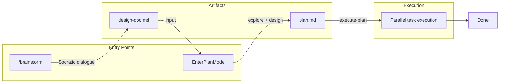

# dev-workflow

Structured development workflow for Claude Code. Enforces TDD, systematic debugging, and verification.



## Why This Plugin

Most plugins add capabilities. This one changes how you work.

**The problem:** Claude is capable but undisciplined. It skips tests, claims "should work now" without verification, fixes symptoms instead of root causes, and accumulates context until it loses track.

**The solution:** A workflow system that enforces discipline through architecture:

| Problem | Solution |
|---------|----------|
| Context pollution | Parallel task agents |
| "Should work now" | Verification before any claim |
| Symptom patching | Systematic debugging framework |
| Skipped tests | TDD as methodology, not suggestion |

## Architecture

Built on Claude Code primitives:

```
SessionStart hook
    └── Loads getting-started skill with planning methodology

EnterPlanMode / ExitPlanMode
    └── Native plan mode for design

/dev-workflow:execute-plan
    └── Parallel task agents with dependency tracking + post-completion actions
```

**Token efficiency:**
- Skills loaded on-demand via triggers
- Task agents handle parallel execution
- Model selection per task complexity

## Features

### Skills (11)

| Category | Skills |
|----------|--------|
| Methodology | `test-driven-development`, `systematic-debugging`, `root-cause-tracing` |
| Quality | `verification-before-completion`, `testing-anti-patterns`, `defense-in-depth` |
| Collaboration | `receiving-code-review` |
| Workflow | `finishing-a-development-branch` |
| Session | `getting-started`, `condition-based-waiting`, `pragmatic-architecture` |

**Rigid skills** (follow exactly): TDD, debugging, verification
**Flexible skills** (adapt principles): brainstorming, architecture

### Commands

| Command | Purpose |
|---------|---------|
| `/dev-workflow:brainstorm` | Refine idea → design doc via Socratic dialogue |
| `/dev-workflow:write-plan` | Create TDD implementation plan saved to `docs/plans/` |
| `/dev-workflow:execute-plan` | Execute plan with state tracking and post-completion actions |
| `/dev-workflow:resume` | Resume interrupted plan execution |
| `/dev-workflow:abandon` | Discard active workflow state |

**Primary workflow:** `/dev-workflow:brainstorm` → `/dev-workflow:write-plan` → `/dev-workflow:execute-plan`
**Quick workflow:** `EnterPlanMode` → `ExitPlanMode` for simple 1-3 task features without plan persistence.

### Agents

| Agent | Purpose |
|-------|---------|
| `code-explorer` | Survey codebase for context |
| `code-architect` | Design implementation approach |
| `code-reviewer` | Review completed work |

## Installation

```bash
claude plugin add pproenca/dev-workflow
```

Or:

```bash
git clone https://github.com/pproenca/dev-workflow ~/.claude/plugins/dev-workflow
```

## Prerequisites

**Required:** `git`
**Optional:** `jq`, `bats-core`, `shellcheck`, `pre-commit`

### Worktree Workflows

The plugin supports git worktree workflows using a sibling directory pattern:

```
my-repo/          # Main repository
my-repo--feature/ # Worktree for 'feature' branch
```

No configuration needed. Worktrees are created alongside your main repository.

See the `simple-git-worktrees` skill for details.

## Usage

Skills load automatically at session start. The `getting-started` skill establishes the protocol: before any task, check if a skill applies.

State is managed by TaskCreate/TaskUpdate. Sessions can resume via `/dev-workflow:resume`.

## Development

```bash
./scripts/setup.sh       # Contributor setup
./scripts/validate.sh    # Full validation
bats tests/              # Test suite
```

## Acknowledgments

Inspired by:

- [anthropics/claude-code](https://github.com/anthropics/claude-code)
- [anthropics/skills](https://github.com/anthropics/skills)
- [obra/superpowers](https://github.com/obra/superpowers)

## License

MIT
