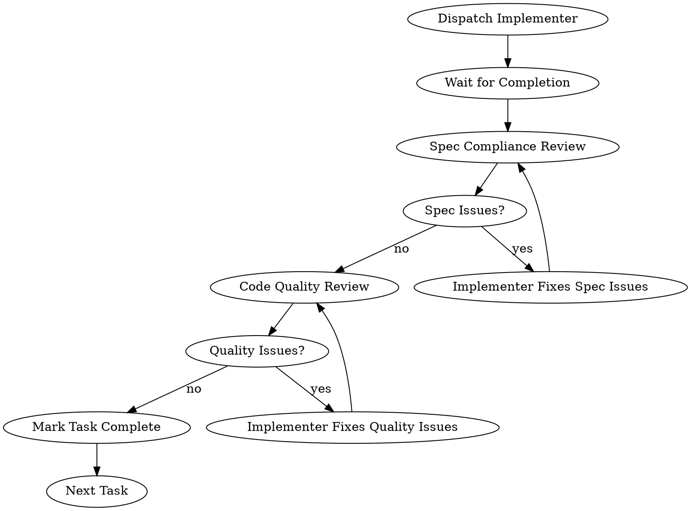

# Execute Plan

Execute implementation plan with state tracking and mandatory post-completion actions.

**Model Requirements:**
- Orchestrator (this command): **Opus 4.5** - handles planning decisions, state management, coordination
- Task execution agents: **Sonnet** - handles individual task implementation (TDD cycles)

## Input

$ARGUMENTS

**If empty or file not found:** Stop with error "Plan file not found or not specified"

## Step 1: Initialize State

Read plan and create state file for resume capability:

```bash
source "${CLAUDE_PLUGIN_ROOT}/scripts/hook-helpers.sh"
PLAN_FILE="$ARGUMENTS"

# Verify plan exists
if [[ ! -f "$PLAN_FILE" ]]; then
  echo "ERROR: Plan file not found: $PLAN_FILE"
  exit 1
fi

# Create state file
create_state_file "$PLAN_FILE"

# Read state
STATE_FILE="$(get_state_file)"
TOTAL=$(frontmatter_get "$STATE_FILE" "total_tasks" "0")
echo "STATE_FILE: $STATE_FILE"
echo "TOTAL_TASKS: $TOTAL"
```

**If TOTAL is 0:** Stop with error "No tasks found in plan. Tasks must use format: ### Task N: [Name]"

## Step 2: Setup TodoWrite

Extract task titles and create TodoWrite items:

```bash
grep -E "^### Task [0-9]+(\.[0-9]+)?:" "$PLAN_FILE" | sed 's/^### Task \([0-9.]*\): \(.*\)/Task \1: \2/'
```

Create TodoWrite with:
- All tasks from plan as `pending`
- "Code Review" as `pending`
- "Finish Branch" as `pending`

## Step 3: Choose Execution Mode

```claude
AskUserQuestion:
  header: "Mode"
  question: "How should tasks be executed?"
  multiSelect: false
  options:
    - label: "Sequential"
      description: "Execute tasks one by one with full TDD cycle"
    - label: "Parallel (Recommended)"
      description: "Run independent tasks concurrently via background agents"
```

---

## Sequential Execution

Execute tasks one by one using background agents with two-stage review after each task.

### Process Flow



### 3a. Check for Interrupted Dispatch (Compact Recovery)

Same as parallel execution - check if a previous task was interrupted:

```bash
source "${CLAUDE_PLUGIN_ROOT}/scripts/hook-helpers.sh"
STATE_FILE="$(get_state_file)"
DISPATCHED_AGENTS=$(frontmatter_get "$STATE_FILE" "agent_ids" "")

if [[ -n "$DISPATCHED_AGENTS" ]]; then
  echo "RECOVERING: Resuming interrupted task with agent $DISPATCHED_AGENTS"
fi
```

If `DISPATCHED_AGENTS` is not empty, call `TaskOutput` for that agent, then clear state and continue.

### 3b. Execute Each Task

```bash
source "${CLAUDE_PLUGIN_ROOT}/scripts/hook-helpers.sh"
STATE_FILE="$(get_state_file)"
CURRENT=$(frontmatter_get "$STATE_FILE" "current_task" "0")
NEXT=$((CURRENT + 1))
echo "EXECUTING: Task $NEXT"
```

Mark task `in_progress` in TodoWrite.

Launch task in background:

```claude
Task:
  subagent_type: general-purpose
  model: sonnet
  description: "Execute Task [N]"
  prompt: |
    Execute Task [N] from plan.

    ## Task Content
    [Task content extracted via get_task_content]

    ## Before You Begin
    If anything is unclear about requirements, approach, or dependencies:
    **Ask questions now.** Raise concerns before starting work.

    Questions to consider:
    - Are the requirements clear?
    - Do I understand the approach?
    - Are there dependencies I need to know about?
    - Anything ambiguous in the task description?

    ## Your Job
    1. Follow each Step exactly as written
    2. After each "Run test" step, verify the expected output matches
    3. Commit after tests pass

    ## While Working
    If you encounter something unexpected or blockers, **ask for clarification**.
    It's always OK to pause and clarify rather than guess.

    **DO NOT:**
    - Guess at unclear requirements
    - Make assumptions about intent
    - Add features not in the spec
    - Skip verification steps

    ## Before Reporting Back: Self-Review (MANDATORY)

    Review your work with fresh eyes before reporting.

    **Completeness:**
    - Did I fully implement everything in the spec?
    - Did I miss any requirements?
    - Are there edge cases I didn't handle?

    **Quality:**
    - Is this my best work?
    - Are names clear and accurate (describe WHAT, not HOW)?
    - Is the code clean and maintainable?

    **Discipline:**
    - Did I avoid overbuilding (YAGNI)?
    - Did I only build what was requested?
    - Did I follow existing patterns in the codebase?

    **Testing:**
    - Do tests verify BEHAVIOR, not mock behavior?
    - Did I watch each test fail before implementing?
    - Are tests comprehensive for the requirements?

    **If you find issues during self-review, fix them now before reporting.**

    ## Report Format

    When done, report:
    - What you implemented (specific changes)
    - Files changed (with paths)
    - Test results (command and output)
    - Self-review findings (any issues found and fixed)
    - Any concerns or blockers
  run_in_background: true
```

Persist state immediately:

```bash
source "${CLAUDE_PLUGIN_ROOT}/scripts/hook-helpers.sh"
STATE_FILE="$(get_state_file)"
frontmatter_set "$STATE_FILE" "dispatched_group" "sequential:$NEXT"
frontmatter_set "$STATE_FILE" "agent_ids" "[agent_id]"
```

Wait for completion:

```claude
TaskOutput:
  task_id: [agent_id]
  block: true
```

### 3c. Two-Stage Review (MANDATORY)

After implementer completes, run two-stage review before marking task complete.

**Stage 1: Spec Compliance Review**

Verify implementer built exactly what was requested (nothing more, nothing less).

```claude
Task:
  subagent_type: general-purpose
  model: sonnet
  description: "Spec review Task [N]"
  prompt: |
    You are reviewing whether an implementation matches its specification.

    ## What Was Requested
    [Task content from plan]

    ## What Implementer Claims They Built
    [From implementer's report]

    ## CRITICAL: Do Not Trust the Report

    The implementer may have been incomplete, inaccurate, or optimistic.
    You MUST verify everything independently.

    **DO NOT:**
    - Take their word for what they implemented
    - Trust their claims about completeness
    - Assume tests passing means spec is met

    **DO:**
    - Read the actual code they wrote
    - Compare implementation to requirements line by line
    - Check for missing pieces
    - Look for extra features not requested

    ## Your Job

    **Missing requirements:**
    - Did they implement everything requested?
    - Are there requirements they skipped?
    - Did they claim something but not implement it?

    **Extra/unneeded work:**
    - Did they build things not requested?
    - Did they over-engineer or add unnecessary features?

    **Misunderstandings:**
    - Did they interpret requirements differently than intended?
    - Did they solve the wrong problem?

    ## Report

    Report ONE of:

    ✅ SPEC COMPLIANT - All requirements met, no extras, no missing items.

    ❌ SPEC ISSUES - List specifically:
    - Missing: [requirement] not implemented
    - Extra: [feature] added but not in spec
    - Misunderstood: [requirement] interpreted as [wrong thing]
```

**If spec issues found:** Dispatch implementer to fix, then re-run spec review.

```claude
Task:
  subagent_type: general-purpose
  model: sonnet
  description: "Fix spec issues Task [N]"
  prompt: |
    Fix the following spec compliance issues for Task [N]:

    [Issues from spec reviewer]

    Fix each issue. Do not add anything else.
    Report what you fixed.
```

Loop until spec compliance passes.

**Stage 2: Code Quality Review**

After spec compliance passes, review implementation quality.

```claude
Task:
  subagent_type: general-purpose
  model: sonnet
  description: "Quality review Task [N]"
  prompt: |
    Review code quality for Task [N]. Spec compliance already verified.

    ## Changes to Review
    [Files from implementer report]

    ## Quality Criteria

    **Code Structure:**
    - Functions focused and single-purpose?
    - Complexity appropriate (not over-engineered)?
    - Follows existing codebase patterns?

    **Naming:**
    - Names describe WHAT, not HOW?
    - Names accurate and consistent?

    **Testing:**
    - Tests verify BEHAVIOR, not mocks?
    - Test setup minimal and clear?
    - Test names descriptive?

    ## Severity Levels

    **Critical** - Must fix: Security issues, data corruption, tests that don't test behavior
    **Important** - Should fix: Unclear naming, over-engineering, maintainability issues
    **Minor** - Nice to fix: Style, verbosity

    ## Report

    ✅ APPROVED - No critical or important issues.

    ⚠️ ISSUES FOUND:
    - Critical: [issue] at [file:line] - [fix needed]
    - Important: [issue] at [file:line] - [fix needed]
```

**If critical/important issues found:** Dispatch implementer to fix, then re-run quality review.

Loop until quality review passes.

### 3d. Update State After Each Task

Only after BOTH reviews pass:

```bash
source "${CLAUDE_PLUGIN_ROOT}/scripts/hook-helpers.sh"
STATE_FILE="$(get_state_file)"
CURRENT=$(frontmatter_get "$STATE_FILE" "current_task" "0")
frontmatter_set "$STATE_FILE" "dispatched_group" ""
frontmatter_set "$STATE_FILE" "agent_ids" ""
frontmatter_set "$STATE_FILE" "current_task" "$((CURRENT + 1))"
```

Mark task `completed` in TodoWrite. Continue to next task.

---

## Parallel Execution (Background Agents)

Uses `Task(run_in_background)` + `TaskOutput` pattern with two-stage review after each group.

**Note:** In parallel mode, review happens after group completion (not per-task) to maximize parallelism while maintaining quality gates.

### 3a. Check for Interrupted Dispatch (Compact Recovery)

**CRITICAL:** Before analyzing groups, check if a previous dispatch was interrupted by compaction:

```bash
source "${CLAUDE_PLUGIN_ROOT}/scripts/hook-helpers.sh"
STATE_FILE="$(get_state_file)"
DISPATCHED_AGENTS=$(frontmatter_get "$STATE_FILE" "agent_ids" "")
DISPATCHED_GROUP=$(frontmatter_get "$STATE_FILE" "dispatched_group" "")

echo "DISPATCHED_AGENTS: $DISPATCHED_AGENTS"
echo "DISPATCHED_GROUP: $DISPATCHED_GROUP"
```

**If `DISPATCHED_AGENTS` is not empty:** Agents were launched but TaskOutput was interrupted. Resume waiting:

1. Parse agent IDs from `DISPATCHED_AGENTS` (comma-separated)
2. Call `TaskOutput` for each agent ID (they may already be complete - results return immediately)
3. Clear dispatched state after all TaskOutput calls return:

```bash
source "${CLAUDE_PLUGIN_ROOT}/scripts/hook-helpers.sh"
STATE_FILE="$(get_state_file)"
frontmatter_set "$STATE_FILE" "dispatched_group" ""
frontmatter_set "$STATE_FILE" "agent_ids" ""
# Update current_task to last task in recovered group
frontmatter_set "$STATE_FILE" "current_task" "[LAST_TASK_IN_RECOVERED_GROUP]"
```

4. Continue to next group (skip re-analyzing, use state's `current_task` to determine progress)

### 3b. Analyze Task Groups

```bash
source "${CLAUDE_PLUGIN_ROOT}/scripts/hook-helpers.sh"
PLAN_FILE="$ARGUMENTS"

# Group tasks by file dependencies
# Tasks in same group have NO file overlap → can run parallel
# Groups execute serially (group1 completes before group2 starts)
TASK_GROUPS=$(group_tasks_by_dependency "$PLAN_FILE" 5)
MAX_PARALLEL=$(get_max_parallel_from_groups "$TASK_GROUPS")

echo "TASK_GROUPS: $TASK_GROUPS"
echo "MAX_PARALLEL: $MAX_PARALLEL"
```

### 3c. Execute Groups Serially, Tasks in Parallel

For each group in `TASK_GROUPS` (split by `|`):

**If group has multiple tasks** (e.g., `group1:1,2,3`):

1. Launch ALL tasks in the group simultaneously using `Task(run_in_background: true)`:

```claude
# Launch in SINGLE message for true parallelism
Task:
  subagent_type: general-purpose
  model: sonnet
  description: "Execute Task 1"
  prompt: |
    Execute Task 1 from plan.

    ## Task Content
    [Task 1 content extracted via get_task_content]

    ## Before You Begin
    If anything is unclear: **Ask questions now.** Raise concerns before starting.

    Questions to consider:
    - Are the requirements clear?
    - Do I understand the approach?
    - Are there dependencies I need to know about?

    ## Your Job
    1. Follow each Step exactly as written
    2. After each "Run test" step, verify expected output matches
    3. Commit after tests pass

    ## While Working
    If blocked or unexpected, **ask for clarification** rather than guess.

    **DO NOT:**
    - Guess at unclear requirements
    - Make assumptions about intent
    - Add features not in the spec
    - Skip verification steps

    ## Before Reporting Back: Self-Review (MANDATORY)

    **Completeness:**
    - Did I fully implement everything in the spec?
    - Did I miss any requirements?
    - Are there edge cases I didn't handle?

    **Quality:**
    - Is this my best work?
    - Are names clear and accurate?

    **Discipline:**
    - Did I avoid overbuilding (YAGNI)?
    - Did I only build what was requested?
    - Did I follow existing patterns?

    **Testing:**
    - Do tests verify BEHAVIOR, not mocks?
    - Did I watch each test fail first?

    **Fix any issues before reporting.**

    ## Report Format
    - What you implemented
    - Files changed (with paths)
    - Test results
    - Self-review findings
  run_in_background: true

Task:
  subagent_type: general-purpose
  model: sonnet
  description: "Execute Task 2"
  prompt: |
    [Same comprehensive prompt structure as Task 1]
  run_in_background: true
```

2. **IMMEDIATELY persist agent IDs to state** (before calling TaskOutput):

```bash
source "${CLAUDE_PLUGIN_ROOT}/scripts/hook-helpers.sh"
STATE_FILE="$(get_state_file)"
# Persist agent IDs so they survive compaction
frontmatter_set "$STATE_FILE" "dispatched_group" "group1:1,2"
frontmatter_set "$STATE_FILE" "agent_ids" "agent_id_1,agent_id_2"
echo "STATE PERSISTED: dispatched_group and agent_ids saved"
```

3. Wait for ALL agents in the group to complete:

```claude
# Wait for all background agents
TaskOutput:
  task_id: [agent_id_1]
  block: true

TaskOutput:
  task_id: [agent_id_2]
  block: true
```

4. **Two-Stage Group Review**

After group implementation completes, run combined review for all tasks in the group.

**Stage 1: Spec Compliance Review (all tasks in group)**

```claude
Task:
  subagent_type: general-purpose
  model: sonnet
  description: "Spec review Group [N]"
  prompt: |
    Review spec compliance for Tasks [list] completed in this group.

    ## Requirements for Each Task
    [Task specs from plan]

    ## Implementer Reports
    [Reports from each implementer]

    ## CRITICAL: Do Not Trust Reports

    Verify each task independently:
    - Read actual code, not just reports
    - Check each requirement is met
    - Look for missing pieces or extras

    ## Report

    For EACH task, report:
    - ✅ Task N: SPEC COMPLIANT
    - ❌ Task N: ISSUES - [list missing/extra/misunderstood]
```

**If any task has spec issues:** Dispatch fix agents for those specific tasks, then re-review.

**Stage 2: Code Quality Review (all tasks in group)**

After spec compliance passes for all tasks:

```claude
Task:
  subagent_type: general-purpose
  model: sonnet
  description: "Quality review Group [N]"
  prompt: |
    Review code quality for Tasks [list]. Spec compliance verified.

    ## Quality Criteria
    - Code structure (focused, not over-engineered)
    - Naming (WHAT not HOW)
    - Testing (behavior not mocks)

    ## Report

    For EACH task:
    - ✅ Task N: APPROVED
    - ⚠️ Task N: ISSUES - [Critical/Important issues with file:line]
```

**If critical/important issues:** Dispatch fix agents, then re-review.

5. Update state after group completes AND both reviews pass:

```bash
source "${CLAUDE_PLUGIN_ROOT}/scripts/hook-helpers.sh"
STATE_FILE="$(get_state_file)"
# Clear dispatched state now that group is complete
frontmatter_set "$STATE_FILE" "dispatched_group" ""
frontmatter_set "$STATE_FILE" "agent_ids" ""
# Set to last task number in completed group
frontmatter_set "$STATE_FILE" "current_task" "[LAST_TASK_IN_GROUP]"
```

6. Mark completed tasks in TodoWrite.

**If group has single task** (e.g., `group3:5`):

Use same pattern as sequential execution (two-stage review per task).

### 3d. Why This Pattern Works

| Aspect | Benefit |
|--------|---------|
| **Dependencies respected** | Groups execute serially; Task 3 waits for Task 1 |
| **True parallelism** | Tasks in same group run simultaneously |
| **Quality gates** | Two-stage review catches issues before next group |
| **No context leak** | Task content passed to agents, not loaded into orchestrator |
| **Accurate progress** | `current_task` updated after confirmed completion + review |
| **Resume works** | `current_task=2` means tasks 1-2 definitely done AND reviewed |

### 3e. Extracting Task Content

Use helper to get task content for agent prompt:

```bash
source "${CLAUDE_PLUGIN_ROOT}/scripts/hook-helpers.sh"
TASK_CONTENT=$(get_task_content "$PLAN_FILE" 1)
echo "$TASK_CONTENT"
```

This extracts the full task section including TDD instructions without loading entire plan.

---

## Step 4: Post-Completion Actions (MANDATORY)

After ALL tasks complete:

### 4a. Code Review

Mark "Code Review" `in_progress` in TodoWrite.

```claude
Task:
  subagent_type: dev-workflow:code-reviewer
  model: opus
  run_in_background: true
  description: "Review all changes"
  prompt: |
    Review all changes from plan execution.
    Run: git diff main..HEAD
    Focus on cross-cutting concerns and consistency.
```

Wait for results:

```claude
TaskOutput:
  task_id: <code-reviewer-task-id>
  block: true
```

Use `Skill("dev-workflow:receiving-code-review")` to process feedback.

Mark "Code Review" `completed`.

### 4b. Finish Branch

Mark "Finish Branch" `in_progress` in TodoWrite.

Use `Skill("dev-workflow:finishing-a-development-branch")`.

Mark "Finish Branch" `completed`.

### 4c. Cleanup State

```bash
source "${CLAUDE_PLUGIN_ROOT}/scripts/hook-helpers.sh"
delete_state_file
echo "Workflow complete. State file deleted."
```

---

## Blocker Handling

If a task fails:

```claude
AskUserQuestion:
  header: "Blocker"
  question: "Task N failed. What to do?"
  multiSelect: false
  options:
    - label: "Skip"
      description: "Continue to next task"
    - label: "Retry"
      description: "Re-run the failed task"
    - label: "Stop"
      description: "Pause workflow, resume later with /dev-workflow:resume"
```

---

## Resume Capability

If session ends unexpectedly, next session detects state file:

```
ACTIVE WORKFLOW DETECTED
Plan: docs/plans/...
Progress: 3/8 tasks

Commands:
- /dev-workflow:resume - Continue execution
- /dev-workflow:abandon - Discard workflow state
```
