# Mermaid Syntax Reference

Reference guide for Mermaid diagram syntax. Load when generating diagrams.

## Diagram Type Selection Guide

| Visualization Need | Recommended Type | Alternative |
|--------------------|------------------|-------------|
| Process/workflow steps | `flowchart` | `stateDiagram-v2` |
| API call sequences | `sequenceDiagram` | `flowchart` |
| Database schema | `erDiagram` | `classDiagram` |
| Class/object structure | `classDiagram` | `erDiagram` |
| State machine/lifecycle | `stateDiagram-v2` | `flowchart` |
| Project timeline | `gantt` | `timeline` |
| User journey/experience | `journey` | `flowchart` |
| Git branching | `gitGraph` | N/A |
| Distribution/proportion | `pie` | `quadrantChart` |
| Comparison matrix | `quadrantChart` | N/A |
| Historical events | `timeline` | `gantt` |
| System architecture | `flowchart` with subgraphs | `C4Context` |

---

## Diagram Type Examples

### flowchart (graph)
Most versatile. Use for processes, architectures, decision trees, data flows.
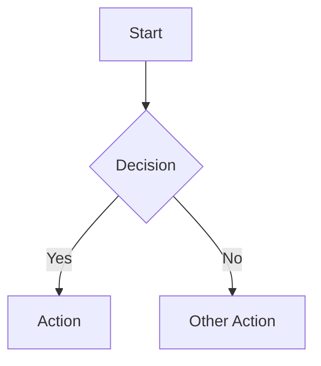

### sequenceDiagram
Use for time-ordered interactions between actors/systems.
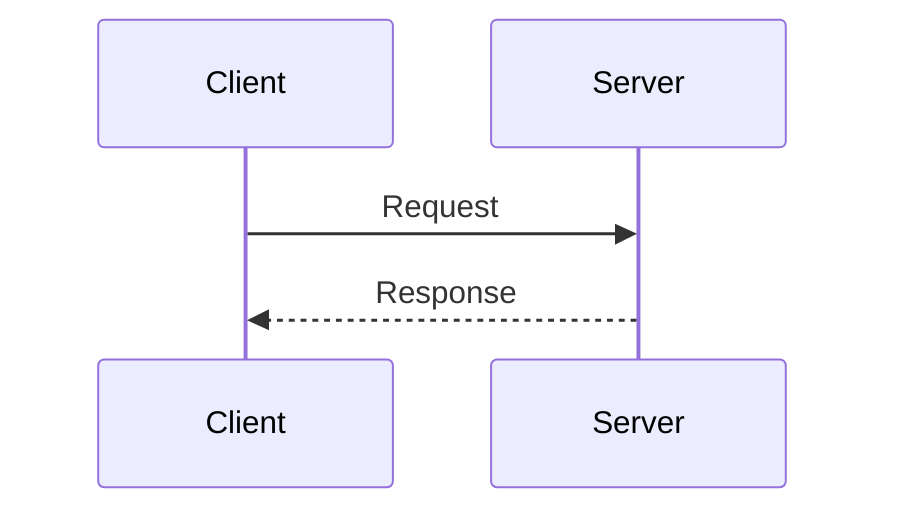

### erDiagram
Use for database relationships with cardinality.
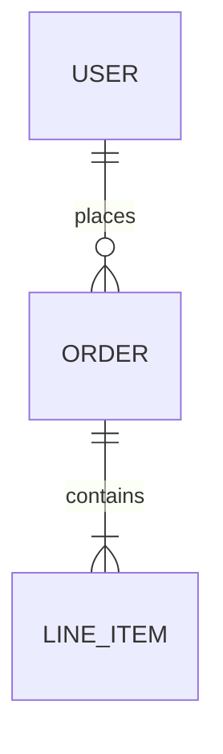

### classDiagram
Use for OOP class structures with methods and inheritance.
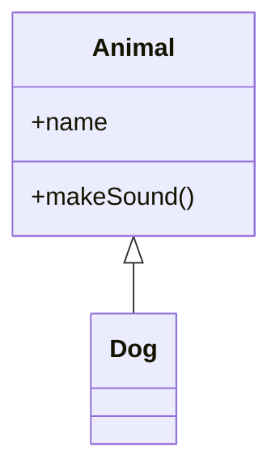

### stateDiagram-v2
Use for finite state machines with transitions.
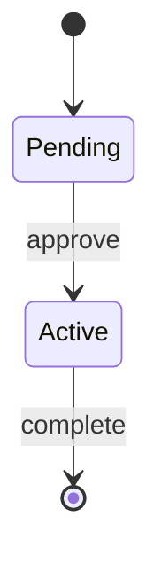

### gantt
Use for project schedules with durations and dependencies.
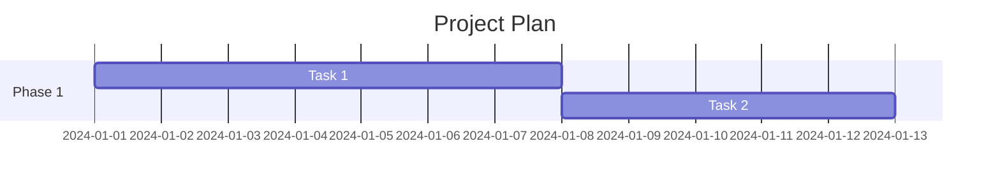

---

## Syntax Reference

### Node Shapes (flowchart)
```
[Rectangle] - Default process
(Rounded) - Terminal/rounded
([Stadium]) - Pill shape
[[Subroutine]] - Subprocess
[(Database)] - Cylinder
((Circle)) - Circle
{Diamond} - Decision
{{Hexagon}} - Preparation
```

### Arrow Types
```
--> Solid arrow (strong dependency)
-.-> Dashed arrow (weak/optional)
==> Thick arrow (important path)
--o Open circle end
--x Cross end
```

### Styling
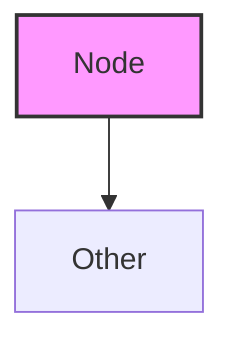

### Subgraphs
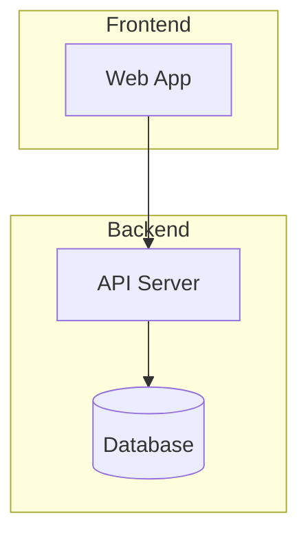

---

## Common Syntax Errors to Avoid

| Error | Wrong | Correct |
|-------|-------|---------|
| Case sensitivity | `graph lr` | `graph LR` |
| Spaces in node IDs | `Task 1[Label]` | `T1[Task 1 Label]` |
| Missing brackets | `A --> B[Label` | `A --> B[Label]` |
| Special chars in IDs | `node-1[Label]` | `node1[Label]` |
| Unclosed subgraph | `subgraph X` | `subgraph X ... end` |
| Quote issues | `A["Label's"]` | `A["Label''s"]` |

---

## Edge Cases

### Complex Diagrams (>15 nodes)
- Split into multiple focused diagrams
- Use subgraphs to group related nodes
- Provide overview + detail diagrams

### Bidirectional Relationships
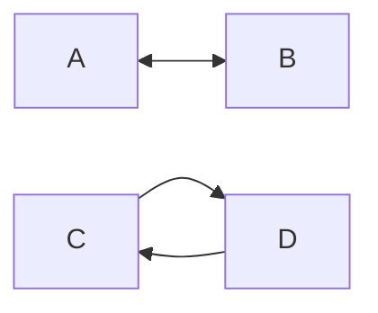

### Self-Referencing
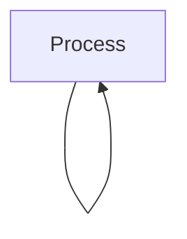

### External Systems
Use dashed styling and external subgraph:
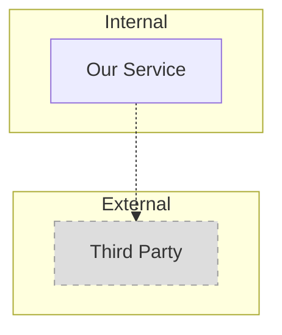

---

## Examples

### Example 1: Simple Flowchart

**Input:** "Create a flowchart for user login"

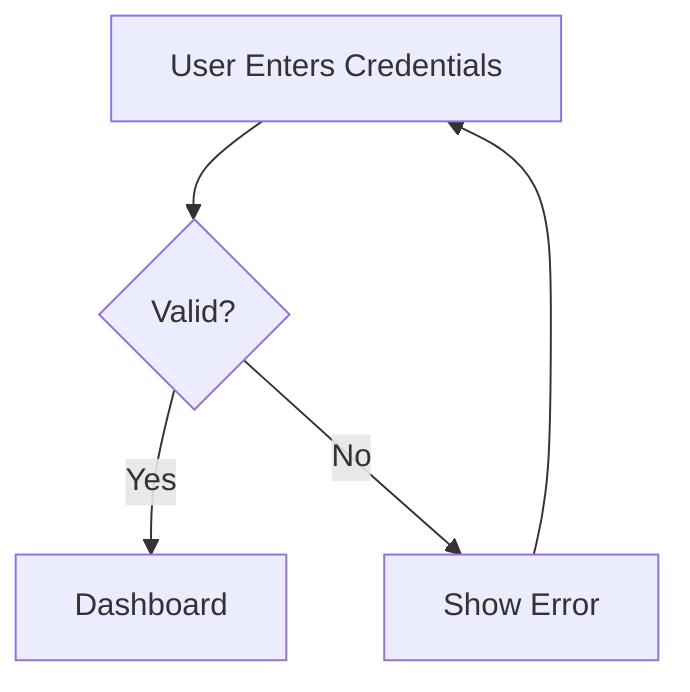

### Example 2: Database ERD

**Input:** "ERD for Users, Posts, Comments"

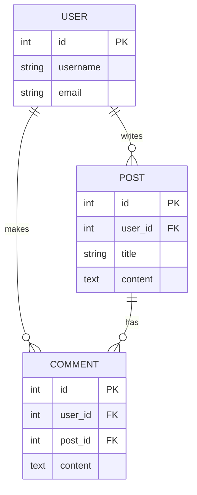

### Example 3: Sequence Diagram

**Input:** "OAuth2 authorization code flow"

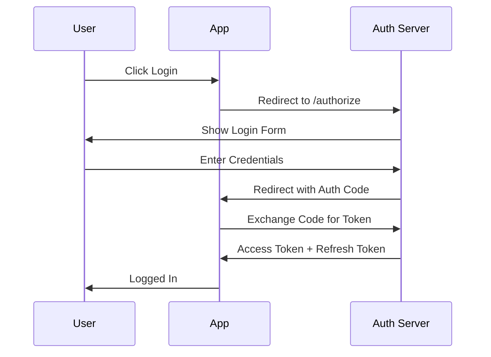
