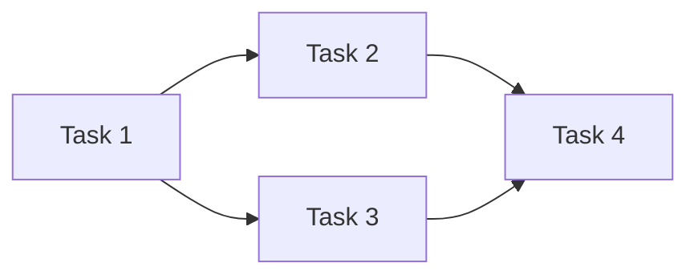
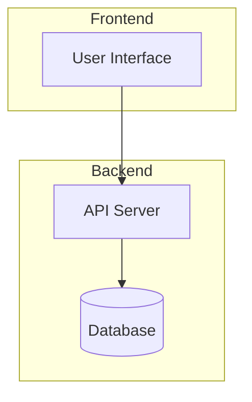
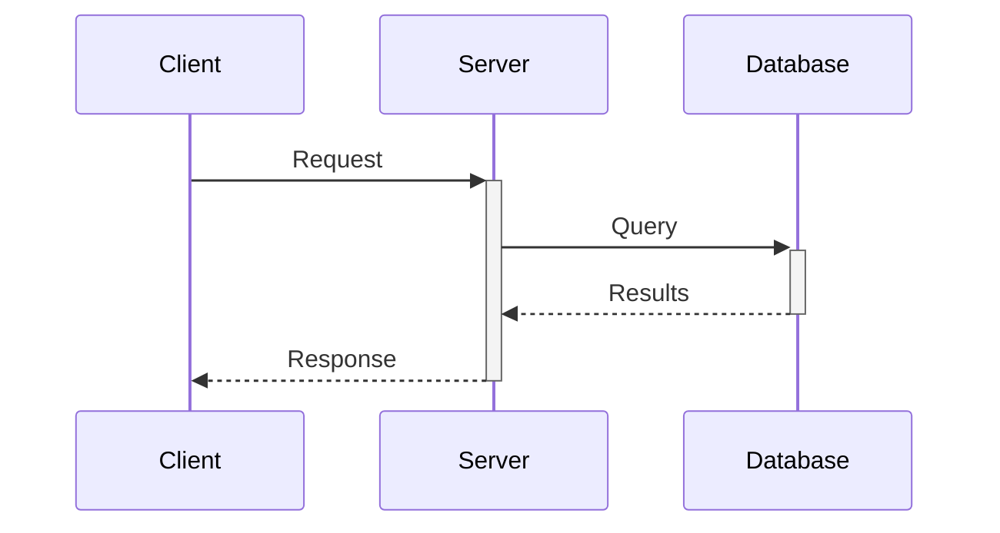
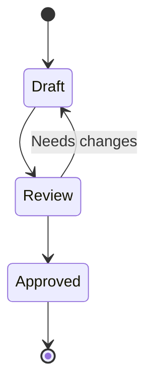
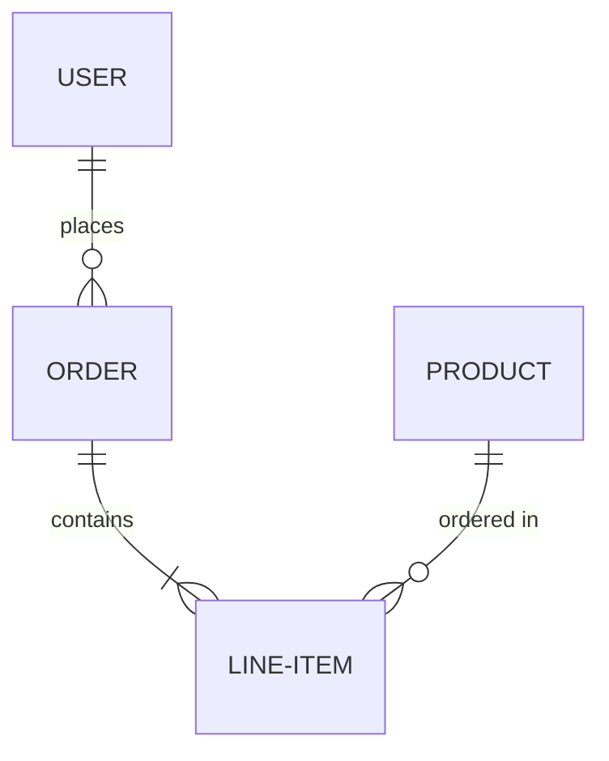
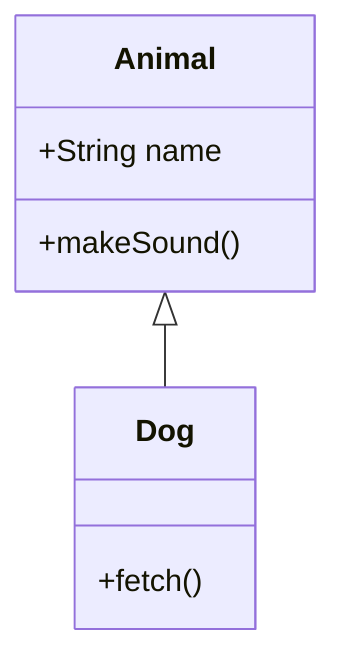
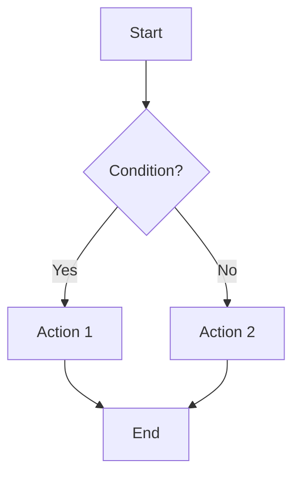
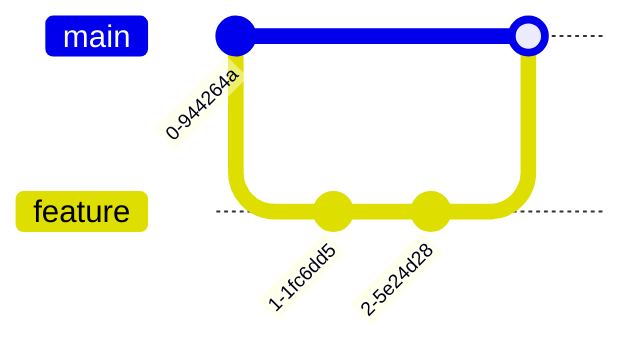
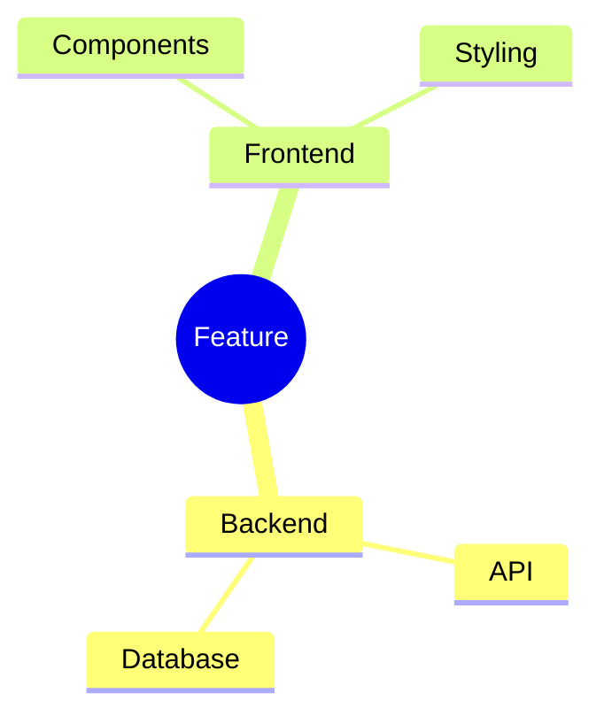
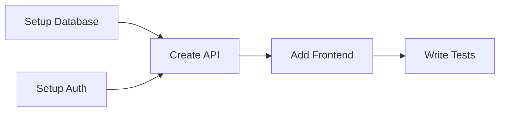

# Diagram Generation Template

Use this template when dispatching diagram generation for implementation plans.

## Dispatch Format

```
Task tool (doc:diagram-generator):
  description: "Generate diagrams for implementation plan"
  prompt: |
    Generate Mermaid diagrams for the following implementation plan.

    ## Requested Diagram Types
    {DIAGRAM_TYPES}

    ## Plan Content
    {PLAN_CONTENT}

    Generate clean, readable Mermaid code for each requested diagram type.
```

## Available Diagram Types

The diagram-generator agent can create these types:

### Task Dependencies (graph LR/TD)
Shows task execution order and parallelization opportunities.


### Architecture (graph TB + subgraphs)
Shows system components, data flow, and module relationships.


### Sequence (sequenceDiagram)
Shows API flows, service interactions, and request/response patterns.


### State (stateDiagram-v2)
Shows workflow states, object lifecycle, and state transitions.


### Entity-Relationship (erDiagram)
Shows database schema and entity relationships.


### Class (classDiagram)
Shows OOP design, interfaces, and inheritance.


### Flowchart (flowchart TD)
Shows decision logic, algorithms, and process flows.


### Git Graph (gitGraph)
Shows branch strategy and merge plans.


### Mindmap (mindmap)
Shows feature breakdowns and concept organization.


## Diagram Selection Guidelines

**Use Task Dependencies when:**
- Plan has 4+ tasks
- Some tasks can run in parallel
- Task order matters

**Use Architecture when:**
- Plan involves multiple components
- Data flows between systems
- New modules/services are created

**Use Sequence when:**
- Plan involves API integrations
- Multiple services communicate
- Request/response patterns matter

**Use State when:**
- Objects have lifecycle states
- Workflow has defined transitions
- Status changes are important

**Skip diagrams when:**
- Plan has < 4 tasks with linear sequence
- Single-file refactoring
- No multi-component architecture

## Output Format

Each diagram should include:
1. **Title** - What the diagram shows
2. **Type** - Which Mermaid diagram type
3. **Purpose** - Why this diagram helps
4. **Code** - Clean Mermaid syntax

Example:
```markdown
### Task Execution Flow

**Type:** Task Dependencies (graph LR)
**Purpose:** Shows which tasks can run in parallel and dependencies


```
