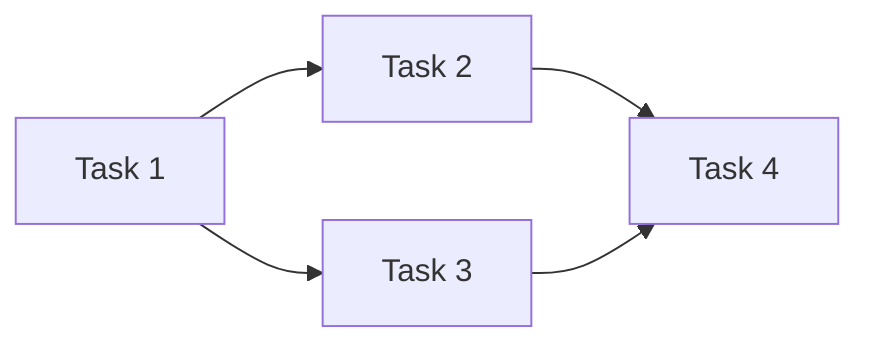
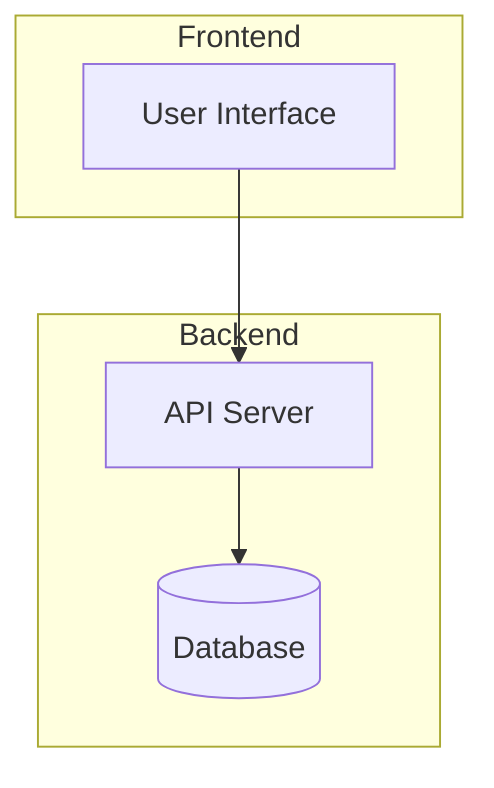
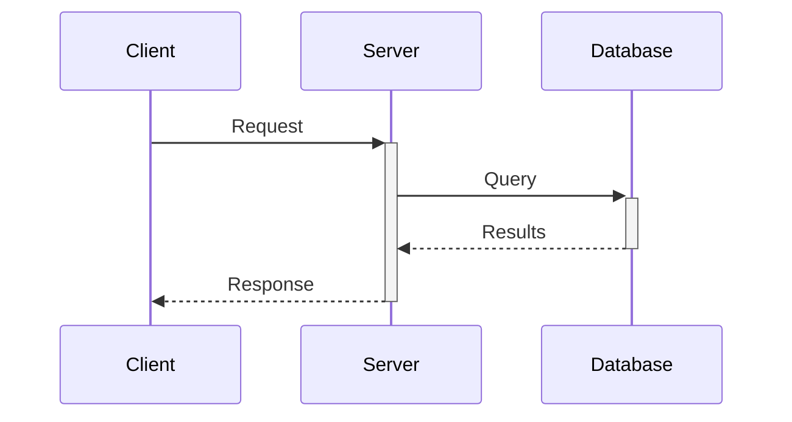
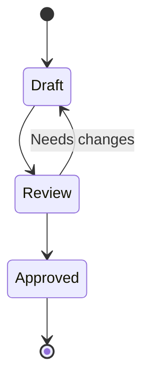
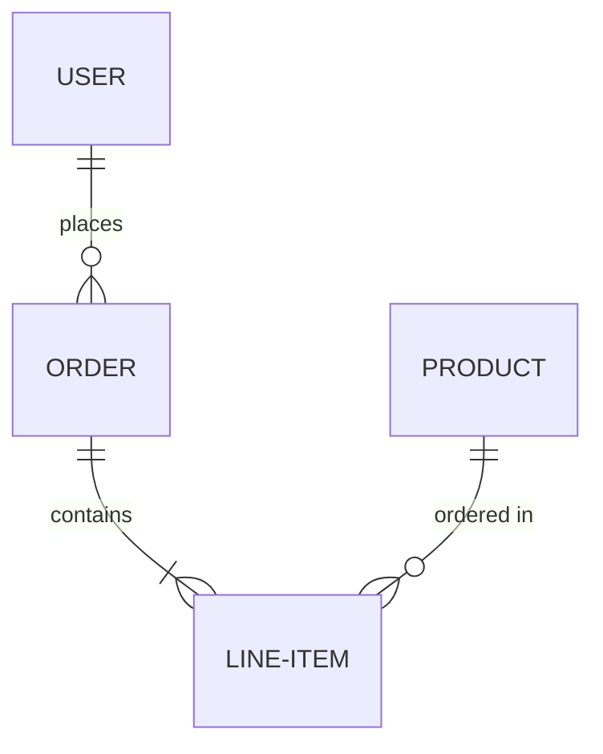
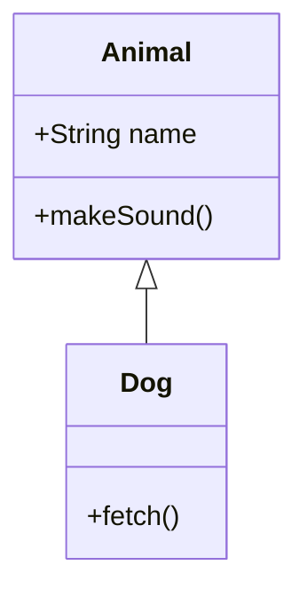
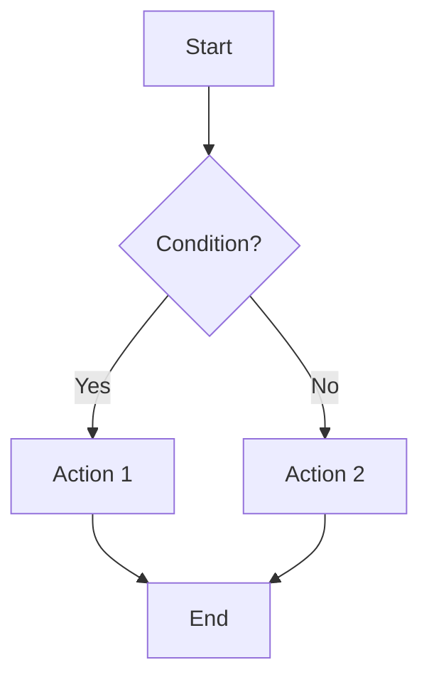
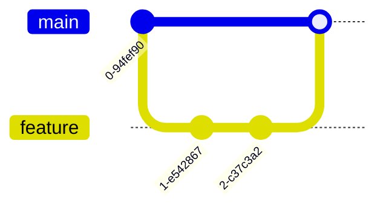
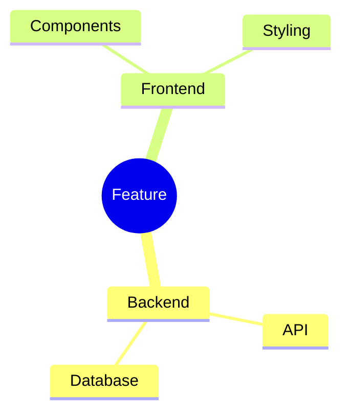

# Diagram Generation Template

Use this template when dispatching diagram generation for implementation plans.

**Key insight:** Diagrams help Claude maintain context during complex plan execution. They're execution aids, not just visual documentation.

## Dispatch Format

### Auto-Detect Mode (Recommended)

Let the agent decide IF and WHAT diagrams would help:

```
Task tool with subagent_type="doc:diagram-generator":
  description: "Auto-detect useful diagrams for plan"
  prompt: |
    MODE: auto-detect

    ## Plan Content
    {PLAN_CONTENT}

    Analyze this plan and decide:
    1. Would any diagrams help Claude execute this plan better?
    2. If yes, which type(s) would be most useful?
    3. Generate only what adds value - skip if plan is straightforward.
```

### Specific Mode

Request specific diagram types:

```
Task tool with subagent_type="doc:diagram-generator":
  description: "Generate [TYPE] diagram for plan"
  prompt: |
    MODE: specific
    DIAGRAM_TYPES: {USER_SELECTION}

    ## Plan Content
    {PLAN_CONTENT}

    Generate the requested diagram type(s).
```

## Available Diagram Types

The diagram-generator agent can create these types:

### Task Dependencies (graph LR/TD)

Shows task execution order and parallelization opportunities.



### Architecture (graph TB + subgraphs)

Shows system components, data flow, and module relationships.



### Sequence (sequenceDiagram)

Shows API flows, service interactions, and request/response patterns.



### State (stateDiagram-v2)

Shows workflow states, object lifecycle, and state transitions.



### Entity-Relationship (erDiagram)

Shows database schema and entity relationships.



### Class (classDiagram)

Shows OOP design, interfaces, and inheritance.



### Flowchart (flowchart TD)

Shows decision logic, algorithms, and process flows.



### Git Graph (gitGraph)

Shows branch strategy and merge plans.



### Mindmap (mindmap)

Shows feature breakdowns and concept organization.



## Diagram Selection Guidelines

**How diagrams help Claude execute:**

| Diagram Type | Execution Benefit |
|--------------|-------------------|
| **Task Dependencies** | Prevents starting blocked tasks, shows parallelization |
| **Architecture** | Clarifies component boundaries during multi-file changes |
| **Sequence** | Tracks message order, helps debug integration |
| **State** | Prevents invalid state transitions |
| **ER Diagram** | Shows relationships, prevents FK violations |
| **Flowchart** | Ensures all decision paths are covered |

**Auto-detect will skip diagrams when:**

- Plan has < 5 tasks with linear sequence
- Single-file changes (bug fix, refactor)
- No inter-component dependencies
- Configuration-only changes

**Auto-detect will generate diagrams when:**

- 5+ tasks with non-linear dependencies
- Multiple components/services that interact
- State machines with 3+ states
- Database schema with 3+ related entities
- API integrations with request/response cycles

## Output Format

### When generating:

```markdown
### [Diagram Title]

**Purpose:** [How this helps Claude execute the plan]

\`\`\`mermaid
[diagram code]
\`\`\`
```

### When skipping:

```markdown
**Diagrams:** Skipped - [reason, e.g., "linear 4-task plan doesn't benefit from visualization"]
```

## Example

```markdown
### Task Execution Flow

**Purpose:** Shows which tasks can run in parallel (T1 & T2) and what blocks T3

\`\`\`mermaid
graph LR
    T1[Setup Database] --> T3[Create API]
    T2[Setup Auth] --> T3
    T3 --> T4[Add Frontend]
    T4 --> T5[Write Tests]
\`\`\`
```
